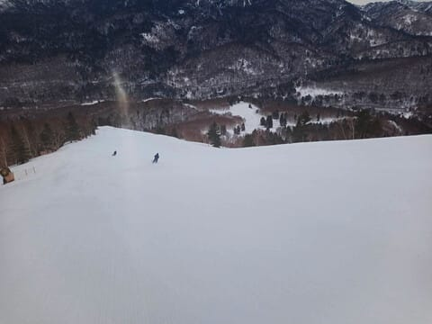

# Goo Blog終了前に，このBlog記事をすべてアーカイブしてくれたよ！…そして今週末も志賀高原

📅 投稿日時: 2025-04-19 00:03:40

🏷️ カテゴリ: [このブログについて](c472a27e408babcdcaa29ba3673d5b4b4.md)

Goo Blogが終了するということで，

このBlogをどうしようか，まだ悩み中なの

ですが…

いや．このBlogはかなり記事が多いし．

さらに記事内リンクが異常に多いんです

よね…

スキー試乗とか旅行記の目次ページとか，

自分のBlog記事へいっぱいリンクを張って

るんですよ．

引っ越しツールを使ってBlogを引っ越しても，

記事内のリンクを新しいBlogのリンク先に

書き換えてくれないので，古いBlogの記事への

リンクのまま残ってしまい，Goo Blogの削除と

ともにリンク切れで使えない目次ページに

なっちゃう…（涙）

…これだけの大量の記事内のリンクを，全部手で

書き換えるなんてムリ…（激泣）

さて．どうしようか．

…と悩んでいるところ，なんと．

心優しい読者の方が，記事アーカイブを

作成してくれました～！！

素晴らしいことにカテゴリ別になってるし，

記事内リンクもGoo Blogの記事には飛ばず，

アーカイブ内の記事に飛んでくれます…！！

素晴らしい…

アーカイブはここをclick↓

[徒然スキーヤー日記　過去アーカイブ](tsakamot2001blob.md)

…とりあえず，これで最悪，私がBlogの

引っ越しをミスったり，急な事故や

睡眠不足で過労死しても，このBlogの内容は

しばらくは残りそうです…←睡眠不足で過労死は，ホントにありそうなところが怖い

viz3さん，ありがとうございます！！！

ってなことで．

本日の志賀高原も，特派員から写真が

送られてきていますが…

今日の早朝営業スタートは曇り空．

早朝営業の時点で，予想が大体あたって

気温は+5℃近くと高かったんですが…

でも，朝イチはかなりバーンは硬く締まって

いたみたいで．

日がかげっていた8時過ぎくらいまでは，

かなり快適に滑れたみたいです…！

ただ，9時前ごろから晴れだして，

日が当たり始めると…

緩斜面は滑りが悪くなってきた

ようですが．

午前中は晴れ間もあったもののそこまで

日差しが強くなく，雪は滑ってくれて，

人も少ないしバーンもほとんど

荒れなかったみたいです．

午後のレポートが無いので，午後が

どうだったかわからないのですが…

午後は日差しで雪が滑らなくなったの

かも…？？

とりあえず，明日・明後日の志賀高原の

直前天気予想ですが．

19日(土)：前日深夜にサーッと雨．

　早朝営業までには止んでいる．

　早朝は雲が多いかもしれないけど，

　午前中から空は晴れていき，昼間は

　日差しが降りそそぎ，暑くなる．

　早朝から気温は+5℃程度と高く，

　朝から雪は柔らかめ．

　日が射すので，朝の早いうちから

　日差しと高温で雪はユルユルになる．

　ヘタするとストップ雪になるか…

　昼間は10℃を越えて暑さを感じる

　ほどで，人が多いコースはあっと

　いう間に荒れた斜面になる．

20日(日)：たぶん，早朝は晴れ．

　この日も朝から気温は+5℃を

　越えて艘で，早朝はちょっとは

　締まり気味かもしれないけど，

　朝早くから雪は緩んでいく．

　午前中に雲が増えていき，

　運が悪ければ昼ごろから雨．

　運が良ければ夕方まで降らずにもつ．

　朝イチの気温は+5℃以上と高く，

　昼間も　日差しはないものの

　+15℃近くまで上がる．

　でも，昼前には曇っちゃうので，

　日差しで雪がドロドロになって，

　ストップ雪になることはないかな…

ってな感じでしょうか．

…まぁ，春スキーですね…

この週末は，早朝の雪がいい時勝負！！

ただ，先ほどの長野の地震で，

志賀高原は明日のリフト営業開始が

遅れる可能性があるという案内が

出てますね…

明日，長野方面へスキーに行く方は

地震の影響があるかもしれないので

ご注意を！

（[焼額山スキー場Facebook](https://www.facebook.com/yakebitaiyama/posts/pfbid02j5JNKSbXr5Le3spvqwwyZomjus9fgWicZjdqKEWf4YuutxHzZ9eGrufNTZec6EbUl)より）

ってなことで．

あと3時間後に出発です…

また2時間半睡眠で明日も志賀高原で

滑ってます～！！

## 💬 コメント一覧

### 💬 コメント by (にいなぱぱ)
**タイトル**: Unknown
**投稿日**: 2025-04-19 16:40:41

毎日楽しく拝読しています。今日はまともに焼額を滑るのが初めてだったので、Ｓさまに会えないかとソワソワしておりました。ウェアは黄色をお召しではなかったでしょうか？1ゴン入口付近で色々な人に声をかけられている有名人？がいらっしゃったので、もしかしたらと思い。人違いでしたらすみません。。

### 💬 コメント by (Skier_S)
**タイトル**: ＞にいなぱぱさま
**投稿日**: 2025-04-19 19:51:09

黄色じゃなくオレンジでした…

淡いオレンジなので，黄色っぽく見えたかもしれませんが…うーん．どうでしょう？？

黒いFISCHERか緑のVOLKLの板を持っていたら，かなり高い確率で私です(笑)．

板に20000mクラブのゴールドステッカーがあれば間違いなく私なので，

次回見かけたら，ぜひお声がけください！！

