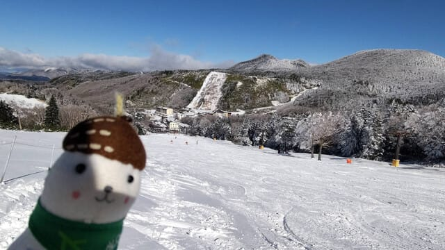
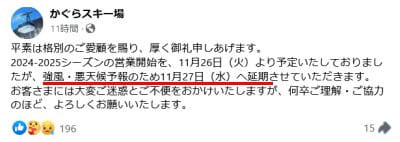
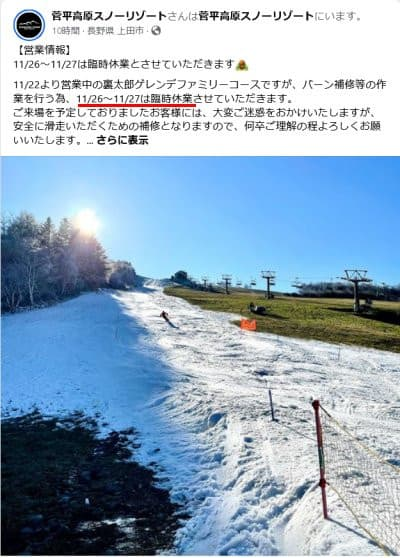
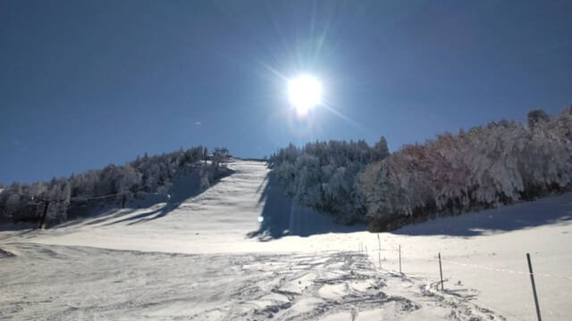
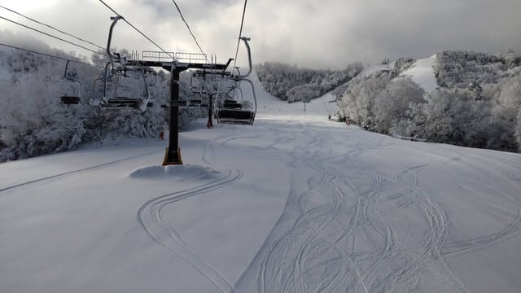
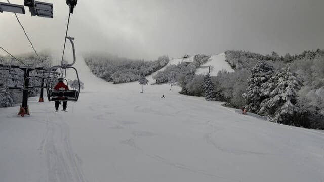
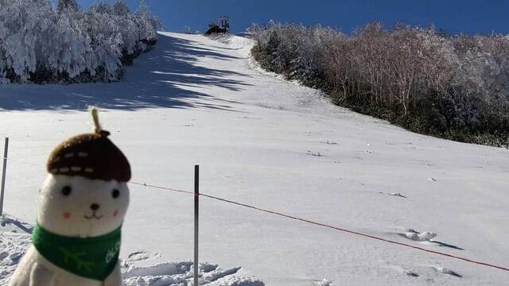
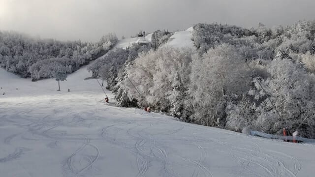
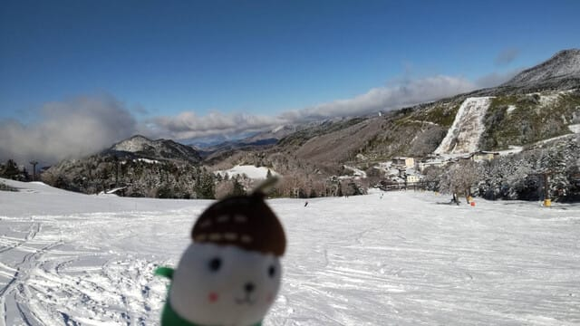

# 11月25日(月)，志賀高原熊の湯スキー場オープンの特派員レポート！…そしてかぐらスキー場はオープン延期，菅平スキー場は26，27日臨時休業

📅 投稿日時: 2024-11-26 02:16:22

えー．

本日…というか，日付が変わって昨日の

25日の月曜日．

予定通り熊の湯スキー場がオープン

しましたよ～！！

このBlogではおなじみの，志賀高原に

忠誠心が異常に高く，毎年シーズンの

最初から横手山が終わるぎりぎり最後まで，

ひたすら志賀を滑り続けるおこみん特派員が，

今シーズンも志賀高原オープンの初日から

写真を送ってくれましたよ～！！

…ただ．

見事にシーズンインを迎えたこのゲレンデも．

本日26日(火)の高温と，夕方から夜にかけての

強い雨で，かなりやられそうで…（泣）

すでにかぐらスキー場は，悪天候を見越して

26日予定だったオープンを1日延期し，

27日(水)のオープンへ変更しました（涙）

（[かぐらスキー場Facebook](https://www.facebook.com/snowkagura/posts/pfbid0R8Ld3GMw7HJkRNX8XZBCpAD8pQQ1GkqoVXzc82x9MWpyCYmjK3p5zjBWrjAPHYV5l)より）

そして，菅平もこの悪天候を見越したのか，

あるいはすでにかなりゲレンデがやられちゃった

からか…

菅平は悪天候予想の26，27日は臨時休業

になるようです…

（菅[平高原スノーリゾートFacebook](https://www.facebook.com/sugadairasnowresort/posts/pfbid0Bkwsh66yr1Zysn9h33MCW7DzH8jXtsdQjC64FhSxC8tBXh93mDb1D6MJwvAeiD4dl?locale=ja_JP)より）

志賀高原は26日午前2時の段階で

まだかなり冷えてますが．

このあと，26日(火)は朝から強い南風が

吹きつけ，気温はぐんぐん上がっていき…

そして，夕方から翌27日(水)の明け方にかけ，

結構激しい雨になりそうです（泣）

27日は明け方に雨が止むものの，終日気温は

高く，28日(金)に，やっと平年並みの気温に戻る

感じですね…

うーん．

26日夜の雨でやられたゲレンデが復活するには，

かなり時間がかかりそうな感じですが…

今週末までに，雨の影響をリセットできるのかな…？

ってなことで，また本題へ戻りますが．

おこみん特派員によれば，本日の熊の湯

スキー場．朝は晴れ！

昼間は雲も多かったようですが．

気温は冷えていたようなので．

雪も一旦融けて緩んだのが固まった

ガチガチではなく，結構いい感じで．

コース幅もイエティに比べればぐっと

広く，ゲレンデコンディションは結構

よかったようです！

…いやー．

今シーズン，初めてスキー場らしい景色を

見ましたね…！！

人工雪の上に15-20cmの新雪が乗った後，

圧雪がかかったような感じで，あさイチの

コースは最高だったとのコメントでした…

うらやましい…

でも．イベントコースとかももう真っ白に

見えるけど．

人工雪がないところは薄いんでしょうね…

しかし．

これだけよさそうなゲレンデコンディションも，

あと数時間の命で．

本日26日の夕方からの高温＆雨で，

あっという間にダメになってしまうのが

すごい残念…（泣）

次に人工降雪機が動かせるほど

冷えるのは，28日(木)の深夜からなので．

うーん…

雨でやられた後，29日(金)の一日だけの

人工降雪では，一ノ瀬や高天ヶ原は，

予定通り30日から営業できるのか，

結構ぎりぎり厳しい感じのような

気がするなぁ…（涙）

せっかく一旦こんな見事なゲレンデが

できたのに．

ホントに返す返す，26日夜からの

雨が惜しすぎる…

とりあえず．

このBlog読者の皆さんは．

昨日の記事に書いたように．

日頃の行いを限りなく良くするように

心がけ，天気の神様への祈りと，

冬将軍を待ちわびる踊りと，

このBlogへの感謝を忘れないはずだから．

26日夜の雨＆高温は，そこまでひどくは

ならないはず…っ！！←だから最後の奴が余計だってば

## 💬 コメント一覧

### 💬 コメント by (カンタロス)
**タイトル**: Unknown
**投稿日**: 2024-11-26 08:48:21

エスさま、こんにちは。

狭山でシーズンインしてきました。

他のゲレンデ状況を拝見させてもらってますが、

これ、地味に、狭山が1番いいんじゃないか？！

て感想です。

シーズンインなのでいろいろ確認しがてら、主力戦闘マシンのG9fisで滑りましたが、r30でも十分なゲレンデ幅。（個人的感想）

板を洗うシャワー完備、雨降っても関係ない屋根付き。

完璧です（笑）…距離は短いけどシーズンインの練習と考えれば。

高速代もかからないし、意外と良かったです。

### 💬 コメント by (ねも)
**タイトル**: Unknown
**投稿日**: 2024-11-26 10:33:19

Ｓさん　お久しぶり！

｢今シーズン初めてスキー場らしい景色｣に、Ｓさんのスキー愛(哀愁？)を感じました(笑)

暖かな静岡も急に寒くなってきたので、雪国の降雪を期待しましょう！

### 💬 コメント by (Skier_S)
**タイトル**: もうすぐ12月
**投稿日**: 2024-11-27 01:26:55

＞カンタロスさま

狭山，そんなにいいんですか…！

でも，駐車場代が高いし，やっぱり狭いイメージが…

まぁ，このころのイエティよりはコース幅は広いですが（笑）．

＞ねもさま

もう，でもホントに今シーズン初めてのスキー場らしい景色でした~…

