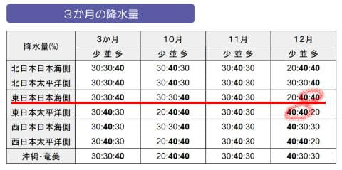

# 気象庁から今年の10月～12月の3か月予報が出たよ！10月は暑いけど12月はちょっと冷えて冬型が強まりそう！スキー場にとってはいいニュース！

📅 投稿日時: 2024-09-25 06:01:51

🏷️ カテゴリ: [スキー天気予想](c6554f5c3c106093b511a8daae23757e8.md)

ということで．

相変わらずクリティカルな状況が続き．

今日もとんでもない時間に更新している

わけですが…

今日も睡眠時間2時間切りますね（涙）

更新してる暇があればホントはちょっとでも

睡眠時間をとりたいところだけど．

今日は[気象庁の3か月予報](https://www.sunny-spot.net/chart/FCXX93.pdf)の発表日なので．

頑張って解説記事を書いてみました…

偉い！自分！

まずは気になる気温傾向を見ると…

10月は高温が60％と高温傾向．

11月は高温40％と，わずかに高温になるかも

しれないけど大体平年並み．

そして12月は低温が40％と，わずかに低温に

なりそうな予報…！

久々の，平年より低くなる可能性が高い

予報が出ました…！！

実にどれだけぶりだろう…

降水量の予報を見ても．

12月は日本海側で降水量が多め，

太平洋側で降水量が少なめの予想で．

これは冬型が強まるということを

示してますね…！！

解説を見てみると…

おっと．11，12月のラニーニャの確率が，

9月上旬の速報値の60％から70％に上がってます…！！

そして，右側の説明文にあるように，

インド洋ダイポールモードが，負になっている

ようです…！！！

以前記事に書いたように，スキーヤーにとっては，

[エルニーニョより正のインド洋ダイポールモードが怖い](eba6aabb82183f8425d6fed8f647d087e.md)

のですが．

インド洋ダイポールモード，スキーヤーが怖い

正の値から負の値に変わっているようで．

これはスキーヤーにはいいニュースですね…！

さらに解説を読み込むと…

下の図左側の解説の赤線部分，

「ラニーニャでインドネシア付近に積乱雲発生」

（インドネシア近辺の対流活動活発化）

→偏西風が日本付近で南に蛇行（右図赤矢印）

その結果，解説に緑線で示したように，

期間後半は冬型が強まるようです…！！

200hPa流線関数にもその様子が出ていて．

中国大陸で高圧性循環①，

日本付近で低圧性循環③が出ている結果，

偏西風は赤矢印のように流れ，

偏西風は日本付近で南下します…

そのように偏西風が流れるので．

日本付近の850hPaの流線関数を見ると．

東シナ海～西日本で北風が強くなっていて，

期間後半…すなわち12月は，冬の季節風が

強まるという予想です！！

図を拡大すると…

確かに，赤くくくった部分．

偏西風の南下に呼応するように，

北風が強い予想になってます…！！

この結果．

12月の予想を見ると．

850hPa気温は日本付近で負偏差…

すなわち平年より低くなる予想となってます！！

拡大図を見ても…

日本近辺だけ，見事に平年より低い

水色領域に入ってますね…！

あぁ…850hPa気温の予想が平年より

低くなるって，実にどれだけぶりに

見た予想だろう…

昨シーズンの終わりの4月とかから

最近にかけて，平年比+2～3℃がずっと

続いたからなぁ…

ということで．

10月はまだ暑い日が続く可能性が高いけど．

ラニーニャ傾向や，負のインド洋ダイポール

モードなど，いい予兆が出てきているので．

11月は平年並みに戻っていき，

12月は冬型が強く，日本海側の降雪が

多そうという感じで．

久しぶりにスキーヤーを元気にさせる

長期予想でしたね…！！！←というより，記事の内容がマニアックすぎ

…ただ．

気象庁の長期予報は，後半の予想が外れがち

という，ちょっと嫌な思い出もあるので…

こういう予想こそ，ぜひ当たってほしい．

今から1か月後に，

「やっぱり12月の予想は高温に変わり

ました～！！」（てへぺろ）

みたいにならないことを祈るばかり…

PS.　実は本日，気象庁から

「全般季節予報支援資料寒候期予報」

として，12月から2月の予報も出されて

いるので，明日はそちらを解説します…

## 💬 コメント一覧

### 💬 コメント by (ozuriski)
**タイトル**: 平年並みなら御の字
**投稿日**: 2024-09-25 10:17:07

マニアックすぎる天気図解説、毎回楽しみにしています。

ここ10年を振り返ってみると、寒候期予報は良い方にも悪い方にも外すことがありますが、ラニーニャは（とエルニーニョも）外していません。

例えば2020/21はラニーニャなのに寒候期予報では多雪も低温も確率は20％として、結果、東日本日本海側の降雪量は平年比130％でした（気温は+0.37℃とやや高温で当たりでした）

この冬がラニーニャになるのかはまだ予断を許しませんが、インド洋ダイポールモードも負なのであればますます期待できます。

このまま予報どおりに雪の多い、あるいはせめて何とか平年並みの降雪量になって、特に12月の早い段階に強い寒波が来てドカッと降ってシーズンインが早くなり、暖冬少雪以上に深刻な3月の高温がなく今年のように平年並みであってくれればと思います。

### 💬 コメント by (カンタロス)
**タイトル**: Unknown
**投稿日**: 2024-09-25 16:06:59

エスさま、こんにちは。

みんなで寒くなる！！と強く思えば寒くなるはず！！

（阿頼耶識の法…だったかな？）

寒くなるよう、強く思い込みましょう!

### 💬 コメント by (Skier_S)
**タイトル**: 今シーズンはいいシーズンになりますように…！
**投稿日**: 2024-09-26 03:04:46

＞ozuriskiさま

マニアックな解説を読んでいただいてありがとうございます（笑）．

そうですね…エルニーニョとラニーニャ予想は外してませんね．

今シーズンは負のインド洋ダイポールモードも出てるし，少なくとも12月は期待できそうだと思ってます…！

＞カンタロスさま

みんなで寒くなる！と思いこんだら寒くなるなら，寒くならないほうが良いと

思っている人を抹消していくのが一番近道かも…←違うから

とりあえず，冷えるように祈って踊って思い込みましょう！！

