# 10月29日(土）のイエティのレポート…2011/2012シーズンのオープンから一週間

📅 投稿日時: 2011-10-30 00:00:03

🏷️ カテゴリ: [2012スキー滑走日記](cca3a0e9524e0203150f790b1fc3c71ad.md)

という感じで．

さっきYetiから帰ってきましたが．

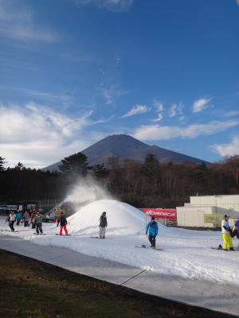

いやーーーー．

やっぱり．

スキーは，太陽の下でやるものですなっ！

富士山がきれいに見えて快適でした…

今日は朝8時から営業開始．

うーん．

[先週より](e3730258fef5c5f81270f7dcebc978367.md)コース幅広がったんじゃない？？

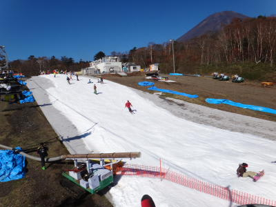

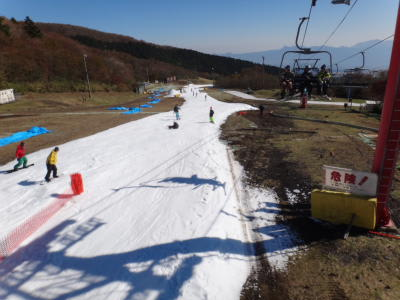

今日は1箇所でこぼこしていた箇所があったけど．

それ以外はフラット．

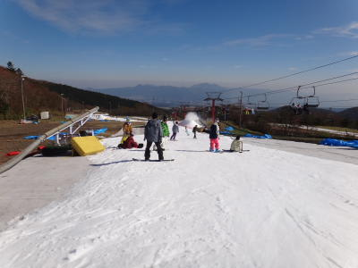

雪に穴が開くことはなく．

比較的好コンディション．

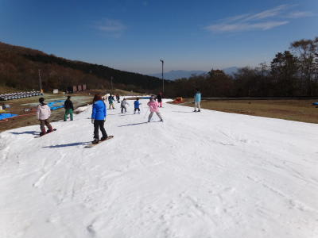

…廊下状なのは相変わらずですけど．

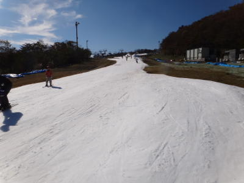

でも，滑ってる間もがんがん雪つけしてましたし．

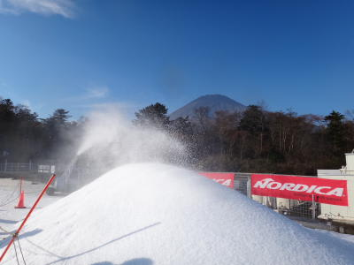

リフトはスキー履いて乗り降りできます．

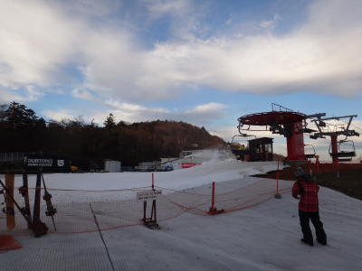

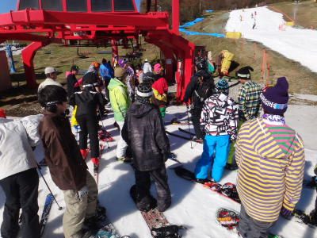

しかし，混雑度合いはなぜか天気が悪かった先週よりすいていた

気がするのは，なぜ？？

駐車場も，止まってる車は先週より台数が少なかったし…

リフトを降りた，みんながボードを履くエリアも

それほど込まなかった気がするなぁ．

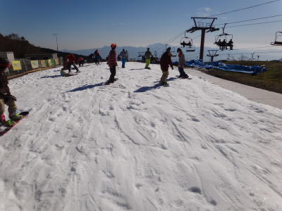

とりあえず，リフト待ちは列が先週より短め．

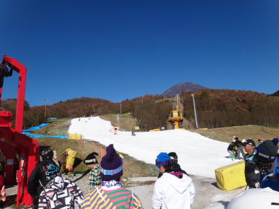

最大5分またなかったですね…

クワッドと並行にかかるペアリフトもちゃんと動いていたので，

ちょっと歩いてペアリフトに乗れば，待ち時間0で済みます．

＃クワッドも高速じゃないので，かかる時間はペアと同じ

この時期に，リフト待ちなく滑れるなんて！

さらに．

Yetiのメール会員になれば，毎回リフト500円引きなんですが．

2回目は半額という特典があるので．

今日は1日券1400円で滑れたという．

＃駐車場代1000円と有料道路代500円がかかるけど（涙)

10月にスキーを滑れる，というだけであらゆることを許せるというのにっ！

リフト券もすげー安く．

リフト待ちもなく．

天気も良く．

ああ…

シアワセ…．

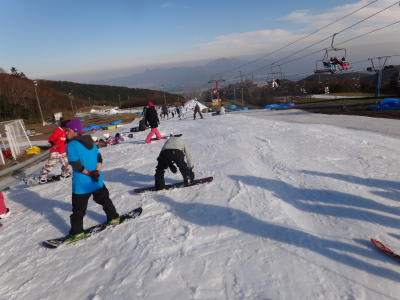

これをシアワセといわず，何をシアワセと言うんでしょう！？

というくらい．

楽しく過ごせた一日でした．

とりあえず，午後4時から，ナイター営業に向けての

30分のコース整備タイムが入りますが．

朝からそれまで，ひたすら滑り続けたのでした…

もう，この時期はどうせ練習がてらゆっくり滑るので，

逆にYetiくらいの緩めのコースがいいですね．

また，来週も行くぞ～！

## 💬 コメント一覧

### 💬 コメント by (千春)
**タイトル**: ブログ見せていただきました
**投稿日**: 2011-11-01 12:15:30

はじめまして。

今週、イエティに行くので、コース幅などが気になって検索していたら

こちらのブログにたどり着きました。

画像と解説いっぱいのブログを拝見していると、

もうコース幅なんて関係ない！滑れるだけでいい！

と思えてきました（笑）

ありがとうございました。

またブログ見に来ます。

### 💬 コメント by (Skier_S)
**タイトル**: ようこそ！
**投稿日**: 2011-11-02 00:34:07

ようこそ，このマニアックなブログへ(笑）．

昨シーズン滑走日記を見てお分かりのように，ほぼ毎週どこかのスキー場レポートをしておりますので，今後も楽しみに！

とりあえず，今の時期は滑れるだけシアワセです．満足です．

リフト待ちがなくてコースが長いので，軽井沢よりいい気がします．

今週末，おそらく私もYeti滑っていますので…

