# 4月17日の志賀高原詳細モード…一の瀬エリアはほぼ終了，来週は滑れても楽しくなさそう（涙）

📅 投稿日時: 2016-04-19 03:52:20

ということで．

今日も帰宅が遅いのに．

こんな時間にBlogを更新しているSkier_Sです．

…ってことで．

日曜の志賀高原の詳細レポートですが．

…

…うーむ．

そんなにいっぱい書くことはない気がするなぁ…

とりあえず．

曇り空で始まった，日曜の朝．

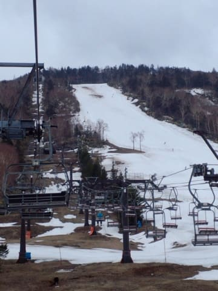

幸い，雨にはならずに済んだか…

と，ちょっと安心してゲレンデに出るわけですが．

ちょっと風が強めで，寺子屋のリフトは動いてないようです…（ちょっと残念）．

でも，一の瀬と高天ヶ原は山頂まで動いているので．

まぁ，大丈夫かな…

…と，リフトで山頂に登ると…

…曇り空ってことは，晴れた朝特有の放射冷却が無いわけで．

朝から雪はかなりユルユルな状態か…（涙）

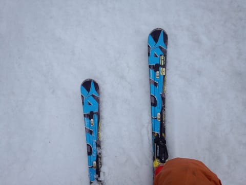

で．

なんだか．

一の瀬ファミリースキー場．

昨日から比べると，かなり雪が減ってるのですがっ！！？？（激涙）

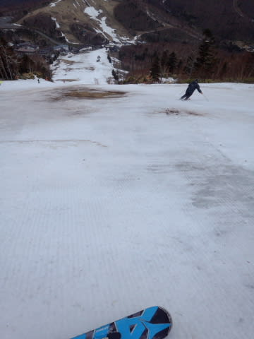

正面バーン上部は，真ん中にぼっこり穴が開いており．

両脇を滑るしかない状態ですが．

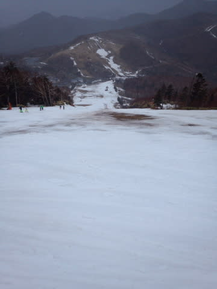

当然，その両脇も雪が薄いし…

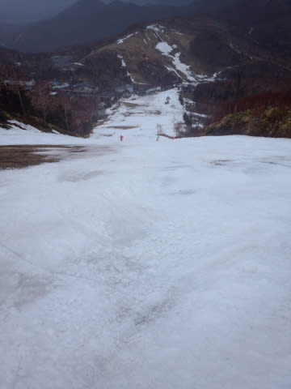

石ころ踏むことを覚悟で滑らないといけない状態…（泣）．

なんてこった…

天気は，風が結構強かったけど．

朝のうちは意外と時折日が射したり…

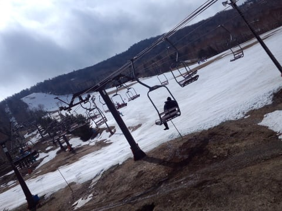

かと思えば，曇ったり．

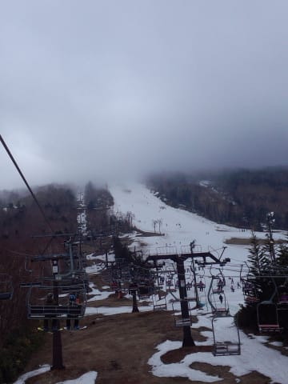

そして，9時半ごろからはぽつ・ぽつと雨粒が落ちてくる

タイミングもあるという，

コロコロと変わる天気でしたが…

うぎゃーっ！！

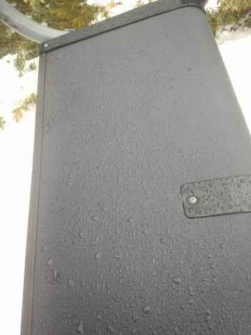

…11時近くから，パラパラ程度ではあるものの．

本格的に雨が降り出してきました…（涙）．

そして．

この雨のおかげで．

ゲレンデの雪は…

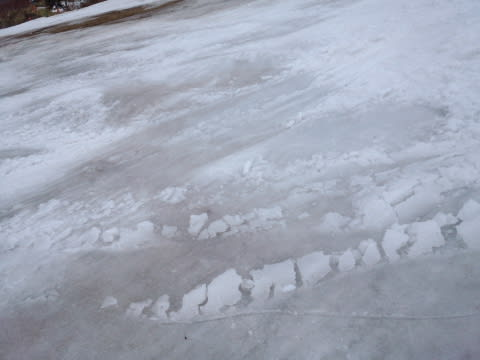

雪は…

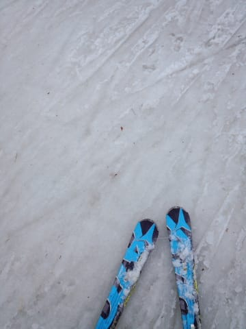

雪は…（涙で語れない）

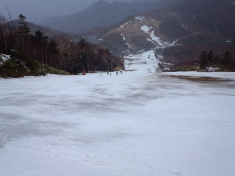

もう，正面バーンはかなり壊滅的な状況…

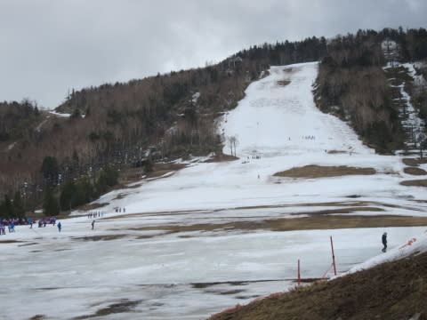

てか，下半分もかなりやばいか…？？

もしかすると．

この日，一番雪がマシだったのは天狗コースだったかも？？

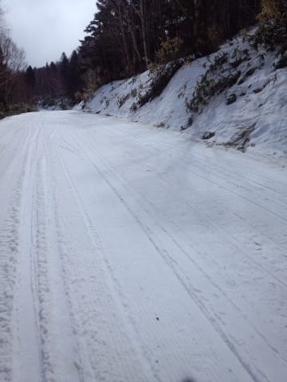

…激烈に斜面は緩く，楽しくないけど…

ってことで．

あまり雪も良くないし．

雨が降ってきたので．

早めのお昼ご飯…

と，12時前にいったん雨宿りがてら昼食を食べていると．

…その間に風が強くなったらしく．

あれ？リフトに誰も乗っていないんですけど…

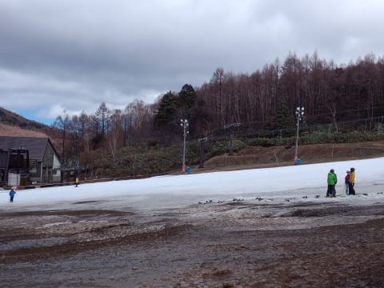

…って．

え？

ええ？

リフト運転見合わせっ！？？？

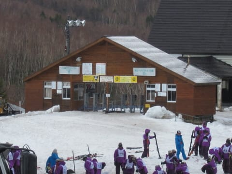

…ってことで．

12時前から，一の瀬の全リフトが停止してしまいました…（泣）．

で．

風が強くなり，リフトが止まったというのに．

そのタイミングで雨が止み．

すっきり青空がのぞいてくるという．

…この，皮肉…（涙）．

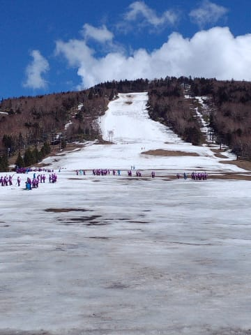

あぁ…

雨が止んだのに．

なぜ，なぜリフトが止まるのか…

奥志賀か熊の湯に逃げようか，と調べてみたけど，

奥志賀・横手を含む，志賀の全リフトが止まっちゃってるようです（涙）．

なんてこったっ！！！！

ってことで．

リフト営業開始を，1時間半ほど待ってみましたが．

むしろ，風はだんだん強くなっていき．

全くちっともこれっぽっちもリフトが動く気配がないので．

「まだ帰らない～っ！！リフト動くまで待つ～っ！

　まだ滑りたい～っ！！」

と，まだ滑り続けたがる娘を引きずって←やはり，血は争えない…

午後1時半過ぎに，泣く泣く撤収しました…

帰り道で，高天ヶ原に寄ってみますが．

やはり，リフトは動いてないなぁ…

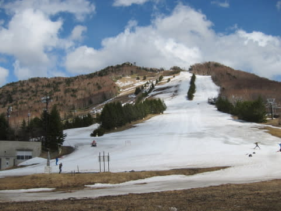

でも．

高天ヶ原のNHKバーンは，一の瀬正面バーンより

ずっとまともそうに見えますね～．

これなら，来週末まで行けるかな？？

しかし．

なぜ．

なぜ，リフトが止まる午後に雨が止んで，

無駄に晴天になっているんだろう…（泣）．

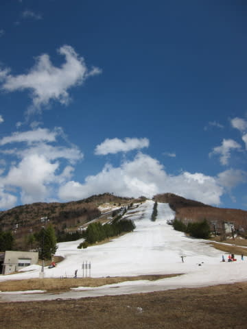

ってことで．

そのまま帰るのもかなり悔しかったので．

夜間瀬川沿いでのんびり花見をしてから，

帰宅の途に就いたSkier_Sだったのでした…

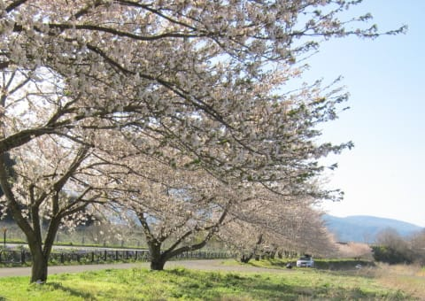

あぁ…

一の瀬は，今週末が正面バーンを滑れるラストっぽかったのに．

なんだか残念な終わり方だったなぁ…（涙）
