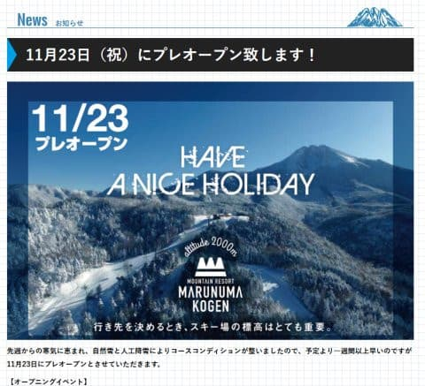
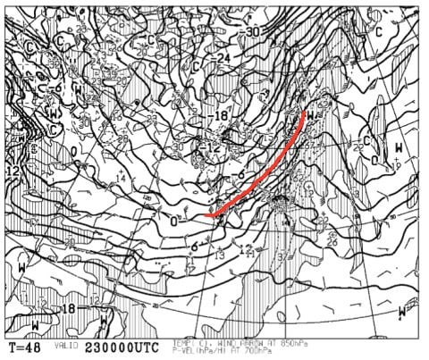
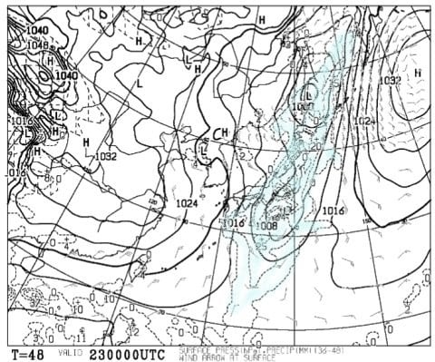

# 志賀一の瀬，八方，白馬五竜，アサマ2000，丸沼など，前倒しオープンのスキー場続出！…そして，23日（祝）のスキー場の天気は？

📅 投稿日時: 2017-11-22 01:01:16

なんと．

冷えてますよ．

今シーズンは，冷え冷え踊りを踊っていないというのに．

冷え冷えですっ！！

素晴らしい！

わがホームゲレンデの焼額も，

昨晩から今日にかけて，

すごく積もったみたいですし…

（[焼額山FB](https://www.facebook.com/yakebitaiyama/?hc_ref=ARQGYHkq_N7p-qPUSkX3pWWP75zcGIbBkaHXA4Rno1M1idVH6HR3VDxGBysZL8l11PE&fref=nf)より）

この冷え冷えのおかげで．

志賀高原の一の瀬第2ペア，高天ヶ原トリプルの，

今週末からのプレオープンが決まりました～！！

（[志賀高原リゾート開発FB](https://www.facebook.com/ShigaKogen.Ski/posts/1469050289877836)より）

うーむ．

11月中に一の瀬と高天ヶ原が滑れるように

なるなんて…！！！

ここ10数年なかったことだな…

素晴らしい！

そのほかにも．

かぐらスキー場は，

23日から，みつまたまで滑れるように

なるようです…！！！

（[かぐらスキー場HP](http://www.princehotels.co.jp/ski/kagura/files/pdf/20171123courseguide.pdf)より）

この時期に，みつまたまで滑れるように

なったことって…あったっけかな？

さらに．

なんと！！！

八方は今日火曜日にオープンしていたようです…

滑れるのは，パノラマのみらしいですが…

（[八方尾根スキー場HP](http://www.happo-one.jp/news/8236.html)より）

白馬五竜は22日オープン決定！

（[白馬五竜スキー場HP](http://www.hakubaescal.com/winter/information/2017/11/21/1122%e6%b0%b4%e3%81%8b%e3%82%89%e3%81%ae%e5%96%b6%e6%a5%ad%e4%ba%88%e5%ae%9a%e3%81%ab%e3%81%a4%e3%81%8d%e3%81%be%e3%81%97%e3%81%a6/)より）

47は23日オープンのようです．

そして．

丸沼も12月1日オープン予定を一週間以上前倒し，

11月23日オープンになったし…

（[丸沼高原スキー場HP](https://www.marunuma.jp/winter/news/5978/)より）

アサマ2000も，25日オープン予定だったのが．

急遽23日からプレオープン決定！

24日は，2000円で滑れるようです…

（[アサマ2000HP](http://www.asama2000.com/information/detail/5140.html)より）

そのほか，湯の丸，鹿沢なども．

予定通りの23日オープンが確定っ！！

素晴らしい…

素晴らしいよ，今シーズン…（感動）

ってことで．

かなりの数のスキー場のオープンが決まった，

23日の祝日．

果たして，天気や如何に…？？？

まずは，祭日の前日．

22日夜9時の850hpa天気図を見てみると…

ありゃりゃ？？

…今日まで冷え冷えだったけど．

22日は赤く示した0℃線がかなり北に上がり．

志賀高原近辺には，+3℃線が…（涙）

…これだと．

23日の前日の夜は，人工降雪機は動かせませんね

…って．

それどころか．

22日夜9時の地上予想図を見てみると…

ヤバい…

西から降水域が近づいてる！！

なんとか，夜9時の段階では．

志賀，白馬，かぐらあたりはぎりぎり

降水域にかかっていなさそうだけど…

22日夜から23日朝にかけて，

ポツポツと液体が降ってくる覚悟を

しておいた方がいいかも…

南風なので，志賀はそれほどひどい雨に

ならないと思いますが…

で．

肝心の23日，朝9時の850hpa予想図を見てみると．

うーむ．

赤く印した0℃線は，まだスキー場の北にあり．

そして，23日朝9時の地上予想図で，

降水域を見ると…

あぁ…日本全域，降水域がかかってる…（涙）

ってことで．

23日の朝は，残念なことに雨でスタートしそうです…

あ，でも，それほどひどい雨にならないかな．

太平洋側にプチ低気圧があるので，前線の効果は

弱まりそう…

だけど．

23日の夜9時の850hpa気温図を見ると…

ぐほう！！！

この日の夜は激冷え！！

赤い0℃線は太平洋側まで下がります…

…だもんで．23日のいつかの時点で，

雨は雪に変わるという．

18日土曜日とほぼ同じパターンですね…

今のところ，この天気の変わり目となる

寒冷前線の通過タイミングは読めませんが…

まぁ，昼前には通過しそう．

それで，だ．

24日の平日の850hpa予想図を見ると，だ．

なんだ！！？？これは？？

水色の-6℃線が志賀高原に近づいてますよ！！

これは…24日の朝．

また，マイナス10度クラスの激冷えだよ！！

そして．

この日の地上天気図は．

スゲー冬型…

日本海に雪雲がどっさりかかって，

日本海側に大量の降雪が予想されてます…

これは．

このままの天気図だと．

24日朝，日本海側のスキー場は20～30cmの

新雪が楽しめるのでは！？？？

うーむ．

なぜ23日でなく，24日に…

ってことで．

まとめると．

23日（祝）：昨晩からこの日の朝にかけて，ぽつぽつ雨．

　気温はプラスなので，昨晩からの人工降雪は無し．

　緩めの雪でスタート．

　昼前くらいに気温が一気に冷え始め．

　標高が低いスキー場は雨から湿った雪に

　変わっていき．

　…志賀高原だと，曇りからいきなり雪になるかな？？

　そのあと，午後はパラパラと雪が降り続ける．

　標高が高いスキー場は，ガスが出るかも…

　あー．志賀高原は西風だから，雪雲の切れ間から

　日が射すときもあるかも．

　

24日（金）：前日の夜から雪が積もり続け，

　日本海側のスキー場は20～30cmの積雪．

　志賀はそれほど積もらないかもしれないけど…

　でも10cmくらい積もるかな？？

　激冷え．

　人工降雪機フル稼働．

　寒すぎるかもしれないけど，11月下旬としては

　Goodなコンディション

…って感じで．

なぜ，24日の方がコンディションがいいかなぁ…（ちょっと涙）

でも．

そのあとの土日は…

ふむ！？？

うむむむむ！！？？

…この土日．

コンディション良さそうです…

いや．

23日はちょっと残念な感じだけど．

それ以降，またすごくなりそう…

今シーズンは恵まれてるなっ！！！

## 💬 コメント一覧

### 💬 コメント by (いー)
**タイトル**: Unknown
**投稿日**: 2017-11-22 18:42:34

お久しぶりです

Sさんと同じく アイスガード ig50ですが

2シーズンでスタッドレスの残溝約1.5mm

シーズン途中でタイヤ交換かなぁ？

痛い出費になりそうです…

12月1週から一ノ瀬スタート予定です。

またよろしくお願いします！

### 💬 コメント by (Goku)
**タイトル**: Unknown
**投稿日**: 2017-11-22 21:24:44

今シーズンはここまで素晴らしすぎ！

おととしの分まで取り返したような気分です。

この調子で昨年並みにＧＷまで雪たっぷりのシーズンであるように祈るばかりです。

ところで焼額山の営業期間が未だに訂正されていませんね・・・気になる～

### 💬 コメント by (Skier_S)
**タイトル**: 明日スキーに行けず（涙）
**投稿日**: 2017-11-23 04:40:04

＞いーさま

お久しぶりです！

スタッドレス2シーズンでプラットホームまで1.5mmって…

シーズン何km走るんですか？？

IG5Plus，寿命が結構長いなぁ…と感動していたのですが．

12月第1週は，私も志賀滑ってます～！

おそらく焼額だと思いますが…

もしかすると，一の瀬にも出没するかも？

また今シーズンもよろしくおねがいします！

＞Gokuさま

いやーーー．

恵まれてますね，今シーズン…

12月になってパタッと降らなくなるとか，

高温になるとか，そういうオチが待ってないか

ちょっと心配ですが…

12月第1週に，ヤケビゴンドラオープン

してくれないか願ってます（笑）

