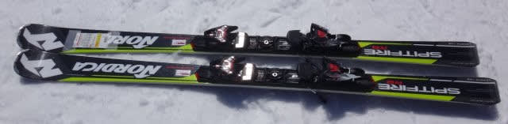
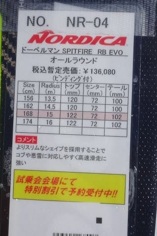
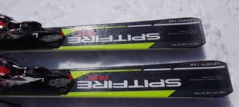

# 2018シーズンモデル，スキー試乗レポート第10回…NORDICA編

📅 投稿日時: 2017-05-19 02:05:23

今週末，20，21日とも．

すごい気温が上がって，

夏スキーのような陽気になりそうで．

…雪が一気に解けてしまいそうな気配を

感じている今日この頃．

みなさまいかがお過ごしでしょうか．

えー．

本日も，スキー試乗レポートです．

今日は1機種のみ，ノルディカ編です．

では，どうぞ～！

----

○NORDICA Dobermann SPITFIRE RB EVO 168cm

基礎オールラウンド

長さ168cmでも，サイドカーブがR=15ということで，

小回りでも大回りでもない，

両方の中間を狙った，

まさにオールラウンドといった感じの板．

滑ってみると，結構なカービングマシンで．

どっしり感があり，かなり張りの強い板．

トップからテールまで，エッジの全長がしっかり

効いている感じ．

エッジががっつり効いて，スピード耐性も

強く，

たわみ止まり感があり，

荒れた斜面での安定感もあります．

板を抑えるポジションはセンターからトップ寄りで．

谷回りで板のトゥピースより前をたわませていく

感じで乗っていくと，

すっと縦に落ちていく谷回りに入っていけます．

山回りでテールに乗ると，切れ上がっていく．

トップ⇒テールと前後動きを使う板かな？

張りがあるので，かなりのスピードを出しても

板が窒息したり，グリップを失うような弱さはなく，

かなりスピードを出して縦に落としていくと

面白い板でした．
