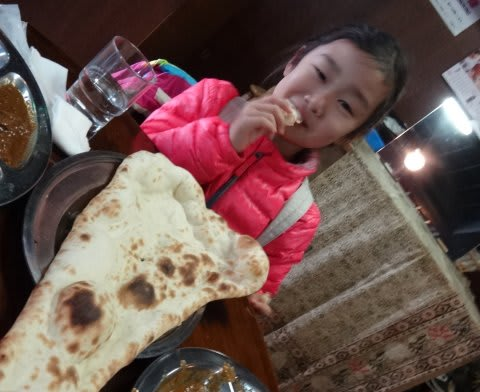
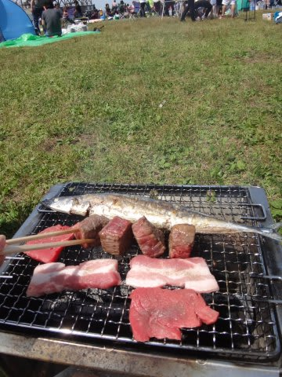
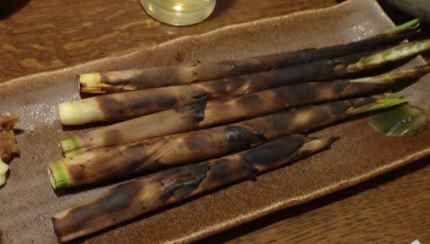
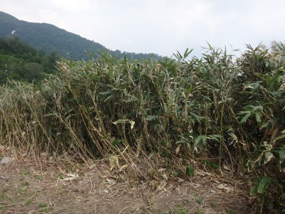
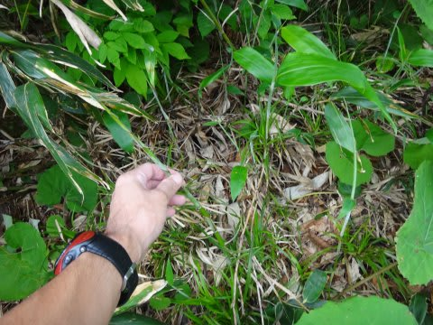
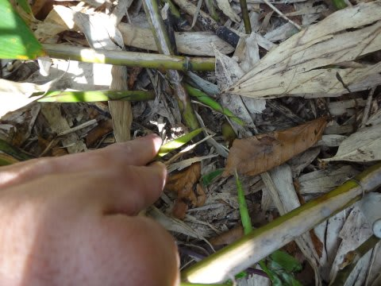
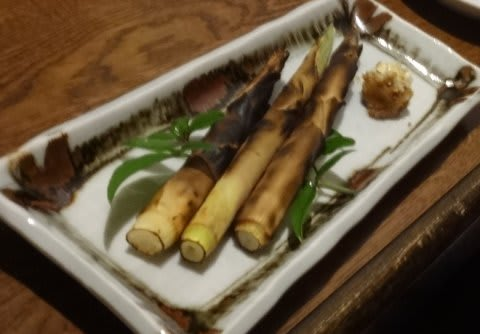
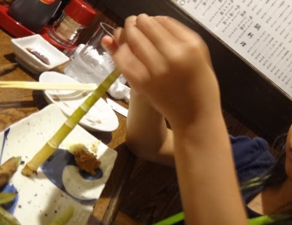

# うちの娘…かなり食べ物の趣味がおかしいのだが

📅 投稿日時: 2015-06-20 02:35:37

えー．

甘いものが大好きで，ケーキを何個でも

食べてしまう父親に似ず．

ケーキやジュースがそれほど好きじゃなく．

…ケーキバイキングでも，[カレーばかり食べる](e44589e80c529cb933f9dd83722343d1e.md)ようなわが娘ですが．

…そう．

志賀高原の一の瀬で，割と有名なネパールカレーのお店「かもしか」．

大人でも辛いと感じる，ここの本格的カレーが好きだったり．

そのほかにも．

バーベキューに行くと，肉よりサンマを焼いてほしがるとか．

＃娘用にサンマが焼かれているので，BBQとちょっと違った

＃雰囲気になっている…

スーパーで金目鯛の刺身を見つけると．

「買って，買って，買って～！！」と目の色を変えて

食べたがるとか．

…こんな感じで，なかなか渋い

食べ物の嗜好をもっているのだけど．

こんな娘の大々大好物に．

「根曲り竹」

という．

それはそれは，子供があまり好まないようなものが

大好きなんですね…

それこそ，あればあるだけ食べちゃいます．

3人前や4人前，ひたすら筍ばっかり食べちゃうんです．

…まぁ，確かに．

根曲り竹，おいしいですけど．

…普通は子供の味覚に合わないと思う…

で．

今回，私が月山で滑っている間．

娘はそのあたりを散歩していたわけですが．

そう．

この時期の月山の近辺．

こういう普通の笹のやぶを探すと…

あるんですね．

筍が…

根曲り竹というのは，こーゆーゲレンデ脇になんぼでも

生えてるようなクマザサの筍なわけで．

…これを見つけてしまった娘．

「筍，食べたい食べたい食べたい～っ！！！！」

…見たところ，ちょっと細すぎて，ちょうどいい感じの筍もなく．

まぁ，こんなところで筍採っていくのも何かな～，

と思ったんだけど．

…娘の「筍食べたい食べたい～っ！」という欲求を満たすため．

月山を降りた料理屋に寄り，月山筍の若竹焼を頼む羽目に…

大喜びでバクバク食べ続ける娘．

…一皿じゃ足りず，二皿，一人だけで全部食べちゃいました…（涙）

＃結構高いのに…

食べ物に関し，こんな渋い趣味になるなんて．

…なにか育て方が間違ってたのかも…

## 💬 コメント一覧

### 💬 コメント by (Goku)
**タイトル**: Unknown
**投稿日**: 2015-06-20 08:14:05

そうそう、こんな竹藪の中をズンズン入って行くと採れますよ～

月山では焼き筍で食べるのが一般的なんですか？

信州のように『サバ缶』入れたタケノコ汁ってのはないのかな～？

### 💬 コメント by (マルハバ)
**タイトル**: Unknown
**投稿日**: 2015-06-20 09:40:10

＞有名なネパールカレーのお店「かもしか」

知らなかったなぁ・・

名前が他人とは思えないんで

来年はＯＢ連中を誘って行ってみようと思います♪

それにしても

肉と一緒に焼かれるサンマには笑えます！（爆）

### 💬 コメント by (Skier_S)
**タイトル**: 筍
**投稿日**: 2015-06-20 21:47:12

＞Gokuさま

おそらく，サバ缶＆味噌で合わせる竹の子汁は

信州独特だと思ってます…

信州以外だと，ゆで筍か焼き筍が普通ですね～．

でも，私も信州のサバ缶竹の子汁大好きで，

どれだけでも食べられますけど（笑）．

＞マルハバさま

ネパールカレー「かもしか」，

カレーバイキングで食べ放題なので，

お値段ちょいと高めですが，

目の前のタンドーリで焼いてくれたナンを

好きなだけ食べられるので，なかなか

リーズナブルかと…

http://tabelog.com/nagano/A2001/A200104/20001724/

私は志賀に行くと，かなりの確率でお昼はここです．

＃娘がいると，確実に土日どちらかはお昼はここ

そうそう，BBQのさいには，ぜひサンマを…

炭火のサンマはすごいおいしいですよ！

### 💬 コメント by (ひろりん)
**タイトル**: Unknown
**投稿日**: 2015-06-22 17:46:37

お久しぶりです♪

今期は1ヶ月飯山に滞在してました。

来期も長期滞在できたらなと。

娘さん、しぶいっすねｗｗｗ

普通味覚が変わって子供の頃食べられなかったものが、突如好物になるはずだけど・・・

すでに、オカシなことになってるようなｗｗ

普通BBQでサンマ焼かないよｗ

かもしか！

私も常連ですよ。ナン、巨大だけど旨いっすね。

値上げ以降、カレーの種類が減ったと思うけど。。。

店員さん、目つきがヤバイと思うｗ

や、ヤラれるってｗｗ

最近、志賀行ったらカモシカか東館のゴンドラ降り場の上か、タカマかぁ・・・

カモシカ、場所の説明が、

一の瀬にあるホテルジャパン1階のネパールカレーの店、かもしか。

ほぼ100%「意味がよくわからない」と聞き返されるｗ

国籍が不明とか、なんでかもしかなんだよとか。

### 💬 コメント by (Skier_S)
**タイトル**: ひろりんさま
**投稿日**: 2015-06-23 02:24:45

お久しぶりです！

飯山一か月滞在って…

うらやましすぎます．

斑尾メインでしょうか？？

で，「かもしか」の常連さんだったんですね．

我が家も，家族で志賀に行ったら，土日の

どちらかに必ず行きます．

あの巨大ナンはおいしいですよね～．

子連れの常連は珍しいらしく，いつもすごい

大歓迎してくれます．

娘を連れて行くと，店員さんみんな

「またきたね～！」ってかんじで，

いろいろ娘に大サービスしてくれます…

しかし．

確かに．

