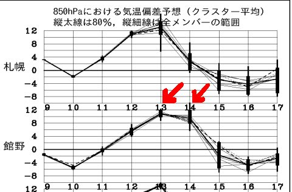
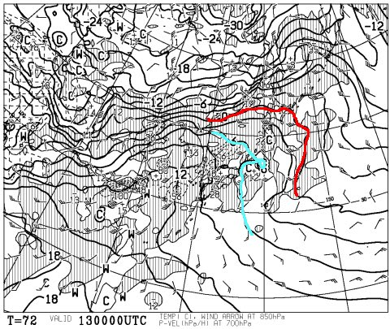
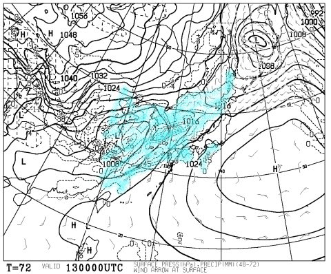
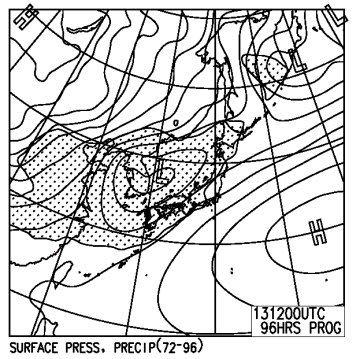
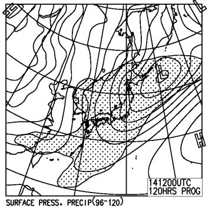

# なんと！明日から4日間志賀高原！…土曜は天気改善の兆し！

📅 投稿日時: 2016-02-10 22:24:27

そうなんですよ．

ええ．そうなんです．

なんと．

金曜日に，休みが取れたんですよっ！！！

4連休ですっ！！！

…なので．

私は4日間，焼額をグルグルしてる予定です（笑）．

…とりあえず，昨日から今日にかけて，かなり雪が積もったようで…

焼額も[一晩で50cm以上積もった](https://www.facebook.com/yakebitaiyama/photos/a.133097176785637.26773.116999658395389/933564106738936/?type=3)らしく．

そして，今晩も，まだチラチラと雪が降っているようで．

明日の朝は，-10℃近い冷え込みで，かつ晴れそうなので．

おそらく．

間違いなく今シーズン最高の朝になるのでは？？

柔らかい極上圧雪バーンをいただけるはずっ！！！！！

コース脇は，結構なパフパフが残ってるのでは？？

そして，終日晴れるので…

かなり楽しい一日になりそう！！

明後日の金曜は，ちょっと気温が上がりそうだけど…

ってか，暑くなるくらいで，

雪はちょっと重くなるかもしれないけど．

まぁ，一日晴れそうで．

そこそこのスキー日和かな？？

で．

それで，だ．

問題の，土曜日なわけだが…

渾身のハイパー冷え冷え踊りの効果や，如何に？？？

…

…

だ，ダメだ…

やっぱり，まだ，平年比+12℃近い予想のまま…（激泣）．

…土曜朝9時の850hpa気温図を見ると

やはり，+6℃線が志賀高原に…

これは，やっぱり昼間は+10℃近くにまで気温が

上がっちゃいそう…（涙）．

しかし．

しかし，だ．

土曜朝9時までの12時間の降水域を見てみると…

あれ？

まだ志賀高原に届いていないな…

そして．

土曜夜9時の降水域を見ると…

をををっ！！！

土曜夜9時になっても，降水域の網掛けが

志賀高原にまで届いていないっ！！

これは…

このままの天気図なら．

土曜の気温は高いままだけど，

夜9時までは降らずに済みます！！！

土曜の雨は，回避できそうですっ！！！

上手くいけば，土曜は午前中，晴れ間も覗くタイミングがあるかもっ！？？

…だけど．

日曜の地上天気図を見てみると．

降水域は，見事に日本全体を覆っているので…

うーーーむ．

今のままの天気図なら，

日曜は朝から雨です（涙）．

おそらく，昼頃までは雨．

午後，どこかのタイミングで雪になりますが…

そのタイミングはまだ未定．

早ければ昼，遅ければ夕方かな…

ってことで．

日曜はまだダメっぽいけど．

皆さんの踊りの効果か．

土曜は雨が降らなさそうな予想に変わり．

土日ともに雨，という最悪の状況は避けられそうな感じに

なってきました～っ！！

あとは．

日曜も，雨じゃなく雪になるように．

そうです．

まだ，気を抜くことなく．

雪になれなれ踊りを踊り続けるのですっ！！！←なんだか，踊りが変わってないか？

## 💬 コメント一覧

### 💬 コメント by (Goku)
**タイトル**: 踊ります
**投稿日**: 2016-02-10 22:47:47

雪になれなれ踊り

踊ります・・・朝まで踊り続けます（笑）

滑走中は

雪になれなれ滑りをしてみます。

### 💬 コメント by (aqura)
**タイトル**: 日帰りスキー
**投稿日**: 2016-02-11 12:10:01

木曜日、日帰りスキーにやって来ました。いやー、いい天気ですねぇ…、ちょっと、雪がゆるいけど…U+1F612

土日、来たいけどU+3030(-。-;)

雪降れ踊りを踊らないと…(^_^;)))

### 💬 コメント by (Skier_S)
**タイトル**: 今日は晴天の一日！
**投稿日**: 2016-02-11 20:26:34

＞Gokuさま

今日は一瞬しかお会いできませんでしたね…

でも，最高の一日でしたね！

こんな日が毎日続けばいいのに…

この土日は…（涙）

踊ってください！

雪になれなれ踊り，いっぱい踊ってください！

＞aquraさま

いやーーー．

今日は最高の天気でしたよね～！！

土日まで，この状態が続いてほしいのですが…

とりあえず，雪降れ踊りお願いします！！

