# 2018年8月，子連れ座間味で小5の娘とファンダイビング！その5…座間味のダイビング1本目はサンゴのきれいなポイント！

📅 投稿日時: 2019-09-05 01:38:11

先週，ヤマ場を乗り越えて，

さらに週末にも，睡眠時間を削って

原稿を書き上げたので．

今週は，少しは楽になるのかな…

と，思っていたら．

今週もいろいろ切羽詰まってます！

きわどい感じです！

Amazfit GTRを買ったおかげで，

自分の睡眠時間が後で振り返れる

ようになったわけですが…

振り返ってみると，この一週間，

すごい睡眠時間が並んでいます…（涙）

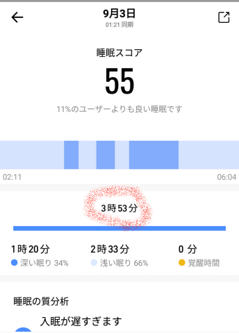

毎日こんな感じの時間が並んでいて．

ヤバさが数字としてはっきり

見えるようになったので．

我ながら「大丈夫か？」という

気になってきました（泣）．

明日も朝，早くに会社に行かなくては

ならなくなったので…

ヤバい．

モアルボアルから帰って来てから，

ヤバい．

今週末こそ，ゆっくり寝たい．

そろそろ寝ないとヤバい感じ…

でも．今週末も，ゆっくりできるのかどうか

きわどそうな感じ…！！（涙）

ってな近況を書いたところで．

今日も座間味ダイビング旅行記です！←いや，だったらこんなBlog書いてないで早く寝ようよ

--

ということで．

ボートは座間味のダイビング1本目の

ポイントに到着しますが…

いや，きれいな海！！

…とても今日，座間味に渡れるかどうか

ギリギリの海況だったとは信じられない…

…そして日差しもバッチリで，

水中も明るくて，水中写真がきれいに

撮れそうな感じ…！

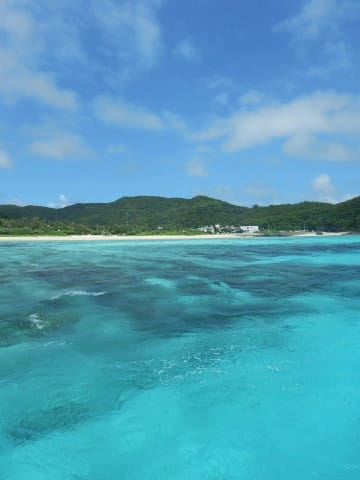

ってことで．

ブリーフィングを受けたら．

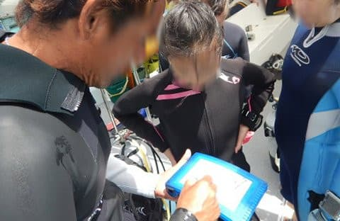

座間味の海へ，エントリー！

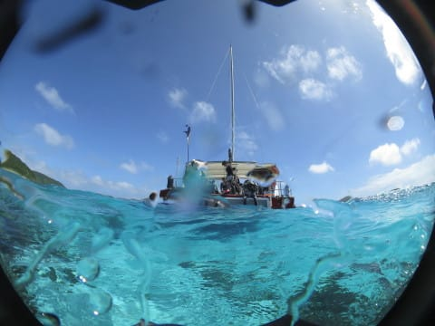

モアルボアルに続き，

今回も我が家で1チーム．

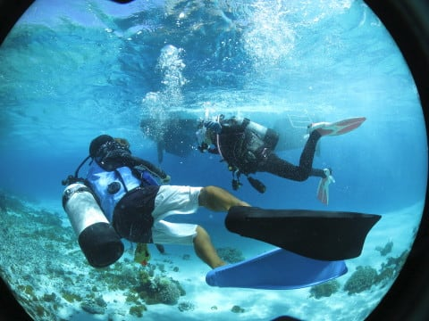

…まぁ，最大深度12mの制限がある

娘と潜るので，別チームにならざるを

えないのですが．

今回も，家族でガイド1名貸し切り

というゼイタク！

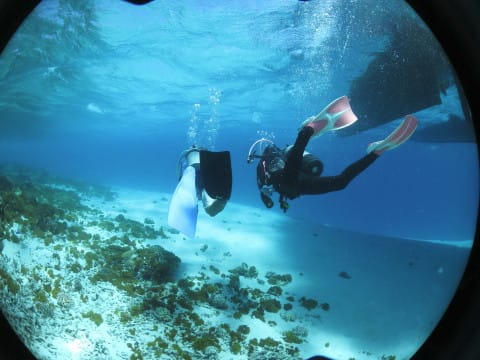

そして…

ホントに天気が良くて，日が射して

水中も明るいし．

透明度もいいし…

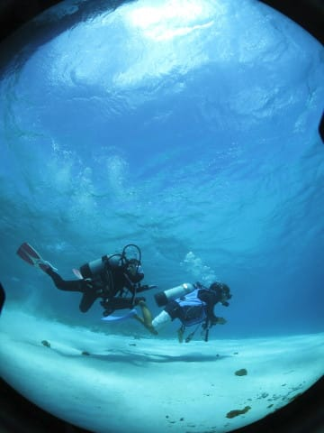

熱帯低気圧の影響はなく，

超快適なダイビング日和じゃないですか！

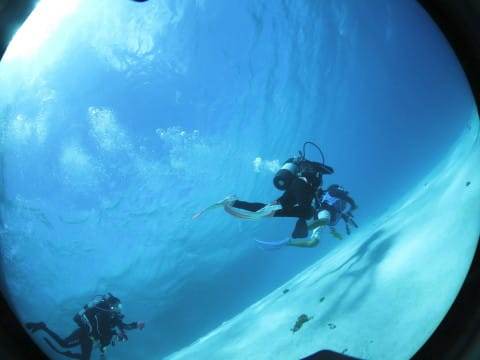

…娘も嬉しいのか．

謎のポーズを取ってます…

そんな，穏やかな海を進んで行くと…

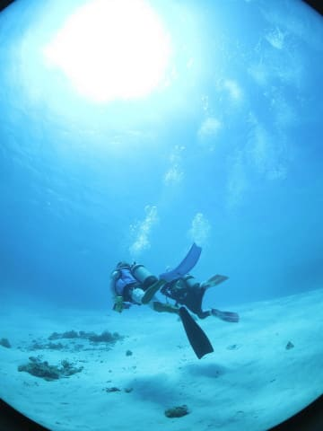

デバスズメダイがいっぱいいる，

小さなエダサンゴに近づいて…

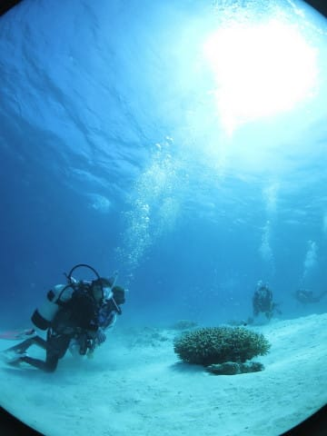

デバスズメを驚かすと，ミドリイシの

枝にサッと隠れるのが面白いらしく．

遊んでますね…

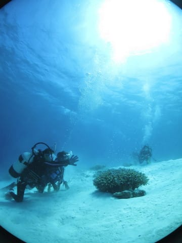

…遊ばれているデバスズメさん

たちが，ちょっとかわいそうな

感じもしますが…

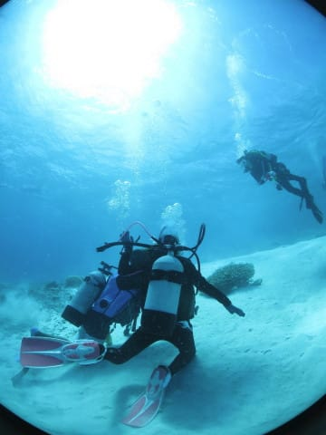

でも．

娘はデバスズメダイが好きらしく．

この前で結構粘ってました…

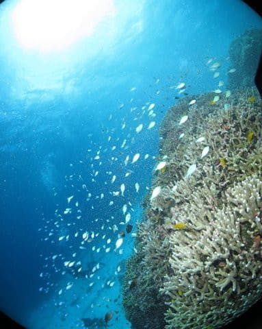

そのあとは．

きれいなエダサンゴの上を漂って．

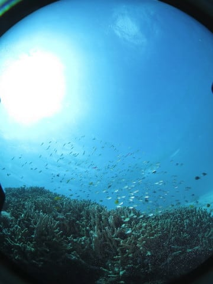

サンゴに戯れる魚たちを

見て，癒されます…

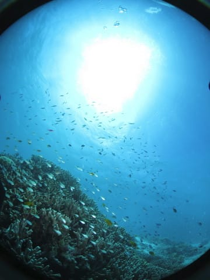

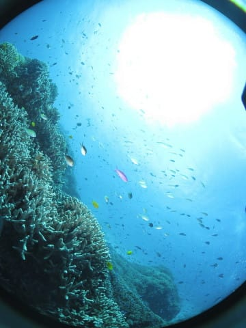

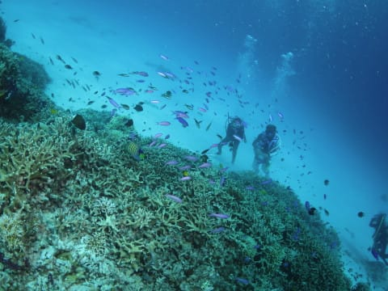

あとは，なぜかカスミアジが

ずっと着いている，この根．

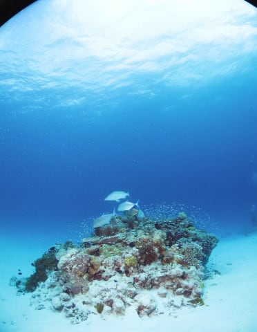

目の前まで近づいても，

カスミアジはダイバーを気にしないかの

如く，根の周りをグルグルし続け…

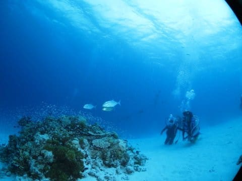

一旦，根から離れたかな？？

と思ったら…

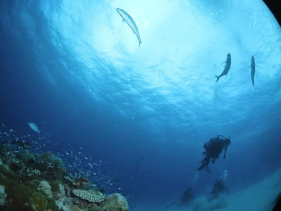

また，ぐるっと回って

根の上に戻ってくるという…

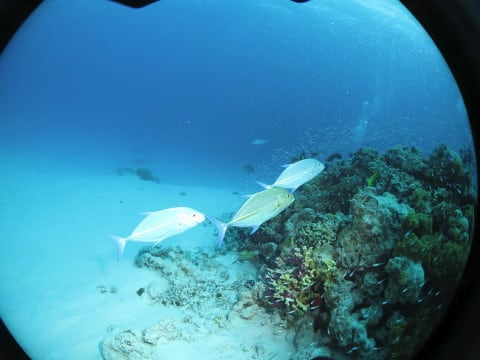

特に捕食をしてるでも無し．

…なぜかわからないけど，

この根が気に入ってるんでしょうね…

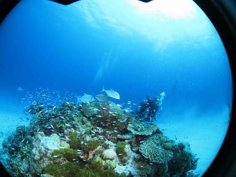

ってな感じで．

ボートのそばの砂地まで戻ってきましたが…

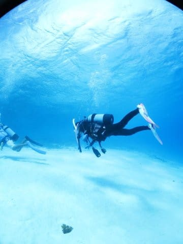

底の砂が，どんな感じなのか試したかったのか，

いきなり砂地にタッチするわが娘…

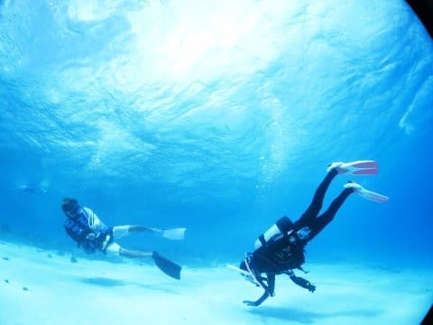

そして，何事もなかったかのように，

元に戻って進んで行きますが．

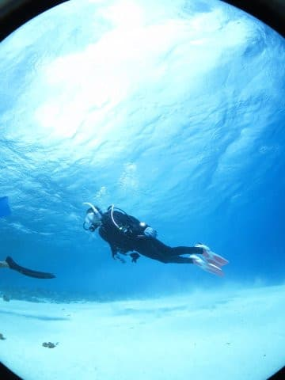

また，親バカと言われそうだけど．

…これだけの砂地で，海底にそっと

タッチして．

それほど砂を巻き上げずに

元に戻れるってのは．

娘のダイビングスキルは，やっぱり

そこそこのレベルに達してると思う…

ってな感じで．

座間味1本目のダイビングは

終了！

外海が荒れているとはみじんも

思わせない，座間味らしい穏やかな

癒しの海で．

癒し効果たっぷりの，ヒーリングダイブ

だったのでした…

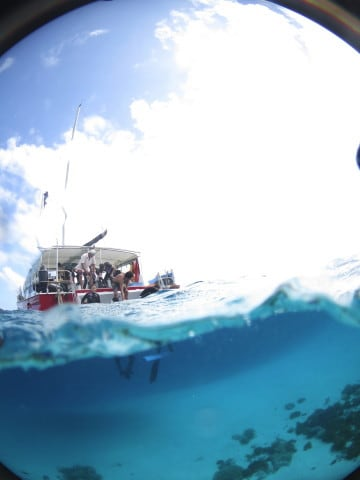

…でも，このダイブの水中写真．

娘と一緒にファンダイブできる喜びで．

娘が写ってる写真ばっかりだった

気が…（笑）．

## 💬 コメント一覧

### 💬 コメント by (マルハバ)
**タイトル**: デバスズメダイがいっぱいいるエダサンゴ・・
**投稿日**: 2019-09-06 07:28:40

これ「ダイビングの原風景」みたいに感じます。

大物を求めていろいろな海に潜り

その目標が全て達成されると、ふと

初めての体験ダイビングで見た

あのキラキラとした風景が恋しくなりました。

### 💬 コメント by (Skier_S)
**タイトル**: ＞マルハバさま
**投稿日**: 2019-09-07 01:43:36

そうなんですよ…

やっぱり，光が良く当たる深さ3~5m程度の浅瀬で，

キラキラ輝く光に照らされているエダサンゴに群れる

デバスズメダイ…

っていう，「いかにもトロピカル！」っていう海が

好きです．

年間本数が増えていくと，だんだんマニアックになっていきますが，

今の年間せいぜい20本程度だと，のんびり癒しの

海が一番いいです…

