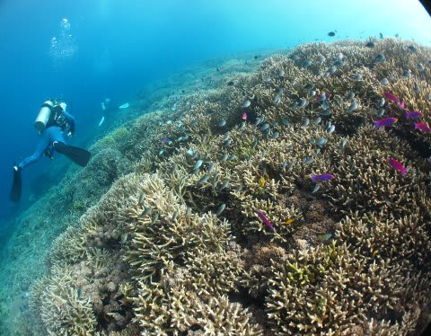

# 私が使ってる水中カメラ

📅 投稿日時: 2011-10-14 00:23:26

🏷️ カテゴリ: [ダイビング日記](ce3a7a8d424d112fce83ee85c81a0e344.md)

と言う感じで．

長きに渡ったコモドダイブクルーズ旅行記がようやく終わったわけですが．

ダイビングレポートなので，いっぱい水中写真が乗ってるわけですけど．

「いったいどんなカメラで撮ってるのん？」と，

気になる人もいると思うので．

＃ホントにそんな人いるんか？？

ちと，水中カメラのお話をば．

私が使っているのは，CanonのS90.

2万6000円程度で売っていた，きわめてフツーなありきたりのコンパクト

カメラです．

このカメラを，こういうCanon純正の水中ハウジングに入れて…

さらに…

こんな感じで，アームに外付けフラッシュをつけてます．

フラッシュは昔なつかしのINON D-180．

S－TTLではない，外光オートのストロボですね．

で．

このアームの真ん中辺りにくっついてるの．

実は．これがミソです．

INONのフィッシュアイ，UFL-165AD.

こいつをこんな感じで，本体に取り付けます．

このドームレンズ．

広角35mm換算のレンズにまでしかつけられず．

広角28mm換算のS90には公式には対応していないことになっているんですが．

物理的にはくっつけられます．

このレンズをつけて，普通に撮ると

こんな風にケラレるので…

ちょっとトリミング（クロップ)してやると．

こんな感じで普通に使えます…

レポートの途中で使ったこの写真も…

もとはこんな感じでした．

普通のワイコンでは画角が足りないなぁ…って思うとき．

このドームレンズが役に立ちます．

ただ…

…このレンズの欠点は．

プラスチックドームなので，ゴーストが異常に出るって

ことですね～

逆光位置にするとつらいです．

この左下，かなり派手なゴーストが出てます…

こいつにも，画面下の方に，レンズの内面反射が出てますね．

無反射コートがしっかり効いたガラスレンズだと出ない現象ですが…

しかし，ゴーストが出ないように注意すれば．

結構使えます．

っていうか，フィッシュアイの画角に慣れたら，フィッシュアイなしの

カメラには戻れません…

とりあえず．

全国のS90+DC-35ユーザーの皆さん．

S90には対応していない，フィッシュアイレンズのUFL-165AD.

問題なくS90で使えてますよ～！！
