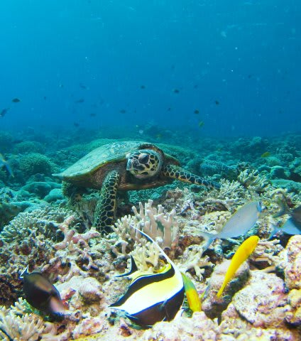

# 子連れで座間味に行ってみた　その4

📅 投稿日時: 2011-08-11 20:34:13

というわけで．

昨年のコモドクルーズ以来のダイビング！

ボートの一番後ろから，ジャイアントストライドでのエントリー．

…

無事．

フィンも履き忘れず，レギュをくわえ忘れることも無く，

バルブも開け忘れず．

無事，9ヶ月ぶりの海に潜ることができました．

カメラも，先日，久しぶりにいろんな操作をやって記憶を戻しておいたので．

何とか，それほど違和感無く操作できます．

今回のポイントは，大きなエダサンゴの群落が見所．

いやー．慶良間のサンゴは元気ですなー

フレンドリーなタイマイもいましたね～

しかし．

この1本．

どうやら，太陽光が強く，絞り優先モードでシャッタースピード警告が

出てしまったため，ついつい絞りすぎたのが効いたか．

ちょっとフラッシュが回ってない写真になっちゃった…

うーん．

大体，1本目は露出失敗するんだよな…

残念．

しかし．

今回．

昨年気づいた，とある技を試してみたんです．

それは…

「私が使っている，外光オートの外付けフラッシュS180にとって，

内蔵フラッシュって外付けフラッシュを光らせるタイミングを

伝えるだけのものだから…

マニュアルでフラッシュ光量調整できるS90なら，カメラのフラッシュ光量を最小にしとけば，フラッシュチャージ時間待たなくていいから連続撮影時の待ち時間が早いのでは？」

と言うやつ．

で．実験してみたわけですが．

これは成功でしたね．

1枚とって，次の1枚がレリーズできるまでのラグが圧倒的に

短くなりました．

時間にして1秒以下．

これは，ストレスが少なくていいですね～．

(ガラスハゼと卵)

って感じで．

相変わらず，1本目はオキナワの海を楽しむというより，

カメラの調子をつかむのに必死な1本となりましたが．

久しぶりの南の海に感動してエグジット．

娘はすでに泳ぎ終わっていたらしく，船の上でくつろいでました．

ポイントからは，5分ほどで港へ戻ります．

港から宿まで近いので，ウェットを着たまま戻れるのが気楽で

いいですな～．

宿へ戻って，シャワーを浴びたら…

しばらくお散歩．

娘よ…

見つけた猫の尻尾をつかんだらいかんぞ．

お散歩の後は，夕食タイム．

ペンション星砂は，夕食がおいしいというお勧めで選んだ宿．

お勧めの通り，沖縄料理が中心となった夕食は，おいしかったですな～．

今回．

3歳の娘は夕食なしでお願いしていたけど．

夕食の量が多いので，娘は取り分けて食べれば十分でした．

＃でも，夕食なしだったのに，デザートとかお吸い物とかは

＃ちゃんとつけてくれました…子供にはいろいろ優しく

＃してもらえて，感謝．

まだ，風邪が本格的に治っていないので．

夕食後は，早々に寝てしまいました…

＃風邪なのに潜ったらいかんだろ～
