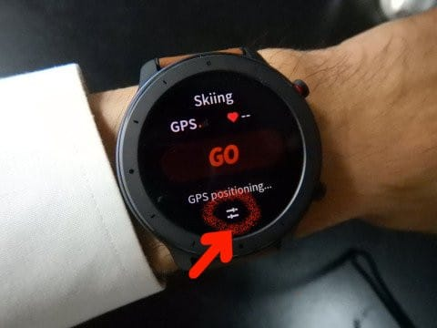

# Amazfit GTRスキーモード，AutoPauseの設定があったよ…そして，11月は冷えるのか？1か月予想図を見てみた

📅 投稿日時: 2019-11-01 00:23:31

🏷️ カテゴリ: [PC,カメラ&小物](c0d8caed13e597efe97b661a8ae56bed0.md)

えー．

昨日，一昨日と書いてきた，Amazefit GTRの

スキーモードの記事ですが．

自動的にPauseしてしまい，

ゆっくり動いていると記録に残らない…

と書きましたが．

自動的にPauseしないというコメントも

いただいたので，

「もしかすると，PauseのOn/Off

　設定があるのかな？」

と，アプリやら本体やらをいろいろ

見てみたところ…

時計本体の，Workoutメニューから

Skiingを選んだ際に…

表示される，このスタート画面，

スタート画面の下にある，

この部分．

この部分をタップすると，スキーモードの

設定メニューに入ることができて．

この中に，Auto pauseの設定がありました！

どうやら，このAuto pauseがEnableに

なっていたから，自動的にポーズに

入っちゃったみたいです．

これが分かれば，問題解決．

Auto pauseをTurn offに設定すれば．

自動的に止まらなくなるはずなので．

土曜日のYetiにて，自動ポーズが入らない

場合にどうなるか，改めて確認

してきます～！

ということで．

Auto pauseをoffにできれば，

不満の一つは解決するので．

昨日，一昨日の記事は一部

書き換えました…

…デフォルトでこの機能がONだったのか

OFFだったのか，いまいち記憶が定かで

無いですが．買ったばかりの時に

嬉しがっていろいろ触って，

ここの設定を変えてしまったのかも…

ということで．

Auto pauseをoffにしたらもう少し精度が

上がるのか．

スマホとの連携バグが解消するのか．

明後日の土曜日の結果をお楽しみに…！

…ってことで．

本題へ．

えー．

早くも，明日から11月です！

…もう，本格的なスキーシーズンが

やってくる，11月ですよ！！！

…ってことで．

恒例，一か月予想図を読み解いて，

この11月が冷えるのかどうかを

見てみました…

まずは，FZCX14を見てみますが．

11月の第1週，

11月2日～8日までの850hpa気温図を見てみると．

こんな感じで，赤く印した0℃線．

まだまだ津軽海峡付近で，

11月8日までは，雪が降るどころか，

気温が高くて人工降雪機も

全く動かせなさそうな感じです…（泣）

そもそも．

水色の，平年比+1℃の線が志賀高原に

近づいているので．

11月8日までは，平年より暖かい日が

続きそうです…（涙）

で．

次は，11月の第2週，

11月9日～15日を見てみますが．

うーむ．

まだ，赤で記した0℃線は東北近辺．

まだまだ雪が積もるには気温が高い

感じですが．

平年より気温が低い部分を示す

網掛けが本州にかかっていて，

0℃線はかなり日本海側に近いづいてるので．

夜中には冷えて，標高が高いところは，

夜中に人工雪が打てるように

なってくるかも…

そして．11月15日～29日を見てみると．

をを！

0℃線が志賀高原にかかってきました！！

これは…

11月下旬は冷えそう！

スキー場もかなり雪が降ってくれそうな

気温になりそうです…

FZCX12から，1か月の850hpa気温傾向を

見てみると．

こんな感じで，水色で囲った10月中は

平年比2～3℃高い，異常に気温が高い

日がずっと続いたことが分かりますが．

赤矢印で記した，11月10日以降は

平年より気温が低くなることが

予想されてます！！

いやーー．

10月があったかかった分，

11月下旬になると，その反動の

ように冷えてくれそう…っ！！！

ってなことで．

この11月下旬は．

この予想が正しければ．

スキー場のオープン遅れはそれほど起きず．

大体予想通りオープンしてくれて．

それも，11月下旬は例年より

比較的いいコンディションに

なりそうな感じ…！！

去年のアサマ2000やかぐら，

志賀高原のオープニングは悲惨だったけど．

今年はいいシーズンスタートに

なることに期待…っ！！

## 💬 コメント一覧

### 💬 コメント by (プチ)
**タイトル**: Unknown
**投稿日**: 2019-11-01 11:23:21

Sさんよかったですね〜

Pause機能が意図的にOFFにできるのならそれに越したことはないですね。これからもamazfit GTA関連記事、スキー記事ともに楽しみに待っております。

### 💬 コメント by (Skier_S)
**タイトル**: ＞プチさま
**投稿日**: 2019-11-02 00:22:44

とりあえず，明日はAuto pauseをOFFにして試してきます～！

レポートお待ちください…

