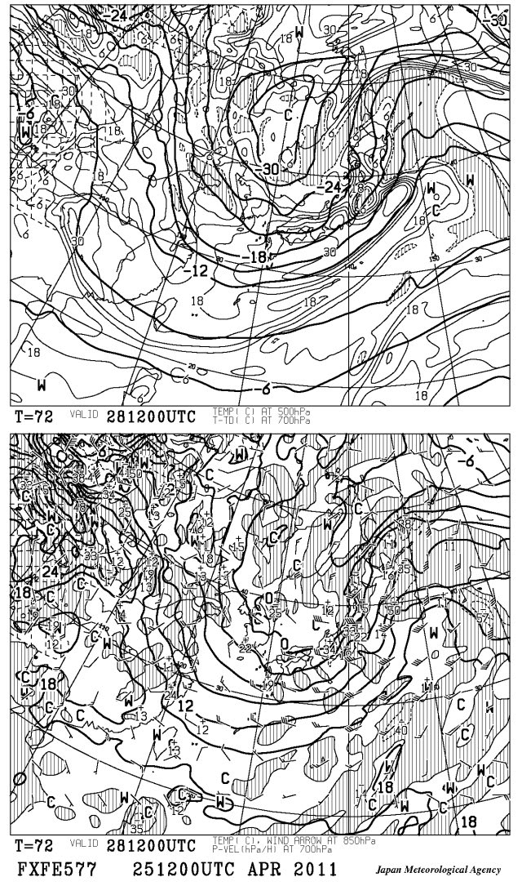
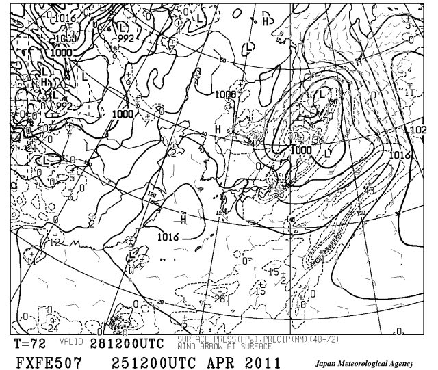
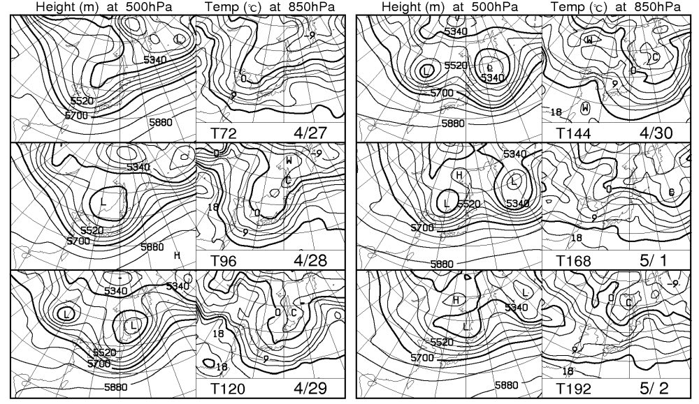

# 信じられないけどこのまま行くと…28日夜から雪？？

📅 投稿日時: 2011-04-26 01:21:46

🏷️ カテゴリ: [スキー天気予想](c6554f5c3c106093b511a8daae23757e8.md)

28日夜から，29日にかけて．

また，志賀高原は雪になりそうな気配．

GW初日は，新雪が積もってそこそこ冷え込み，

信じられないGoodコンディションになりそう．

…

この，28日夜9時の天気図ですが．

上の500hpa気温．

また，マイナス30度の寒気がやってきてるんですが…

下の850hpa気温では，0度線が信州にかかってます．

これは，志賀高原で雪になる目安です．

んで．

こんな感じで，降水域も日本全国に広がっています…

降り始めは強い南風が吹き込んで，荒れ気味の雨天かもしれませんが，

夜遅くは雪になりそう．

ここには載せてませんが，28日のスプレッドは

0.28という非常に小さい値なので，この日の天気は

予想からずれることは少なそうです．

かなり高い確率で，雪になります．

しかし．

この1週間の500hpa図と850hpa気温ですが…

28，29日は，もうすぐ5月と思えないですね．

0度線が本土にかかっているなんて…．

ただ．1日と2日は，気温がぐぐっとあがりそう．

んで，雨です．

すごいあったかい雨で，雪が一気に溶けそう…

まぁ，これから1週間で，今後の予報は変わると思いますので，

1日以降の天気が良くなることを期待しましょう．
