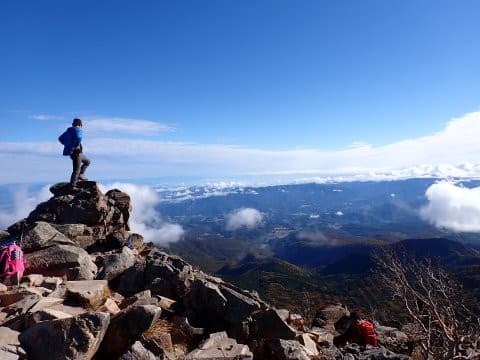
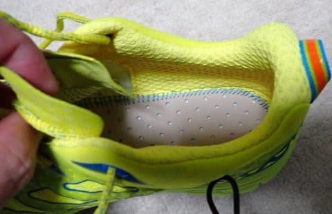

# 今日はテクニカのトレランシューズのテストのために山へ行ってみた

📅 投稿日時: 2022-10-16 00:07:57

ってなことで．

このBlog.

徒然スキーヤー日記

と名乗っておきながら．

徒然ドライバー日記や，

徒然ダイバー日記になることが多かった

このBlogですが．

最近では完全に，

徒然山ハイカー日記

になりつつある今日この頃，

皆様いかがお過ごしでしょうか（時候の挨拶）

ってなことで．

先日．HOKAの靴が破壊してしまいどうしようかと

悩んでいたところ．

ついつい激安につられ買ってしまった，

TECNICAのトレッキングシューズ．

来週からはYetiが始まって，私の撮っては

山歩きどころじゃなくなるので．

こいつに初期不良が無いか，急ぎ使ってみないと…

ということで．

私にとっては，今年ラストの山登りのチャンス

となるこの週末．

土曜の方が天気が良さそうだったので…

本日，ちょっと山に行ってきました～！

って．

このBlog読者なら．

昨日，深夜1時近くにBlogが更新されて

いたのをご存知かと思いますが．

夜中の1時半から，わずか1時間半だけ寝ての

出発です…（涙）

で．今日行ってきたのは，

こんな感じの山ですが…

全く新しい靴のテストなので．

ヘビーで一本道のロングコースとなる

ような山は避けて，

靴が合わずに痛くなったりしたら

途中でいろいろルートを変えて戻る

こともできて．

逆に調子がよければ，いろんなところに

足を伸ばせる山にしました…

朝のうちは天気も良く．

登ってくる途中の視界は最高！

朝のうち，高速道路を走っているときは

雨が降っていたので，どうなることかと

思ったけど…

最初の山のてっぺんからの景色は

文句なしでした！！

足が致命的に痛くなるようなことは

なかったので，その後もいろいろ

トコトコ歩いて．

紅葉を見に行ったりもしましたが…

今年は紅葉が遅めなのか．

いつもは10月第1週くらいがピークなのに，

今日がちょうど見ごろくらいでした！

…って．

今日は山のレポートじゃなかったんだった．

今回はTECNICAのトレッキングシューズ

デビュー戦のレポートをしないと…

このTECNICAのシューズ．

HOKAのシューズと比べると．

やっぱりソールが硬く感じる…

ってか，このTECNICAのシューズも

インソール部のクッションは柔らかめ

なのですが．

HOKAがおかしいくらいに柔らかいので，

それに慣れちゃうと…硬く感じる！

膝や足裏に来る衝撃が，HOKAに比べ

強いので，下りでHOKAほど攻められない…

そして．

ソールはどちらもビブラムメガグリップ

ですが．

HOKAの方が滑らない！

TECNICAのシューズは，乾いた岩場では

すごいグリップ力を発揮しますが．

やはりソールのラグが浅いのが効いてるのか．

泥や砂では滑るし…

さらに，濡れた岩や木の根っこでは

HOKAに比べるとかなり滑ります（涙）

いや．

HOKAのシューズ，ソールがかなり柔らかく，

岩や木の凸凹の形に合わせ凹んでくれるので，

それでガッツリグリップしてたんだな…

というのが分かりました．

TECNICAのシューズは，ソールは

かなり硬いプレート状で，その上に

柔らかいインソールクッションが

載ってる感じなので．

インソール側は柔らかいけど．

ソール側は岩や木の凸凹に合わせて

凹むことは無く．

尖った岩や木の根っこでは点接触になり，

グリップがあまり効かない感じ…

フラットなコースではいいんですが．

こんな感じで，苔むして濡れた岩場や

木の根っこがあちこちに

あるようなコースでは，やっぱり

HOKAの方が安心して走れたな…

うーん．

TECNICAのシューズは，雨が多くて

湿った感じの，日本の本格的な

山歩きには向かないかも…

ただ，本格的な山では厳しいかも

しれないけど．

シッカリ踏まれた平らな土みたいな

登山道では，かなり自然に足が出て，

軽さや足首の動かしやすさもあって，

かなりのハイペースで歩けたし（というか，走れたし）

それほど急斜面がなくて，ゴロゴロ岩場も

ない低山とか，よく整備された丹沢みたいな

所で使うには良さそうなので，

こいつは，そういう所で使うシューズに

しようかな…

となると．

やっぱり，本格的な山にいく靴は

別に必要ということだな…

そう考えると…惜しい．

HOKAのSpeedgoat Mid GTX．

良い靴だったのに…

耐久性が…（涙）

でも．

この靴も，出発した時は新品のピカピカ

だったけど．

一回使っただけでこんなになっちゃった…

この靴も，こうやって数回酷使されたら．

私から放射される電磁波で

すぐダメになっちゃうのかも…
