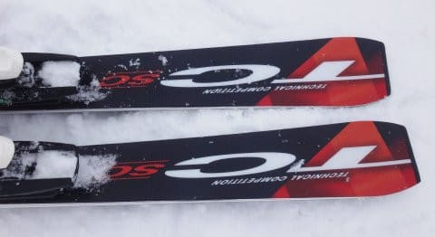

# 2018シーズンモデル，スキー試乗レポート第5回…OGASAKA編その1

📅 投稿日時: 2017-04-19 02:28:24

🏷️ カテゴリ: [スキー板試乗](c0bd8048615710cee890e403a36cc9a2b.md)

えー．

本日の志賀高原は．

朝，強風で奥志賀ゴンドラは止まったものの．

雨は早朝に上がって，朝から晴れ模様となり．

昼前には風も弱まって，ゴンドラも動き出したようで…

とりあえず，雪がそれほどひどく融けなかったみたいで．

ちょいと一安心．

…そして明日，水曜日は．

志賀高原は結構冷え込んで．雪が降っても不思議じゃない…

って天気になりそうですね～．

ってことで．

本題へ．

まだまだ続く，2018シーズンモデルのスキー板の

試乗レポート．

本日は，オガサカ編．

エキスパート向け小回り板，TC-SCのプレート違い2機種の

乗り比べです．

では，どうぞ～！

○OGASAKA TC-SC+FL585プレート　165cm

エキスパート小回り．

技術選向けに作られた，TCシリーズの，小回り用板．

今シーズンは「SC」ということのようですが．

この板，プレートが

　優し目のFLプレート

　強めのGRプレート

の2種類が選べますが．

…こちらは，優し目のFLプレートの方になります．

滑ってみると．

粘るようなフレックスが感じられ，テールがネットリと

たわんでいきます．

このたわみに乗って，小回りはかなり良く回る感じ．

かといって，カービングスペシャルじゃなく，

オガサカっぽく，ずれ・キレの出し入れが自由．

ズレ⇔切れの変化での板の圧変化が急激ではないので，

滑っていく中で，連続的にズレときれを自在に

混ぜて滑っていけます．

テールのエッジが比較的ネットリした感じで

グリップして，オートマチックで回っていくけど．

その中でも，山回りでエッジを外そうとすれば外せる．

エッジが雪面を捉えている山回りでも，板を動かそうと

思えばいつでも動かせるし，動かしたらしっかり圧が

もらえる…という感じの板です．

ガッツリグリップして，キューンとエッジの方向に

走っていく…という，脳内麻薬系の板でもないけど．

きれいにたわんでエッジグリップして，

気持ちよく回っていく感じで．

そこから簡単にずらしに入れて行けるし，

返りはそこそこあるけど，そんなに強くはなくて．

難しいシチュエーションでも，リスクが少ない板です．

うーん．

なんだかS9iに近い感想かも…

○OGASAKA TC-SC+GR585プレート　165cm

エキスパート小回り．

同じく165cmのTC-SCですが．

こちらは強めのGRプレート付きになります．

こちらは，FLプレート付きより張りが強く，

ばね感を感じるようになりますね…！

板にしっかり圧が溜まり，返りが早くなり，

ビンビンした元気さを感じます．

スピード耐性も高くなり，FLプレート付きと

比べると，ズラシよりもエッジグリップが主体の

カービング板になる感じ．

ただ，その中でも，ズレの出し入れはやりやすいです．

谷回りでも，動かそうと思えば板を動かせる自由度が

あります．

また，ズルズル落ちていくような山回りも

楽にできます．

GRプレート付きは，しっかりエッジグリップ系で

板の反応は早くなるけど，

オガサカらしい，ズラしのコントロール性の高さは

キープしていて．

エッジに乗ったオートマチックな滑りだけではなく，

マニュアル操作の滑りもしっかりできる感じ．

板のフレックスが強めになるので，小回りだけではなく，

ミドルターンまで十分使える板になります．

ゆっくり切り替えて行けば，ある程度の大回りも行けます．

ネットリとたわんで小さな半径で回っていけるけど，

圧の溜まりと返りが優し目で，リスクが少ない小回りが

できるFLプレートと，

フレックスが強くなって，グリップ＆高速耐性が強くなる

GRプレート．

おそらく，この板を履こうと思うようなレベルの人は，

GRプレート付きの方が，楽しめるのではないかな～．
