# 11月29日(金)高峰マウンテンパーク(旧アサマ2000)の特派員情報！…そして明日30日から志賀の高天ヶ原スキー場トリプルリフト運転！

📅 投稿日時: 2024-11-30 00:15:29

えー．

やはり，各スキー場は昨晩からドサドサでは

ないものの，ぼちぼち積雪があったようで…

志賀・かぐらをはじめとする各スキー場は，

人工降雪機をフル稼働していたようです！！

そして．

今日も一日雪が降り続け，

志賀は1日で10cm程度の積雪だった

ようです…

うーん．もう少し積もってほしいけど…

西風では雪が降らない志賀高原で，

強烈な西風の中これだけ積もったんだから，

上空の寒気がかなり強く，根性がある

雪雲がかなりの量北アルプスを越えてきた

ようで…

予想をかなり上回る降りだったかと…

で．

火曜日にオープンした高峰マウンテンパーク…

というより，古い人にはアサマ2000の方が

通りが良いですかね．

本日，このスキー場で某特派員が滑って

来たようなので，写真を送ってもらい

ました～！

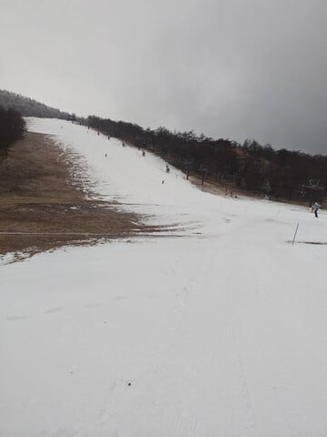

うん．

コース幅に関しては，イエティや軽井沢は

比較にならないレベルの広さですね…

もしかしたら，斜度を含めて現在の日本で

ベストのゲレンデかも…？？？

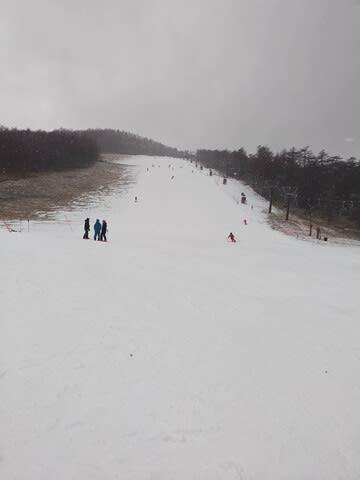

朝は結構硬めの斜面だったようですが．

じき硬いのが削れてモサモサが乗った斜面に

なっていったようです…

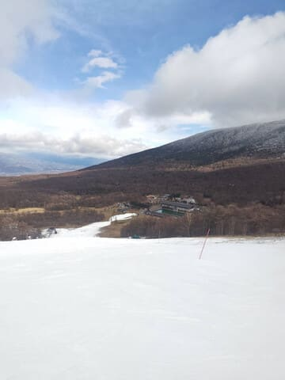

そして…

平日だけど，そこそこ人がいますね．

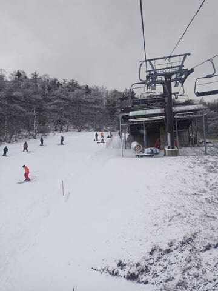

とはいえ．

リフト待ちがあるほど混雑はしておらず…

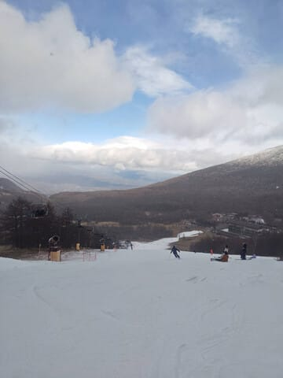

基本的にはリフトはほぼ待ちがなく

乗れたようです…！

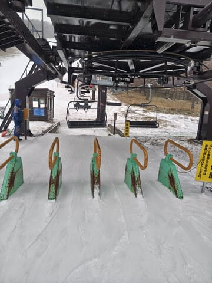

…しかし．

今の時期にこれだけのバーンが滑れるんだから，

他と比べるとかなり恵まれたコンディション

です！！

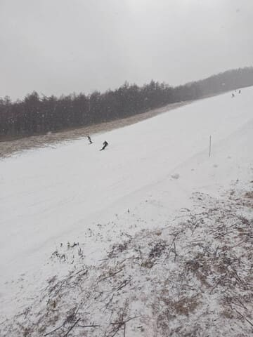

ただ．

朝のうちは晴れ間もあり，降ってもチラチラ

だった雪が，昼を過ぎると結構強く降り，

ピーク時は，リフトに乗ってる間でこれだけ

積もるような雪だったようです…！

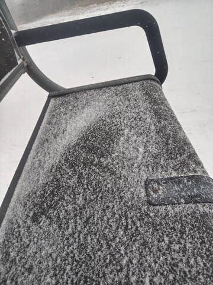

とはいえ．

まだ人工降雪以外の天然の積雪量があるほどでは

無いし．

強く降っている時間はわずかで，またパラパラの

降りに戻ったようで…

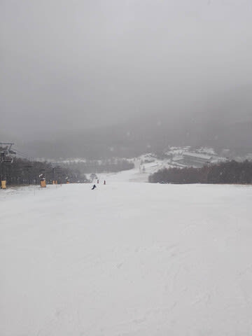

午後3時半の終了時間には，こんな感じで

コース外にうっすら積もる程度の積雪に

とどまったようです…

まぁ，今日の高峰は基本強い西風で絶対

晴れだと思っていたので．

積もるだけすごい…

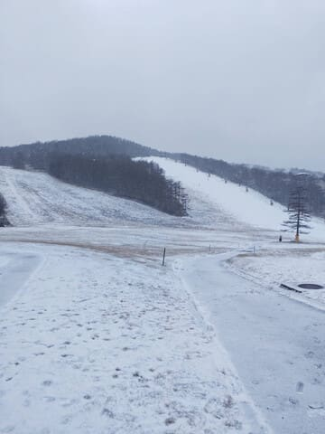

ちなみに．

雪が少ないこの時期にもかかわらず…

ムービングベルトの脇に人工降雪が

打ってあったし．

さらにクワッド脇のオープンしているコースだけ

ではなく，奥の第2ペアリフト側ももう人工降雪を

打ち始めていたようです…

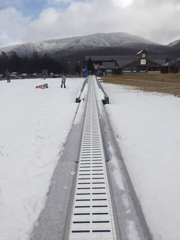

ってな感じで．

今，最新の天気図を見てみると…

なんだか6日以降，冷えそうですよ～！

平年比-2℃くらいの日が1週間くらい

続きそうですよ～！！

これはいい兆候だ！

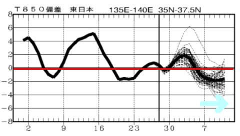

ということで，

おそらく現時点でかなりコンディションがよさそうな高峰．

私も行きたい気マンマンですが…

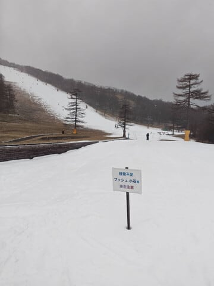

今週末はとある事情により，またイエティです…(泣)

あぁ…高峰の幅と斜度で滑りたかった…

とりあえず，土曜滑りに行ってくるので．

また帰ってきたらレポートします～！！←って，自分でも飽きつつあるイエティレポート，読む人いるのか？

そして．

今日はまだ深夜1時前．

なんと，スキーに行く前日にしては

珍しく，5時間寝れそう…

## 💬 コメント一覧

### 💬 コメント by (ねも)
**タイトル**: Unknown
**投稿日**: 2024-11-30 08:00:54

Ｓさん　八方尾根ゴンドラに返信ありがとうございます。

昨シーズンお休みした八方尾根、今季は！と、早割リフト２日券を買っちゃいました✌️　13600円、コロナ禍前ならありえない⁉️

私の最後の八方尾根になるかも(笑)

昔はアサマ2000でしたっけ、10年くらい前に一度だけ。

雪と景色が良かったような(-_-;)

### 💬 コメント by (けんけん)
**タイトル**: Unknown
**投稿日**: 2024-11-30 08:22:59

白馬はもう1メートル超えたみたいです。羨ましいですね😭

### 💬 コメント by (Skier_S)
**タイトル**: 今日は高峰に行きたかった
**投稿日**: 2024-12-01 01:27:28

＞ねもさま

早割13600円なら安い…と思ってしまう今年のリフト券事情．しかし，最後の八方ですか？？

高峰はその通りで，旧アサマ2000です．雪は良いというより硬いイメージが…(笑)

＞けんけんさま

西風でも雪が積もる白馬方面は，今回の寒気はそこそこの強さだったので

かなり積もったようですね…

一気に八方・栂池・五竜・47がオープンしましたが，まだ滑れるコースは少ないですね…

来週末からの冷えで，でかなり滑れるようになるかな…？？

