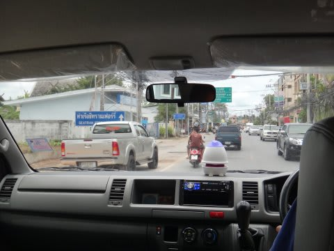
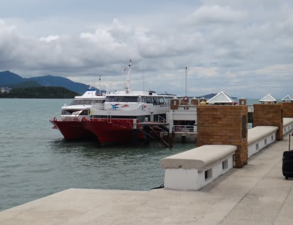
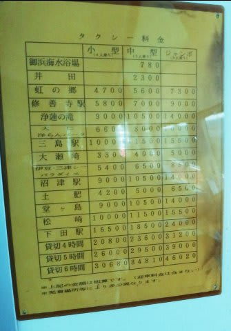
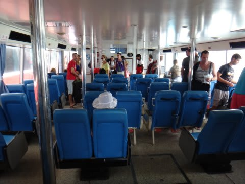
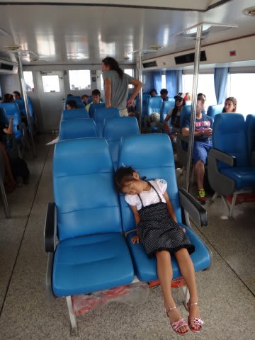
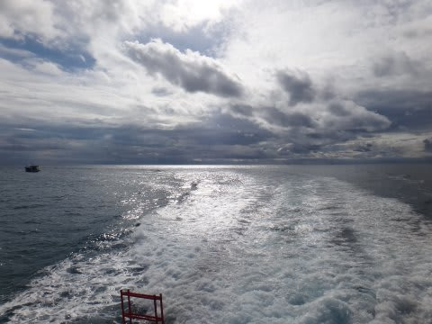
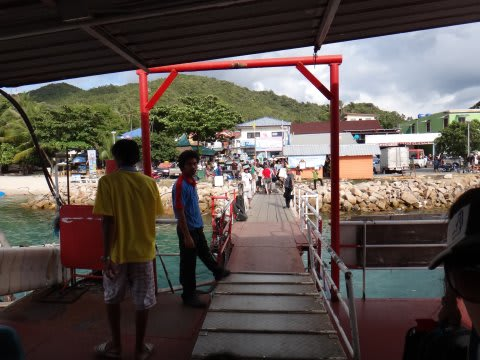
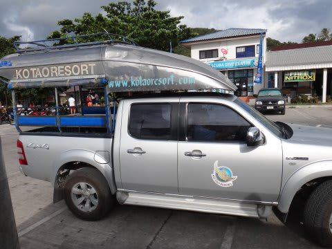
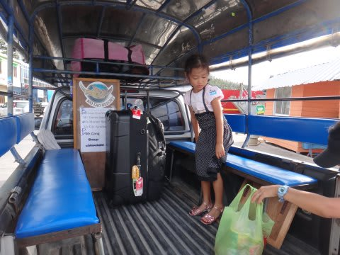
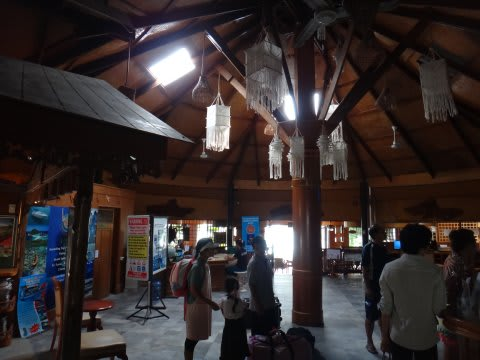

# 2013年9月　子連れタイ・タオ島ダイビング旅行記　その5…ようやくタオのホテルへ到着！

📅 投稿日時: 2013-10-08 00:54:11

えー．

なんだか昨日の午前中に，このBlogを見た人は．

「なんだ？話がつながってない，変な記事が投稿されてる？？」

と思ったかもしれませんが．

実は．

私のミスで，本来の記事に続けて，編集中の

記事がアップされてました…

間違って読んだ人は，忘れてやってください(願）．

ってことで．

本編へ，Go!

----

で．

ショッピングセンターで5時間つぶした後は．

車で10分ほどの港へ向かい…

13:30発のタオ行きの船へ乗り込むわけですが．

なんだかこの船，日本の中古みたいで…

こんなのが撤去されず，掲示されたままでした…(^^;

…いや．

も，もしかしたら，サムイから5800バーツ払えば，

ホントに修善寺駅にいけたのかもっ！？←んなわきゃない

で．

船に乗り込むと．

昨晩羽田を発ってから，それほど寝てない娘は，

乗ったとたんに爆睡…

このまま人形のように到着まで寝続けてました．

…ホントに，長距離移動に全く気を使わなくていい娘だこと…

で．

船は途中，パンガン島を経由して，タオに向かうわけですが．

どーしたわけか．

2時間で着く予定が，3時間経ってもまだ到着しないんですが…

ってことで．3時半到着予定が，1時間半遅れて．

午後5時近くにようやくタオ島に到着…．

今回泊まるホテルは「コ・タオ・リゾートホテル」．

ピックアップのトラックが迎えに来ますが．

荷台の上で荷物気分を味わっていると．

…5分ほどでホテルに到着です．

