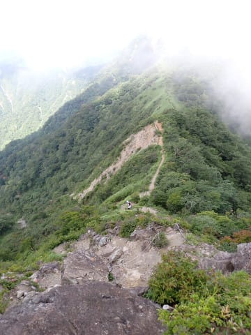

# 丹沢山系，塔の岳⇒丹沢山⇒蛭が岳を往復してみた　その2

📅 投稿日時: 2023-08-04 04:11:51

（[その1](ecd37f7ae25fa9e67a443605c85a24627.md)から続く）

ってなことで．

無事蛭ヶ岳山頂につきましたが…

最後の丹沢から蛭が岳の間1時間，

トレランランナーとデッドヒート状態で

後ろ10～20mあたりを近づいたり，

距離が開いたりを繰り返しつつ山頂へ

向かいましたが…

何とか抜かれることなく，山頂まで到着！

普通の山用の長ズボンに普通の山用

バックパックを背負った，いかにも

普通の山登りっぽい格好をしている

私にじりじり引き離されていった

後ろのトレイルランナーさん．

「速いですね…」

とちょっと驚いていたけど…

しかし，そのトレイランナーさんは，

蛭ヶ岳山頂で立ったままエナジーゼリーを

口にしただけで，すぐ復路に向かって

いきました…

丹沢から蛭ヶ岳まで来て休まず折り返しとはっ…！

やっぱりトレランランナーは違う…

あなたのほうがずっとすごいですよ…！！

ってなことで．

3時間半も歩いた（走った）し，最後の

15分は心拍数170で引っ張ったので…

私はもうヘロヘロ．

こっちはゆっくり山頂で30分ほど休みます…

天気は良くて景色はいいけど．

8時半の山頂なのに，気温は30度を超えてるし．

日が差すベンチだと暑すぎるので，

木陰で30分ほど休息して．

9時2分，下山スタート！

しかし，蛭ヶ岳～丹沢間．

背の高い木が生えてなくて，

見晴らしがよくいい景色なんだけど…

私の苦手とする，自分の歩幅で歩くことを

許さない階段や木道が続き…

そして激しいアップダウン．

あれをまた登り返すのか…！！

見ての通り，かなり激しい登り返しです（涙）

帰りの登りは体力に効く…（泣）

後ろを振り返ると…

かなり登り返したよ．

丹沢山まで，こんな登り下りが続くこと

数回．

どうも，行きの蛭ヶ岳到着でほぼ

スタミナを使い切ったらしく．

帰りはペースが上がらない…

心拍数は上がってるけど，

すごいゆっくりペースで心拍150を

突破してしまいます（涙）

丹沢山に着く直前くらいで，

もう，登りになると，ものすごいゆっくり

ペースでも，あっという間に心拍160くらいに

上がってしまう…

普通なら，そこそこのペースでも心拍150を

キープできるのに．

何度も立ち止まりながらじゃないと登れない…

ということで．

かなりバテ気味の丹沢山直前の

長い登り階段が殺人的に効く…

で．

登り階段で時々立ち止まりながらも，

何とか蛭ヶ岳から1時間6分で丹沢山へ

戻ってきました…

バテているうえに，気温30度を超えている

というのもあるのか…

ものすごいゆっくりペースなのに，

心拍169と，すごい心拍が上がってます．

いや…これがバテた状態か…

登り返しが何度もあるとはいえ，

行きより帰りのほうが下りが多いから

時間がかからないはずが，

丹沢山→蛭ヶ岳の行き1時間2分，

帰り1時間6分と．

帰りのほうが時間がかかりました…（涙）

で．

丹沢山頂で10分ほど休み，

10時17分に出発！

ここからもまだ階段地獄が続きます…（泣）

いや．

ホント，階段，好きじゃないんですが…

そして．

丹沢山から45分で塔の岳到着…

登りは塔の岳→丹沢山は38分だったのに，

下りの丹沢山→塔の岳が45分と，下りの

ほうが時間がかかるとは…！（泣）

最後の塔の岳の登り返しで，心拍が上がって

ペースが追い込めなかった…

丹沢山に着く直前あたりから，Garminさんは

私はもうスタミナ切れだと言っていて．

上り坂で簡単に心拍が上がって，

立ち止まらないと心拍数が150まで

戻らなくなってました…（涙）

行きでは全く立ち止まらず，そこそこの

ペースで登っても心拍150～160で登れたのに．

最後の塔の岳の登り返しでは，何度も

立ち止まらないとあっという間に心拍が

170を超えて，かなりつらい…

無茶苦茶ペースが落ちます．

これが，バテるということか…！！

（[続く](eda0a34cf38e590086dd702cd73cf8114.md)）
