# 2025/2/1(土)の志賀高原焼額山スキー場は…曇り時々晴れ時折雪，雪は冷え冷えで荒れず，意外と混まなかったよ！

📅 投稿日時: 2025-02-02 00:12:43

🏷️ カテゴリ: [2025スキー滑走日記](cacd3fbf84d4a679ee61a5894c3f95e14.md)

ということで．

今日も志賀高原で滑ってました～！！

…いやーー．

今日も良かった…

そんなに混まなかったし，予想より

天気は良かったし，雪もよかったし…

そもそも先週末に滑ってなくて，私にとって

トップシーズンではあり得べからざる，

実に12日もスキーをしていないという状態．

12日も滑ってなかったら，スキーの滑り方を

忘れちゃうんじゃないか？？

どれがスキーでどれがブーツでどれが

ストックだったか忘れちゃうレベルの

長さですよっ！！←そんなことはない

ってなことで．長きインターバルを

経ての久しぶりのスキーなので．

雪があって斜度があれば何でも許すという

レベルだった感じなんだけど…

いやーーー．よかった．

今日はホントによかった．

かなりいいコンディションで滑れましたよ～！

まず．

朝イチの志賀高原の上り坂は…

あれ？思ったより雪が少ない…

上林チェーンベースまでの上りは

ほぼ雪がなかったし．

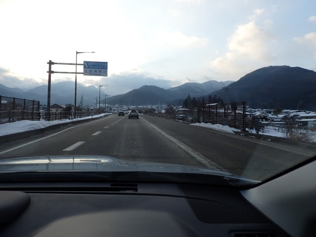

スキー場のあるエリアまで来ても，

路面が見えるレベルで，昨日まで

雪が降っていたとは思えず．

割と楽に(いつものトップシーズンの志賀高原比）

上がってこれました…！

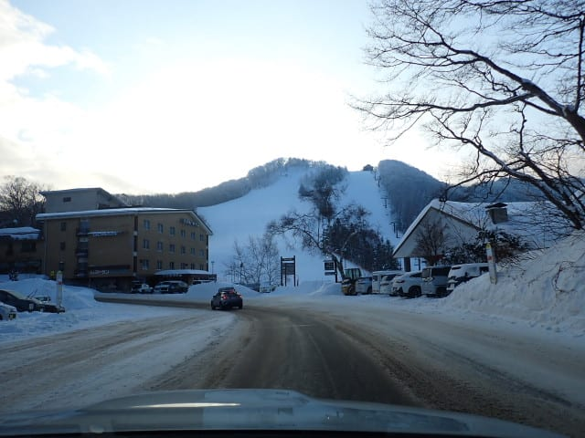

で．

8時半の通常営業開始直前の列はこの程度で…

すごい混雑ではないけど，比較的人が

多かったので．

うーん．

今日は混むのかな…と，思わせる感じ．

（結果的には，そこまで混まなかったんですが）

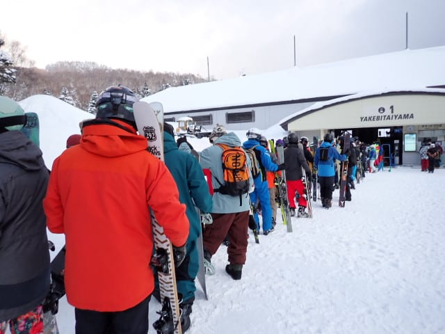

で．

8時半営業開始のゴンドラに乗ると…

いや．

予想外に晴れてますよ…！！

雲は多いけど，ゲレンデに日が射して

ますよ…！！

…朝は曇り時々小雪の予想だったのに？？

予想外した？？

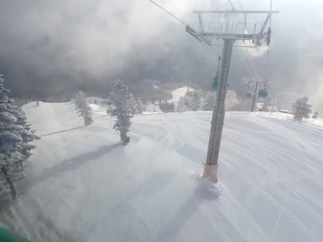

山頂に到着すると…

朝イチの山頂の気温は-9℃ですか…

‐12℃という予想より3度も高く，

こっちもちょっと予想を外したか…(涙)

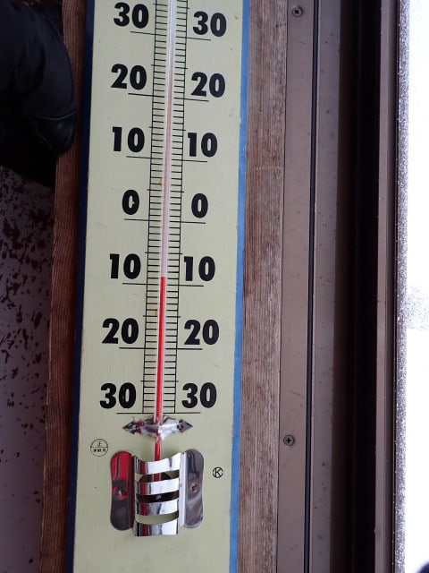

でも．

雲が多いけど，朝イチから，朝の最高シマシマに

日が射す最高の天気！！

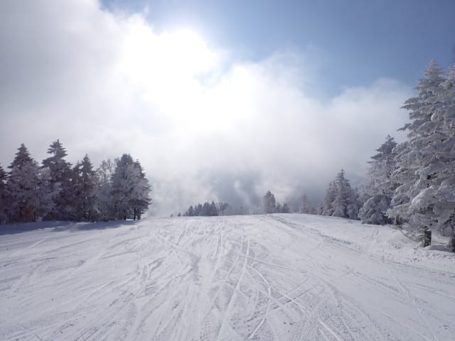

ぐはーーーーー！！！

シマシマ…シマシマっ！！！

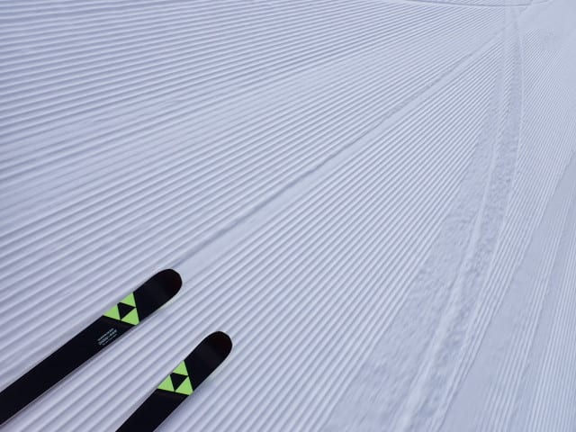

これだよ…

先週末，ご無体仕事で滑りに行けなかった

ので．

先週平日にゲレンデの幻覚を何度も見たけど…

その幻覚に出てきたのは，こんなシマシマ

バーンだったよ…！！

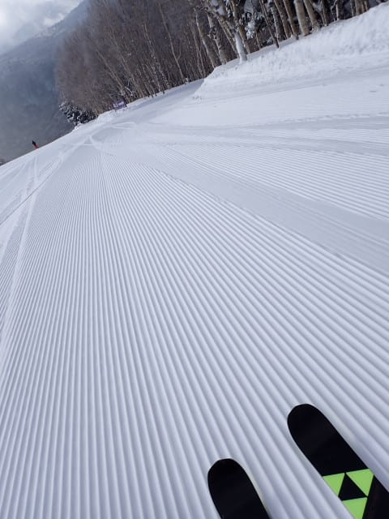

ガシガシに硬くない，トップシーズンらしい

柔らかさがあるけど，しっかり冷えて締まり

気味で，エッジが食い込んでいってくれて，

強い横Gでも崩れない…

これは快楽官能の絶品シマシマバーン！！！

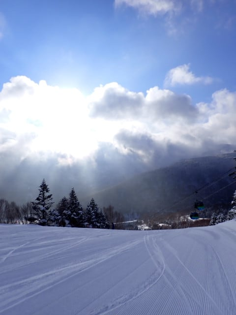

ってなバーンを1時間ほど堪能したら．

シマシマは無くなってきたけど，

それでも雪は冷え冷え最高で，

モサモサではなく，しっかり締まった

いい感じの圧雪！

これなら，今日は雪はそんなに荒れなさそう！

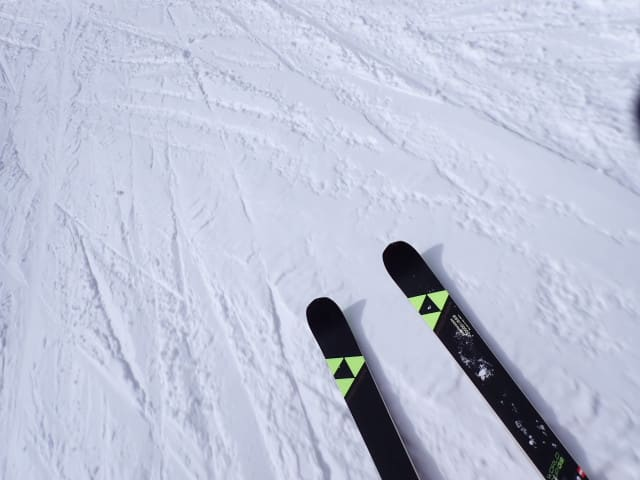

朝10時過ぎくらいまでは，晴れたり

時折日がかげったりという感じで，

予想より天気が良く．

うーん…予想外したかな…

と思っていたら．

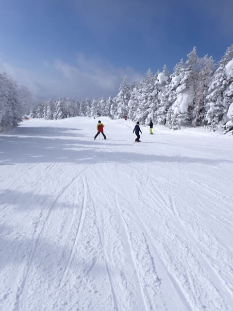

11時近くからは曇りの割合が多くなり…

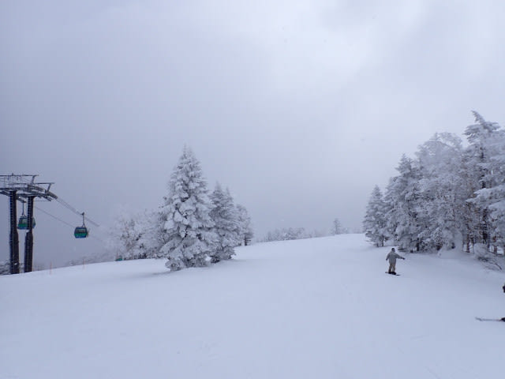

そして，昼前後は時折雪も降る天気で．

まぁ，基本的に曇りベースで時折雪，

晴れ間も結構あったという感じだったので．

完全に天気の予想を外したわけじゃない

ですね…

うん．外したわけじゃないよね…

外してないよね…←読者に同意を強要しないこと

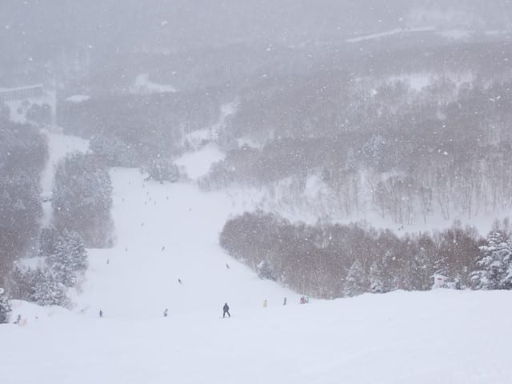

ただ，曇り空といっても，結構明るく

バーン状況はよく見えたので，すごい

滑りやすい一日でした～！

…とはいえ，午前中はサウスコースなど

一部のコースはちょっとだけ人口密度が

高めで．

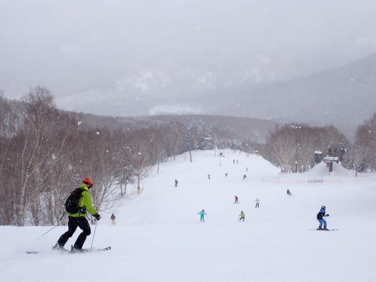

第1ゴンドラも，10時頃から混み始め，

10時半のピークにはこのくらい並んだけど…

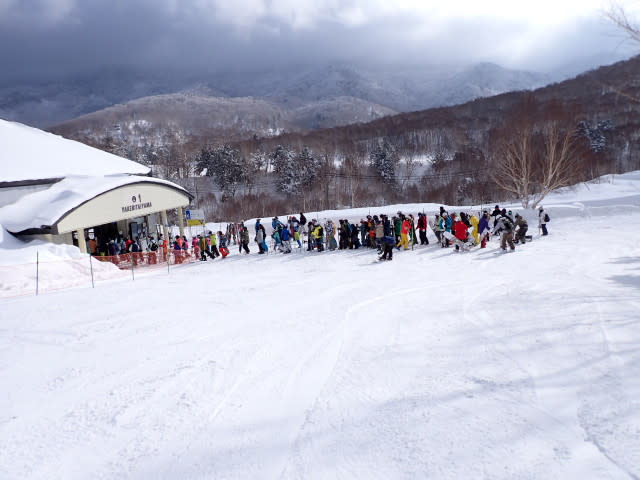

その時でも，第2高速リフトはこのくらいの

待ち時間で，快適に滑れたし．

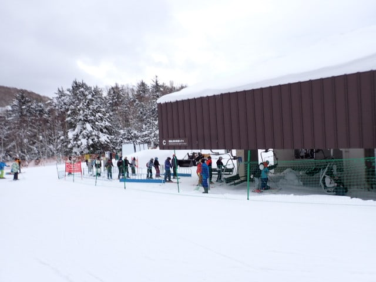

ゴンドラが混んだのは1時間もなく，

11時前にはゲートからちょっとはみ出るか

どうかというくらいの待ちで．

さらに11時を過ぎたら昼休みで

ガラガラになってたし…

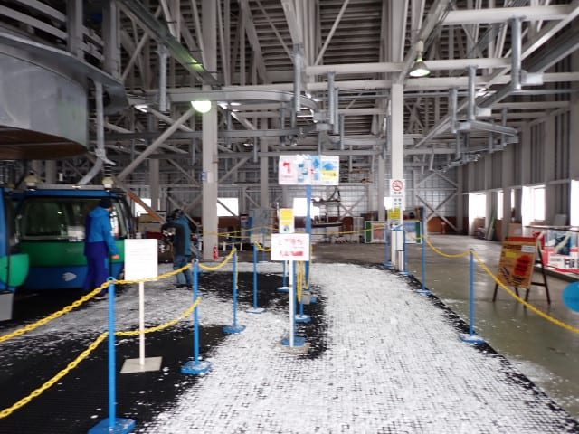

ゲレンデもコースを選べば，白樺とか

パノラマとかは，なぜか昼間でも

結構ガラガラだったし…

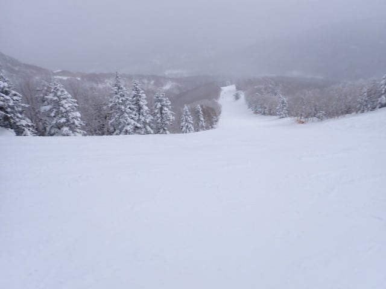

いつもは人が多いGSコースも，今日は

なんだか人が少なめで，下地もしっかり

していたので，いつもみたいに凸凹

バーンにはならず．

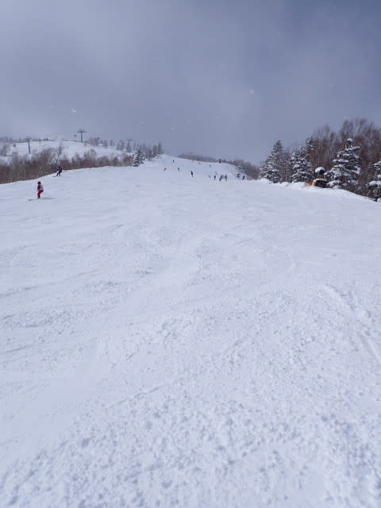

午後になっても，時々日が射すタイミング

があって，人が少なくて雪もいいこんな

バーンを気持ちよく飛ばせたし…

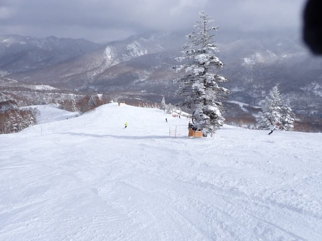

曇りのタイミングも，そこまで雲が厚く

なく，薄日が射してバーンコンディションは

見やすくて滑りやすく．

で，午後も遅くなると…

もう，人がいなくなって快適！！

そして，バーンも荒れてないよ！！

雪はいいし，ガラガラだし…

午後までこんなフラットバーンを

かっ飛ばせていいんですか？？

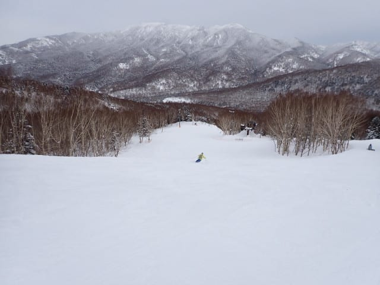

という感じで．

今日もかなり恵まれたコンディションで，

16時15分の営業終了まで，先週滑れ

なかった欲求不満を解消するため，

休まず止まらずひたすら滑り続けたの

でした…

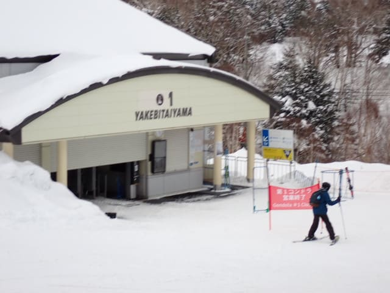

いやーー．

楽しかった．

楽しかったけど…

あぁ…一日がたつのが早い…！！

先週滑れなかった欲求不満を解消するのに，

8時間程度では足りない…

全然滑り足りないよ…っ！！！

というときには．

はい．

焼額ナイタ～！！

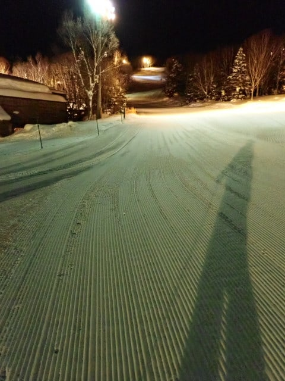

ぐははははははははは！！

シマシマ！！

今日のナイターも，最高シマシマだよ！！

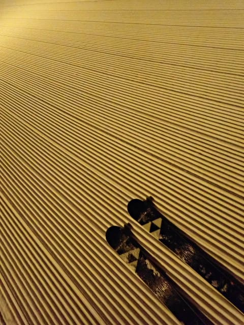

最高の昼間を滑り終わったあと，

またこんな最高シマシマをいただけるなんて…

美味しい最高のご飯を食べ終わった後に，

まだお代わりでもっとおいしいごちそうが

出てきた気分！！

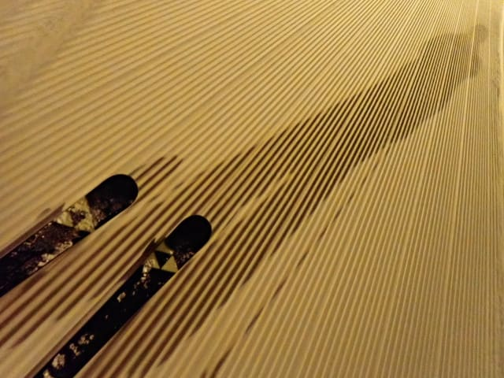

人が少ないので，1時間ほど滑っても

まだシマシマは残ってるし．

営業は6時から8時までのわずか2時間だけ

だけど．

2時間で第3高速リフト15本，ひたすら

ぐるぐるし続けると，残念ながら

ナイターも営業終了となったのでした…

…滑り足りない．

先週滑ってない分，まだまだ滑り足りない！！

ってなことで．

明日も焼額山を止まらず休まず，ガシガシ

滑ってます～！

## 💬 コメント一覧

### 💬 コメント by (ももも)
**タイトル**: Unknown
**投稿日**: 2025-02-01 23:48:13

本日は朝から写真撮影をしていただきありがとうございました。バタバタしてちゃんとお礼が言えずスミマセンでした。双子のような写真でした(笑)

### 💬 コメント by (新緑)
**タイトル**: Unknown
**投稿日**: 2025-02-02 06:58:01

とても気持ち良さそうです。質問です。志賀高原で、初級に近い中級おすすめの場所あったら教えてください！

### 💬 コメント by (かず)
**タイトル**: Unknown
**投稿日**: 2025-02-02 23:01:14

サイコーでしたね  Sさんのキレキレな滑りを後ろから見させてもらいました 笑 また機会があればおねがいします！

### 💬 コメント by (Skier_S)
**タイトル**: もう深夜2時過ぎ（泣）
**投稿日**: 2025-02-03 02:14:03

＞もももさま

お久しぶりにお会いしましたね…

しかしあそこまで同じ格好していたら，どうせならヘルメットとかも合わせますか（笑）

＞新緑さま

初・中級に良いところというと…

タンネの森，一ノ瀬ファミリー下半分，そして焼額なら第3高速リフト沿いのイーストコースあたりが

おススメでしょうか…

タンネの森は結構楽しめますよ！

＞かずさま

ナイター良かったですね～！！

せっかくのヤケオク券，ナイター滑らないともったいない！！！

