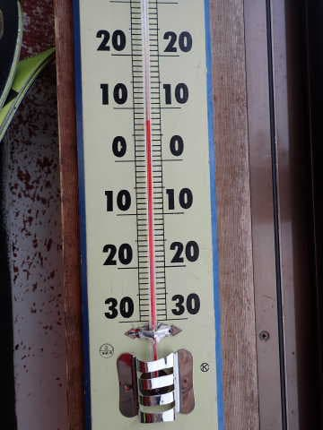

# 2023/3/12(日)の志賀高原スキー場詳細レポート！…そして3月13日の志賀高原は雨＆風で悲惨だったと特派員より

📅 投稿日時: 2023-03-14 01:38:46

🏷️ カテゴリ: [2023スキー滑走日記](cd943df30cfcc3d0896469e2ff98720cd.md)

本日13日も，特派員から志賀高原の情報が

送られてきましたが…

あさイチは雪じゃなく雨だったようで．

さらに強風で焼額は1ゴン，2ゴン，

第3高速が運休という，ほぼ全滅状態で．

奥志賀もゴンドラは止まるという，

悲しい状況だったみたいです…

（[焼額山スキー場Facebook](https://www.facebook.com/yakebitaiyama/)より）

ただ，雨は9時ごろには雪に変わり…

9:30ごろに風が弱まり，焼額第1ゴンドラが

営業開始！

…でも，雪と言ってもかなり湿っぽい

雪みたいですね…

で．

山頂は一応マイナス気温だったみたいで…

雨が雪に変わってしばらくは，

かなりの雪降りで．

短時間で5cmほど雪が積もったみたい

ですが…

11時ごろには雪が止み，薄日も射すくらいなり．

その後はガス⇒午後1時頃に

また小雨，午後3時ごろから雪と，

目まぐるしい天気だったようです…

ってな感じで．

昨日の日曜も，高温で雪が緩んで

あまりいい状態じゃなかったけど…

これに比べればまだマシだ

と，自分を慰めるのに使えるような

ひどい天気だったようです…

ということで，本題へ．

日曜の志賀高原，詳細レポートです！！

えー．

まず．

あさイチは，天気自体は晴れなのですが．

空は青ではなく，白っぽいかすみがかかった

春霞の空で．

あぁ…春だねぇ…

という感じ（涙）

当然，朝から気温が高く．

朝8:30の山頂で+4℃ってどういうこと？？？（激涙)

朝の圧雪は一応シマシマだったものの…

この高温のおかげで，あっという間に

表面が崩れていく，あんまり板がグリップしない

雪になっていて…そんなに楽しくない…(泣)

そして．

あっという間に崩れていくだけじゃなく…

強い日差し＆高温で，営業開始30分後には…

もう，ダメな感じの雪に…(止まらない涙)

志賀高原の3月上旬の朝って…

こんな雪でしたっけ？

これ，4月下旬並みの雪なんですが…(あふれ出る涙)

朝早くからゲレンデ全面が緩み，

朝10時には，早くもバーンが荒れ始めて

きてます…（こぼれ落ちる涙）

そして．

気温も異常に高く．

ウェアの下はTシャツで十分で，

さらにウェアのベンチレーションを

開けないと暑く感じるほどになり…

雪は全力で荒れていき．

標高が低いところは，一部ストップ

スノーっぽい感じになるところも…（涙）

…ただ．

コンディションが悪くて疲れる雪

だからか．

人も少なめで，ゴンドラもそれほど

混まず…

リフト待ちも終日少なめだったので，

まぁそこは良かったかな…？

あまりもの雪のダメさ加減に，

今日も焼額の呪いが解けて，なぜか

ふらふらと一の瀬方面にさまよって

行ってみましたが…

寺小屋は午前は良かったものの，

昼ごろには緩み始め．

一の瀬ファミリーも，昼には全面

ユルユル雪で荒れ荒れ（涙）

高天ヶ原も，昼ごろには全面ユルユルで，

一部雪が薄いところも…

メインバーンの一部にも土が透けて見える

ような薄いところもあり．

今シーズン，雪が少なかったうえに

ここ1週間，すごい勢いで雪が融けている

ので…

ヤバいかも…

昼間の気温は，標高2000mの山頂でも

+8℃という，かなりヤバい感じまで

気温が上がり…

これ，GW並みだな…（泣）

ってか，GWでもこれより寒い日が多いよ…

午後2時ごろには．

緩んだ雪が荒れ荒れになり，

コースの一部はかなり凸凹に

なってきてました…

さすがに，今日の午後は大回りはちょいと

厳しい感じのバーン状況に…（何とも言えない涙）

それどころか．

3月上旬というのに…

焼額にもごく一部，コース上に雪が薄い

ところが出てきてるよ！！！

…これ…

今シーズンはGWまで営業できるのか，

めちゃくちゃ心配…（泣）

なんてこった…

ただ．

今日はごく一部を除いて，そこまで板が

貼りつくような滑りの悪い雪には

ならなかったし．

人も少なくて混まなかったし．

人が少なかったおかげで，バーンは荒れた

ものの，全面コブコブにまではならな

かったし．

まぁ，晴れて暖かい春スキー…

と考えれば．

そこそこ楽しめたのかな～…

と，なんとかポジティブシンキングで

自分を慰めつつ．

いつも通り，日が傾くラストリフトまで

滑り倒したのでした…

うーん．

果たしてこれから，また冷え冷えAgainが

あるのかどうか，天気図を見てみても…

期待薄です（泣）

今週もこれまでに比べればマシだけど，

気温は平年より高い日が続きそうで…

雪が降りそうな気配はありません…

それどころか．

ヘタすると週末の18日に，

また空から液体が落ちてくる

可能性が…（涙）

もうちょっと冷えれば，志賀ならギリギリ

固体になるかもしれないけど．

今の天気図のままなら，微妙に雨．

…そして，その後もしばらくは

冷えそうな気配はなく…

ヘタすると3月いっぱい，もう積雪は

期待できなさそうな感じです…（絶望）

あぁ…

春なんて来なくていいのに…

花粉も飛ぶし．

やはり，この世から春という季節を

抹消せねばなるまい…！！←発想が過激すぎるから

## 💬 コメント一覧

### 💬 コメント by (たーちん)
**タイトル**: Unknown
**投稿日**: 2023-03-14 11:13:41

今年は早くから黄砂もあったと。。。その分雪が滑らないし溶けも早いのだと思います。桜も早いし今年は板じまいが早いのでは😊

### 💬 コメント by (かず)
**タイトル**: Unknown
**投稿日**: 2023-03-14 11:34:12

月曜志賀に上がるも雨でそのまま帰宅  今シーズンレインボーさんに会わずシーズン終了なんてあるかも……

### 💬 コメント by (レインボー75)
**タイトル**: Unknown
**投稿日**: 2023-03-14 16:40:32

火曜日の志賀高原情報

いやあ、寺子屋最高でした。誰もがうまくなったと錯覚できる完璧バーンでした。昼から10本以上。良すぎて帰れませんでした。おかげでレインボー(２時終了)の掟を破ってしまいました。楽しすぎる寺子屋が悪い。

朝の白樺はやや柔らか目。オリンピックはちょっと硬すぎて膝に悪い。いちごんからのポールが楽しい。日曜にレースの応援に行って、加速しないとなと興味がわきました。

すぐに奥志賀へ。ダウンヒルは捨てて、三高とエキスパートを満喫してから、天気もいいので漕いで西館のウエストサイドで昼食。

寺子屋に早く行きたくて、食べたらすぐに移動。天気も良くて雪も良くて。

明日は気温が6℃くらい上がりそうなので、奥志賀は捨てて、早めに寺子屋です。

それから、今日も秋田さんとカズさんの話をしたところです。何で会わないんでしょうね。私は毎日滑ってるのに。なんか動きがすれ違いになるんでしょうね。早く会わないと私も先はそう長くないんで。

### 💬 コメント by (副院長)
**タイトル**: Unknown
**投稿日**: 2023-03-14 23:36:34

あー。今日で、シーズン終了しました。日曜日は暑くて、ペラペラ服。月曜日はべちゃ雪から、板掴み、最後はカリンカリンで、体力奪われました。今日は、昼前にゴンドラから、レインボーさん見かけたけど、そのあと、寺小屋だったんですね。僕は奥志賀第二をグルグルしてました。最後の唐松コースはひなたと影で、まったく違う雪で、疲れて納得の最終でした。

また、来シーズンよろしくお願いします。

で、Sさまstravaされてますか？

### 💬 コメント by (レインボー75)
**タイトル**: Unknown
**投稿日**: 2023-03-16 05:52:09

水曜日の志賀高原情報

朝の上林+1℃　蓮池0℃　ニゴン上+1.8℃。

パノラマから唐松は快楽快適バーン。GSは早くもやわらかめ。オリンピックはやや硬めだけど快楽快楽。白樺は硬め。ダイヤは非圧雪のぼこぼこ不快バーン。でも、先日八方のぼこぼこを体験した隊員にとっては平気なバーンだとか。

9時45分寺子屋着。硬めの極楽バーン。これを12本も回して早めのラーメン1150円。

そのあとちょこっと滑ったら、隊員が「もういいかな」

帰りのファミリーがベスト。気持ち良く一日が過ごせました。

### 💬 コメント by (Skier_S)
**タイトル**: コメント回答遅れました
**投稿日**: 2023-03-16 06:39:38

＞たーちんさま

今年は雪も少ないし，GWはヤバい感じです…

4月下旬には志賀もダメかも（涙）

奇跡の冷え冷え4月を期待！！

＞かずさま

え！！まだレインボーさんと会ってないんですか！？？

＞レインボー75さま

火曜，水曜とも，気温は高かったんですけど…

意外と良かったみたいですね！

これからも気温が高そうですが…

土曜にちょっと積もりそうです．かなり重い雪ですが…

＞副院長様

あ，Garmin使いなので，Stravaと連携できるようなのでアカウントは作って，

Garmin のデータと連携されています…

ただ，有料サブスクリプションしないとほとんど使い物にならないアプリなので，

全く使ってませんが…（笑）

### 💬 コメント by (アリス)
**タイトル**: Unknown
**投稿日**: 2023-03-16 06:40:30

S様

おはようございます🎵

先週に引き続き、今週も平日スキーです✨

8時25分一ゴン2番機乗車🎵

朝一2本廻したら、雪がかなり荒れて来ました😅

止むなく、一の瀬、寺子屋へ脱出❗️

こちらは快適です☀️

寺子屋頂上では偶然にもレインボーさんと遭遇🎵

本日も朝一の一ゴンです🎵

### 💬 コメント by (Skier_S)
**タイトル**: ＞アリスさま
**投稿日**: 2023-03-17 02:41:37

平日スキー楽しめたようですね…！！

気温が上がって晴れた日は，寺小屋一択ですね…

ただ，休日だとみんないい雪を狙って寺小屋に集まるので，混んじゃうのですが…

平日は混まなくていいですね～！！

