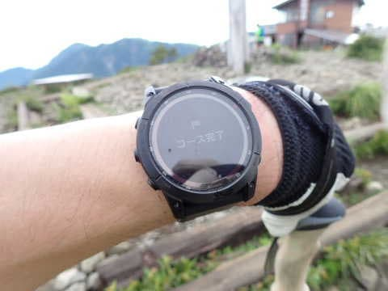
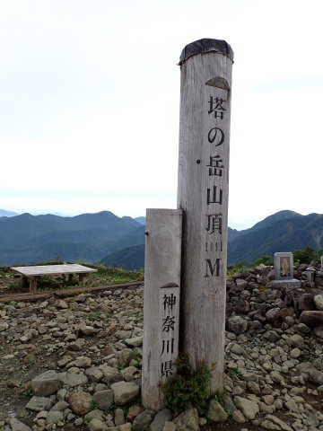

# 菩提峠から塔の岳へ登ってみた，その3…塔の岳山頂へ！

📅 投稿日時: 2022-08-22 02:57:54

この土日は，さすがにお盆明けという

こともあるのか，大変珍しいことに

意外と仕事の宿題が少なく．

土曜にはだいたい宿題が終わっていたの

ですが…←それでも土曜は仕事してたんだね

しかし．残念なことに全国的に山では

雨が降る予報だったので，

日曜は山には登らず，家でじっとしてい

ました…（涙）

でも．

土曜夜から日曜にかけては，久しぶりに

ゆっくりしたかな～．

…お盆休みが怒涛の宿題ラッシュだった

だけに，何もないと逆に

「ホントに大丈夫なのかな？

なんか大事な仕事忘れてないかな？」

と心配になってしまうというのは．

もう，何かに毒されてる感じ…（涙）

ってなことで．

今日は塔の岳の山登りレポート，続きです！

ーー

鳥尾山荘に到着しましたが…

三の塔で休憩してからまだ15分しか経ってないので，

ここでは休憩せず，あっさり通過！

ここから先も，時折鎖があるような

ちょっとした登りがあったりしたけど…

鳥尾山荘から20分．

6:25には行者岳に到着！

…まだ塔の岳には2.3kmもあるのね…

このあたりになってくると．

三の塔付近までの木道できれいに

整備されている登山道と違って，

よくある踏み跡になってきて…

行者岳を過ぎてしばらく．

行者の鎖場ってところがあったり．

落差はせいぜい5-6m程度だけど．

数か所，比較的落差のある鎖場が

あって．意外と侮れないコース…

さらにはこんな感じで切り立っていて．

意外と高度感がある場所があったり…

同じ塔の岳へ向かうルートでも，

大倉尾根とはえらい違いで．

丹沢山系，意外と面白いかも…

振り返って見ると…

意外にアップダウンがあるコース

だよね…やっぱり．

ってなことで．

意外と激しいアップダウンで．

さすがにこのあたり，ペースはそれほど

上げられず．

鳥尾山荘から約30分．

6:56に新大日到着！

ここはベンチがある広場になってますが…

うーん．

見晴らしが無いので，休まず通過！

このあたりでVAAM500mlを飲みきって．

さらに2本目のVAAMを少しずつ飲み

続けてます…

このあたりに来ると，もう鎖場は無くて，

割と平坦なコースを快調なペースで

移動出来て…

新大日から10分で，木の又小屋を通過！

ここまでくれば．

塔の岳山頂まではもうすぐ！

木の又小屋からは，ほぼ平坦な

ルートをたどって…

最後だけ，ちょっと急な坂を登れば…

コース完了！

塔の岳，到着です！

到着時間は7:24．

駐車場から2時間25分くらいでの

山頂到着でした…

まぁ，先週の丹沢山の時にもここを通過してるし．

塔の岳は山頂は先週にきたばっかりなので．

真新しさや感動はそれほどないのですが…

とりあえず，さすがに山頂では

ちょっと休憩しましょうか…

