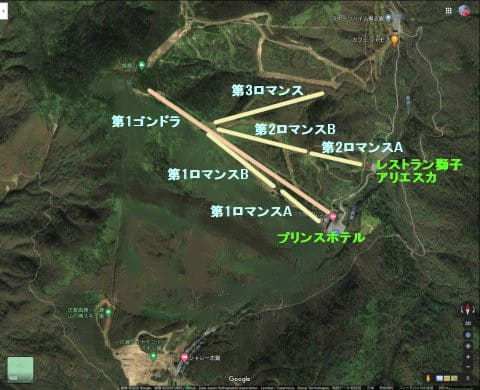
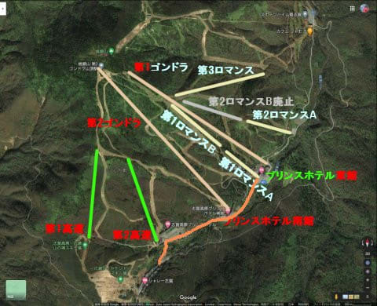
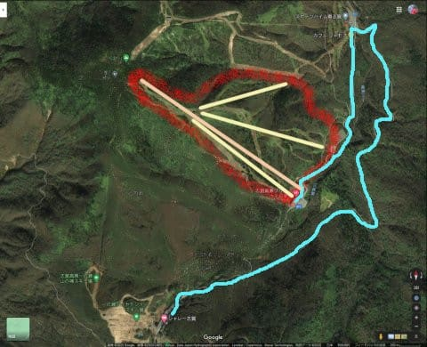

# 焼額山スキー場の歴史を振り返ってみる2…オープンから第2ゴンドラができるまで・志賀高原のバブル期の歴史だな（笑）

📅 投稿日時: 2020-09-23 02:22:27

🏷️ カテゴリ: [スキー雑談](c1f9d2cb7478308da16419928ea3945e9.md)

ってなことで．

本日は[前回の焼額の歴史](ecf9ef2318d00e5a9f4905a77d965f4f6.md)の続きをば．

とりあえず．

1984シーズンに，焼額山スキー場は

ゴンドラ1本，ペアリフト3本で

スタートしたのですが…

冷静に考えると．

1ゴンは場所は変わってないけど，

当時の4人乗りゴンドラは架けかわってるし．

1ロマ，2ロマ，3ロマはすべて廃止されたし．

開業当時のリフト・ゴンドラは今は1本も残ってませんね

当時は，今のオリンピックコースとGSコースの

分岐点に，ペアリフト降り場が三つ並んでいて，

壮観だったんですよね…

…で．

ここからは歴史の変遷を追っていくわけですが．

○開業2年目　1985シーズン

1ロマが2本に分割され，1ロマA，1ロマBの

2本に分割されました…！

いや…この当時の3本のペアリフト．

どれも1km近くあるリフトで，乗車時間が長く．

また，1ロマは下半分が緩斜面，

上半分は今のオリンピックコースの急斜面．

急斜面だけ滑りたい・緩斜面だけ滑りたい

人のために，リフトを分割するという，

「そうした方がいいよね…」

という，納得の分割でした…．

そうそう，

1ロマA，1ロマBが写っている写真がありますが．

オリンピックコースの途中から，下のコースを

見ている写真です…

…分かりにくいので，分割点を赤矢印で

示すと，ここ．

ここを拡大するとこんな感じで．

いかにも1本だったリフトを2分割

した感じで．

1ロマAの降り場とBの乗り場が

縦に並んでます…

1ロマAを降りてからBに乗り継ぐとき，

ちょっと登らなきゃいけなくて

めんどくさかったような思い出が…

○開業3年目　1986シーズン

今度は，2ロマが同じようにA，B線に

分割されたようです…

実はこの年から2シーズンほど

焼額に行ってなかったので．

2ロマA，Bに別れていたのは

ちょっと記憶になくて，いきなり2ロマは

Aだけになっていたと思い込んでいたのですが．

歴史を調べると，2ロマB,2シーズンほど

存在していたようです…！

○開業4年目　1987シーズン

この年は，1986シーズンと全く変わらなかったのですが．

…そう．

1987年は，

私をスキーに連れてって

が公開されてますね…！

…私はこの映画をリアルタイムで見てないのですが…

そうか…この映画が公開されたときは，

まだ2ゴン側が開業してなかったんだ…

ということで．

スキーブームを作り上げた

私をスキーに連れてって公開直後の，

開業5シーズン目となる1988シーズンは，

焼額が強烈に変わりました！！

○開業5年目　1988シーズン

どどん！！

なんと…

この年に，一気に

第2ゴンドラ

第1高速

第2高速

の3本のリフトが架かり，2ゴン側のコースが

オープン！

オープンしたコースは，

パノラマコース

唐松コース

ブナコース

第2連絡コース

白樺コース

サウスコース

さらに，

プリンス南館

ができただけじゃなく…

このオレンジ線で描いた，

一の瀬からダイレクトに焼額に繋がる道

ができました！

いやーーー！

1年でこれだけ作り上げるとは…っ！！

バブル時代ならではの，今ではありえない

投資ですね…！

そうそう．

前回の記事から，焼額のゴンドラが開業時から

第1ゴンドラと書いちゃってましたが．

第2ゴンドラができるまでは，

単に「焼額ゴンドラ」

と呼ばれてましたね…

当然，第2ゴンドラができたことで

「焼額第1ゴンドラ」という

名称に変わってます．

同様に，「志賀高原プリンスホテル」

は，「志賀高原プリンスホテル東館」

に名前が変わりました．

で…私の記憶なら．

この年はまだ，今の

ビギナーズコース（パノラマイン）

スーパーGSコース，

イーストコース，

ミドルコース

は無かった気がします…

さらにこの年，すでに

第2ロマンスB線は廃止

になっていた思い出が…

2ロマBは，1996，1997シーズンの2シーズン

だけの命だったようですが．

このあたり，記憶はあいまいです．

とりあえず．

その前に来たときは，一の瀬と焼額は

かなり距離が離れた，沢や尾根に隔てられた

スキー場というイメージが強かったので．

一の瀬と焼額が繋がったというのは．

今でいえば，熊の湯と一の瀬が繋がった

くらいの衝撃でした…！！

「一の瀬と焼額，つながったんだ…っ！！」って，

もう，むちゃくちゃ驚いた思い出があります…

ということで．

おそらくこのシーズンの直前に

私をスキーに連れてってが公開された

というのは．

直後の焼額リニューアルオープンに合わせた

宣伝の意味もあったのでは…？

と思っている，Skier_Sだったのでした…

（まだ[続く](ee5b743600a6fe727ce465ad2a03c1625.md)）

## 💬 コメント一覧

### 💬 コメント by (アリス)
**タイトル**: 焼額山歴史ありがとうございます
**投稿日**: 2020-09-23 11:22:22

Ｓkier_s様

ご無沙汰しております。

焼額山のゴンドラ、リフトの建設～撤去まで年とともに変化が読み取れます。

やはり、コクドの投資なしでは志賀高原の繁栄はなかったみたいですね。コクドの進出計画～実行までには、和合会、共益会の猛烈な反対があったようですが・・・

### 💬 コメント by (Hide)
**タイトル**: Unknown
**投稿日**: 2020-09-23 13:00:39

S 様

いや～こりゃまた・・・

私が最初に行った時は、既に第2ゴンドラや一ノ瀬からの道路や第1～第3トンネルもできてましたからちょっとビックリでした。

あの頃は雪も多く、蓮池交差点付近でヤケビ方面行くことができず深夜に除雪待ちした記憶があります。

国道の除雪車に「こっちの道やってよ～！」なんてむっちゃぶりしたのですが「あっちは県道だから自分達は国道管轄なのでできないと・・・（当たり前ですね）」

みんな懐かしい思い出です。

### 💬 コメント by (ほっぽ)
**タイトル**: Unknown
**投稿日**: 2020-09-23 13:39:12

Sさん

なるほど、2ロマB線というのは旧2ロマが分割されたんですね。

私は2ロマはA線しか知りません。

そして、2ロマ下のお食事処は一階にななかまど、二外に獅子でした。

アリアスカは既に今の獅子の場所でした。

知ってるようで知らない歴史、ありがとうございました。

http://www2.tokai.or.jp/nana_hoppo/

### 💬 コメント by (Kon Suke)
**タイトル**: 懐かしい
**投稿日**: 2020-09-23 15:28:50

Sさん

お久しぶりです。

私をスキーに連れてって、撮影の時、原田知世のスタントをしている女性とゴンドラに乗ったことがありました。

懐かしいですね。

第１ロマンス上部のオリンピックコースも、３０年前になりますが圧雪はなく一面コブで、第１高速から第１ゴンドラに滑り込みオリンピックコース１０本連続コブ斜面をノーストップで滑り降りていました。

その後すぐに戻って、西舘のフーディに滑り込み、今はクローズしていますが、右側のコブをノーストップで１０本、最後にファミリーで締めていました。

その前までは、奧志賀のエキスパートもシングルがかかり、上から下まで全面コブで、ノーストップを試みていましたが成功しませんでした。

一回だけ、トイレに行きたいときにノーストップが出来ましたが・・・。

あの頃は元気でちっとも疲れませんでした。

でも、コブは滑れてもアイスパーンはダメでしたね。

### 💬 コメント by (Goku)
**タイトル**: Unknown
**投稿日**: 2020-09-23 19:15:09

２ゴン、１高、２高の一気攻勢は凄かったですね！

わたしもあの新しい道ができたときはメチャ感激したのを覚えています。

ヤケビの１ロマがA線Ｂ線に分割されたのに、奥志賀では緩斜面に掛かるリフトと、エキスパートに掛かるリフトが１本の高速ペアに架け替えれれ、それもビックリしましたけど・・・

### 💬 コメント by (みほ)
**タイトル**: Unknown
**投稿日**: 2020-09-23 23:59:02

焼額の歴史、なつかしくて感慨深いです。東館ができてすぐのころ（8４年ごろ？）、森の中のようなスキー場とホテルは若い女性にとって別世界でした。１ロマのコースは立ち木が残る林間コースで、あのころの我が技術、板ではなかなかハードでした。今ならもっと楽しめただろうな・・

### 💬 コメント by (Skier_S)
**タイトル**: 意外とこのネタ盛り上がりますね…
**投稿日**: 2020-09-24 03:07:48

＞アリスさま

焼額山が無かったら，奥志賀も孤立したスキー場になり

また志賀高原の歴史はいろいろ変わっていたと思います…

和合会の国土計画進出反対と，それに答えた堤さんの「客層が違う」という

名言は噂には聞いていますが…

まぁ，単なるお客さんとしての私としては，お互いの都合で

お客さんが迷惑を受けるのではなく，お客さんがいいと思えるスキー場に

なるように，仲良く努力しないとみんな沈んじゃいそうで心配しています．

＞Hideさま

あら．2ゴンができる前の焼額をご存知なかったのですね！

奥地にある穴場スキー場でしたよ…そのころの焼額は．

確かに，蓮池から先は県道と国道で違いますね！

でも，今の志賀高原では県道も国道も，除雪は同じ委託業者が

やってるんじゃないんでしたっけ？ちがうのかな？

＞ほっぽさま

そうなんですよ…私も焼額で唯一乗ったことが無いのが，2ロマBです．

かなり短命なリフトでした…

2ゴンができた年だったかその次の年だったかに，2高下のレストランが

アリエスカとして開業し，その時に2ロマの1Fがななかまどになったんじゃ

無かったかな…

少なくとも，開業時の案内は，2ロマ下は「レストランアリエスカ・獅子」

でした．

ちなみに，2000年のシーズンに，2高横のレストランが

アリエスカから獅子に変わったようです…

たしか，2ロマ下のレストランは，その後1Fのななかまどだけ休日だけ営業して，その後すぐ無くなった気がします．（記憶があいまい）

＞KonSukeさま

おお！大御所からコメントを頂けるとは…

お久しぶりです！

オリンピックコースに完全に圧雪が入るようになったのは，

オリンピックが終わって数年後だった気がします．

それまでは，恐怖のコブ斜面でしたよね．

あれをノンストップで滑るとは…！！！

それも10本連続で…（恐怖）．

そして，当時はコブはいけてもアイスバーンはダメだったんですか．

今はアイスバーン大好きですよね（笑）．

ちなみに，わたスキのスタントの方は，スキーが上手かったんでしょうか…？

ちょっと気になります．

＞Gokuさま

いやーーー．

1988シーズンは驚愕の年でしたよね．

一の瀬からヤケビへまっすぐな道ができて，

「東館って，こんなに近かったんだ…」

とすごい感動しましたよね…あれは．

＞みほさま

コメントありがとうございます～！

焼額の歴史を楽しんでもらえたみたいで良かったです…

そうなんですよ．東館ができてすぐのころはどのコースもすべて狭く，

みんな林間コースでしたよね．

1ロマのコース，できた当時は上半分はかなり急だし狭いし

怖かった気がします…

今の焼額はそれに比べれば天国のようなコースの広さですね（笑）．

