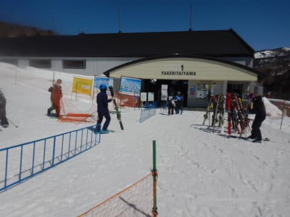

# 2022/4/2(土）の志賀高原は…晴天！朝イチは最高だったけど，焼額は昼頃緩んだよ

📅 投稿日時: 2022-04-03 00:06:09

🏷️ カテゴリ: [2022スキー滑走日記](cc9cb73e4320f6a97af6fccc37587a61a.md)

ってなことで．

本日から焼額の6:30からの早朝営業が

始まったわけですが…

6:30スタートに間に合わせようと思うと，

1時間睡眠で朝2時起きで出てこなきゃ

いけないので，さすがにそれは死ぬな…

やっぱり通常営業の8:30から参加かな？？

と思いつつも．

せっかく早朝も滑れる焼額2ndシーズン券を

買ったんだから

…と．

2時間睡眠で朝3時起きで家を出て，

7:30から滑ってました～！←危険な発想だ…

まず．

朝イチの早朝営業開始1時間後，

通常営業開始1時間前の7:30からスタートしますが…

今日は終日晴天！

見事な春の日差し！

そして，7:30の気温は…-8℃と

真冬並みの冷え冷えですよ！

で，昨日から2-3cmほど雪が積もったようで…

朝のゲレンデは，しっかり締まった下地の

上に，真冬並みのいい雪が乗った最高バーン！

もっとガチガチかと思ったけど…

これは，トップシーズン並みのいいバーン

じゃないですかっ！！！

しっかり締まった圧雪でエッジが効く，

かなり気持ちいいバーン！

4月としては最高級のコンディションっ！！

…ただ，8:30の通常営業を待つ人が，

営業開始前からかなり並んでいたので．

これは，今日はかなり混みそうだな…

と思っていたら．

やっぱり，午前9時半ごろにはゴンドラ

10分待ちくらいの長い列になっちゃいました（泣）

ただ，第2高速リフトは終日ガラガラ飛び乗り

だったし．

ゴンドラ待ちが長かったのは1時間ちょっとで，

11時ごろには待ちもゲート内までに短く

なって，午後はずっとこんな感じの待ち時間で．

それほどひどい待ちじゃなかったです！

ただ．午前中は気温がマイナスをキープ

していたので，日差しがあっても雪はそれ程

緩まず，締まったいい感じのバーンだったの

ですが…

やはり，雲一つない晴天の4月．

日差しが1，2月と比較にならない強烈さ

だったので…

気温は0℃程度だったのに，日差しで

昼頃には雪がダマダマになってきて

しまって…（泣）

午後2時ごろには雪はザクザクになっちゃい

ました(涙)

そのせいで，バーンはだんだん凸凹の

荒れ荒れになっていき．

夕方はかなり厳しい状態になったのが

残念…

さらに気温自体は低かったので．

夕方に日が傾いてくると…

ところどころ凸凹のままバーンが固まっていき．

更に厳しい状態に…（激涙）

…でも，滑る！

それでも滑る！

早朝から滑っても，ラストまで滑る！

…ということで．

今日も3時起きで，7:30から16時まで

昼休みなく，ひたすらグルグル滑り続けて

しまったのでした…

ってなことで．

午後はちょっと残念な感じでしたが．

あさイチはトップシーズン並みで，

昼までは4月と考えればかなりいい感じでしたし．

午後も，一の瀬方面はそれ程緩まなかったようで．

恵まれた土曜日でした～！！

で．

今日も朝3時から活動していて眠く．

明日も朝早いので，もう寝ます…

おやすみなさい…

## 💬 コメント一覧

### 💬 コメント by (ikkun)
**タイトル**: Unknown
**投稿日**: 2022-04-03 07:51:35

おはようございます。いつもお疲れ様です

実は昨日仲間4人と奥志賀高原でした❗まさに駐車場一杯で一番奥に(笑)実は昨年は焼額山でした❗ しかし春？って感じでゴンドラ横レストランもコミコミでしたね❗あ熊落とし行きました( *´艸｀)ニアミスにならないニアミスでした( *´艸｀)

### 💬 コメント by (ながのんちゅー)
**タイトル**: Unknown
**投稿日**: 2022-04-03 08:39:13

おはようございます。

昨日、１ゴンで2回、相乗りでご一緒しましたが、Sさんと確証がない為、お声を掛けられませんでした。

画像の手袋を見て、確認できました。

メット、ゴーグルも板とお揃いとは恐れ入りました。

次回、お見掛けしましたら、お声を掛けさせて頂きます。

地元なのに今シーズン、まだ行くかは微妙ですが．．．

### 💬 コメント by (レインボー74)
**タイトル**: Unknown
**投稿日**: 2022-04-03 19:48:44

日曜日の志賀高原情報

6時30分からのファーストトラックで、ヤケビは大賑わい。

8時30分からの一般市民の私。朝イチはカチカチ山のキンタロー。

でもだんだん緩んでいき、１時間も過ぎると快適バーンに。

ズクズクになっても楽しい。日に日に進化することが、楽しくてたまりまセブン。

今日はファミリーで130人参加の大会があったみたいで、帰りに寄ってくれた友人から、しっかり話を聞きました。クラスを40歳で分けてるらしいけど、これでは74歳では到底たちうちできない。参加人数が増えれば、もっと細かく分けてくれるかも。元気なうちに、そうしてほしいな！

愛する銀嶺が、今日でおしまい。あとは土日だけの営業になるとかで、お昼は味噌ラーメン。ご主人に挨拶もできたし、まあ満足の一日でした。

明日からはヤケビはイチゴンのみ。

二高も山ノ神もおしまいです。おまけに水曜はヤケビはお休み。こんなに雪があるのに、従業員が付属してるかららしい。

### 💬 コメント by (Skier_S)
**タイトル**: 志賀高原から帰宅
**投稿日**: 2022-04-04 02:13:29

＞ikkunさま

あら！志賀高原にきてらしたんですか．

でも，終日奥志賀から出なかったんですね．

私は一日焼額だったので，出会うチャンスは無かったですね…

＞ながのんちゅーさま

あら…目撃されてましたか．

意外と簡単に発見できちゃうんですね…

次回はお声がけください！

希望があれば20000mステッカーお渡しします！

＞レインボー74さま

今日の早朝は硬かったけど，硬いのが好きな私はかなり

楽しめましたよ～！

明日は，重い湿雪が硬めの下地の上に乗って，今日より滑りにくいと

思います…

怪我しないように滑ってください！

