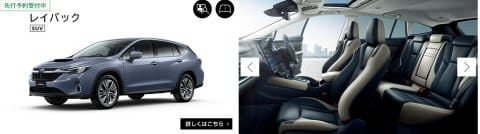
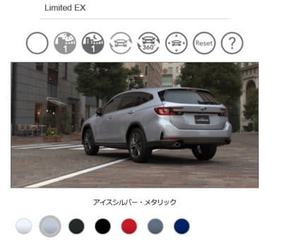
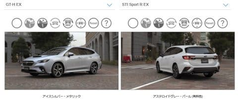

# 本日，スバルのLEVORG LAYBACKの情報が出たよ！LEVORG D型の情報も公開になりました

📅 投稿日時: 2023-09-08 02:28:59

🏷️ カテゴリ: [日記](cc4b5682fb7b8b144980957a978653fb0.md)

えー．

本日．

スバルのホームページに，

レヴォーグ レイバックの

情報が出てましたね…！

（[スバルホームページ](https://www.subaru.jp/)より）

予想に反して，ルーフレールとかもなく，

見た目はそこまでいかついSUVっぽい

感じではなかったですが…

車高が70mmアップし，

最低地上高が145mm→200mmと，

アウトバックやクロストレックと同じ

最低地上高になりましたね…

そこは魅力的！

ただ，やっぱり．

高級グレードの位置づけなのか．

フル装備のLimited EXの1グレードのみ．

（[スバル レヴォーグ レイバック紹介ページ](https://www.subaru.jp/levorg/layback/?=pclineup)より）

エンジンは1.8Lで，

アイサイトEX付き，アイサイトセーフティープラスの

視界拡張（3Dビュー・トップビュー付き），

そしてオーディオはハーマンカードンが標準

装備みたいです…

これ，高そうだなぁ…

新型レヴォーグでも，アイサイトEX無しで

いいかと思っていた自分にとって．

廉価版がなく，オーディオやらなにやら

フル装備でついてくる400万の車に

なっちゃうと，ちょっとさすがに

購入対象から外れます…（涙）

うーん．

さらに，レヴォーグも今日になってD型の

詳細がスバルのページに出ていて．

D型からはアイサイトEX無しグレードが

消え去るみたいですね…

さらに，廉価版のGTグレードも消滅．

Smartedition EXに置き換わり…

GT-H EX，

STI Sport EX

と，あとは2.4LのSTI Sport R EX

の4グレードに整理されました．

レヴォーグD型は，

アイサイトにインプレッサと同じ広角

カメラが追加された3眼カメラになったり，

カメラでトップビューや3Dビューが見れる

ようになった以外はあまり変わらず．

外観は，バンパーくらい変わるのかな？

と思ったけど．見た目，全く変わってない

感じ…

（[スバル レヴォーグ紹介ページ](https://www.subaru.jp/levorg/levorg/grade/index?=view_menu#pdf_area)より）

あ，ウインカーレバーは上と下でロック

される，普通のレバーに戻ったそうです．

そこは大きいかも（笑）．

うーん．でも．

これならC型以前の中古でもいいかも？？

雪道や山登りに行く際に長い未舗装路を

走る自分にとって，最低地上高が高いけど，

ルーフボックスを積んで天井が低い駐車場

にも入れる背が低い車って，すごい

魅力的なんだけど…

LAYBACK，あまりにも高そうな予感…（涙）

うーん．

これは予算的には厳しいなぁ…

PS．LAYBACK，車両価格399万円という噂…

## 💬 コメント一覧

### 💬 コメント by (ひゃくりん)
**タイトル**: Unknown
**投稿日**: 2023-09-08 18:43:53

新型レヴォーグのまとめ記事ありがとうございます。

うちのレヴォーグは15万kmを超えていて、

あと2年、20万kmぐらいまでは乗る予定です。

ただ、いつ壊れてもおかしくないと思うので、

情報収集はしており、

レヴォーグD型と、レイバックのどちらが良いか

悩むのが楽しみなところです。

レヴォーグの地上高でも雪道は問題ないんですが、

ドカ雪の降った妙高エリアで

除雪されていない朝一番の道路にできたわだちで、

車がゴリゴリいって、よく分からない部品が外れたことがあるので、

レイバックの地上高200mmはとても魅力的です。

ただ、確かに値段的なことを考えると、

距離の走っていないレヴォーグC型以前の中古モデルも候補に入ってきますね。

個人的には、高速道路の運転は楽をしたい派なので、アイサイトEXに興味がありますが、

いま使っているツーリングアシストだけでも

満足はしているので十分といえば、十分ですね・・・。

レイバックの地上高200mmが運転にどう影響しているか気になっているので、試乗レポを楽しみに待っています。

### 💬 コメント by (おおすぎ)
**タイトル**: Unknown
**投稿日**: 2023-09-09 10:04:42

S様・・・

ご購入おめでとうございます！

（販売店、第1号車でしょうか！！）

と冗談はさておき、この車も、直ぐに受注停止になってしまうのでしょうか・・・

### 💬 コメント by (Skier_S)
**タイトル**: コメント回答遅れました！
**投稿日**: 2023-09-09 18:03:52

＞ひゃくりんさま

おっと…早くも15万kmですか！

そろそろ買い替えを考えるころですね…

私はBRレガシィからレヴォーグにして，雪道で底やバンパーリップ，サイドアンダースカート部が

雪に擦れることが多く…

駐車場で思ったところに入れられないことも（涙）

なので，レイバックはかなり魅力的なんですが…

2LのVMGよりお値段がかなり高くなるのはちょいと厳しい感じです（泣）

ちなみに，BRレガシィは駐車場の柔らかそうな雪の塊にちょっと突っ込んで止めたら，

バックするときにタイヤディフレクターがぼっこり外れた思い出があります…

レガシィのフロントタイヤディフレクターは知らぬ間に左右ともなくなってました．

雪道や雪の積もった駐車場は，車高が低くフロントバンパー下のクリアランスがない車は

厳しいです…

かといって，車高が高い車はルーフボックスをつけると自走式立体駐車場に入れなくなるところが

あるので，厳しいところ．

＞おおすぎさま

いや…買いません．

というより，買えませんから～！

こんな高い車なら，それだけ安い車を買ってスキー道具に回します（笑）．

しかし，受注停止になるくらい売れてくれるといいんですけどね…

＞

