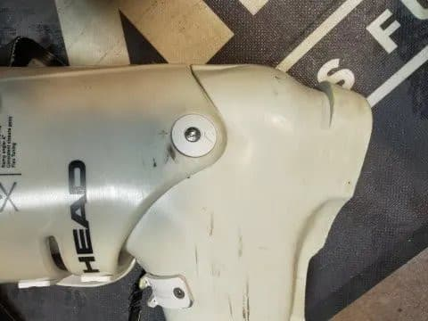
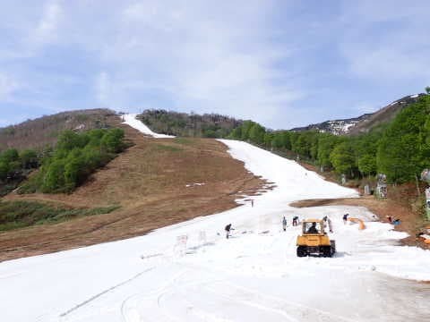

# エキップさんで調整しなおしたHEADブーツで滑ってみたら

📅 投稿日時: 2023-07-04 02:29:35

ってなことで．

2シーズン履いて調整がくるってきていた

HEADブーツ．

購入時にばっちり合わせてもらっていたのに，

膝がまっすぐ入らなくなっていたので，

[エキップさんでカントやらフットベッドの
再調整をしてもらい](e1f002012636820e67f6e0047c9d3f736.md)，また膝がまっすぐ

入るように調整してもらったわけですが…

調整しなおした後のブーツで滑って

みました～！

荒れ荒れの5月のかぐらでの試し履きだった

わけですが．

滑ってみると…

うぉぉぉ！！

谷回りがやりやすい！！

ニュートラルから谷回りにかけての捉えが

さらに早くなったので，谷回りの不安定さが

なくなって，谷回りからさらにがっつり

踏めるようになりました～！！

…これ，エキップさんブーツを初めて

履いた時の感動に近い…

やっぱり，長く履いていると徐々にカントや

インソールの調整がずれていってしまうよう

ですね…

いや．

実はエキップさんでいちばん最初に

REXXAMブーツを買って調整してもらった

のは，シーズンオフの10月ごろ．

この時期はシーズンが終わってかなり経ち，

滑りのポジションを忘れているってのもあり．

さらにシーズンに入って，エキップさん

ブーツのあまりにものフィット感と捉えの

早さから．

自分の滑りのポジションが，ブーツを作った

当初と全く変わってしまったんですよね…

いや．

いいブーツを履くと，滑りはすごいシンプルに

なります．

谷回りだ切り換えだ角付けだとかなんだかんだ

考えることなく，単に板の真上から踏み続ければ

よくなるし，X脚も内足・外足のバランスの

崩れも，それによる外足の板の流れとかも，

ブーツがすべて解決してくれるので…

ってなことで．

自分の滑りがだんだん変わっていった結果．

なんだかブーツポジションが自分の滑りと

ずれてきた感じがあり，REXXAMブーツを

購入したシーズンの途中にカントを見直して

もらったところ．

その際もやはり見事に大きくカントがずれて

ました…

この時は，エキップさんブーツを履いてから

滑りが変わっていき，自分でも滑りとカントが

ちょっとずれてるな…とわかるほどだったんで，

「カント調整しなおさないと…」と思ったんですが．

（今やこのREXXAMブーツもお亡くなりに

なってしまいましたが…)

今回のHEADブーツは，ブーツを作ったのも

シーズン終盤で，自分のポジションが固まって

いる時期だったし．

さらに，このブーツを履くようになって以降，

自分の滑りがそこまで極端に変わった感覚も

なかったし．

そもそも，ブーツの調整がずれているという

感覚も全くなかったので．

まぁ，そんなにずれてないよな…

でも，せっかくだから見てもらおうかと

思ったら．

見事に膝が内側に入っていて，

まっすぐ踏めてない状態になっちゃって

ました…

これは，自分のポジションや骨格がずれて

来ているというのもあるかもしれないけど．

シェルがひずんでいる

という宣言を受けたので．

シェルのゆがみでずれた分も大きそう…

とりあえず．

ブーツを直して滑ってみると．

をを！！

ニュートラルでちゃんとエッジがニュートラルに

なる！！

当たり前のことだと思うけど…

意外と，ちゃんとチューンされてないブーツは

ニュートラルでもエッジが残ったり，完全

ニュートラルになりきる前にエッジが外れたり

します…

そして．

ニュートラルポジションでちゃんと板が

ニュートラルになるので…

そこからわずかに谷回りに入った瞬間に

きれいに外足のインエッジが捉えてくれて．

谷回りのものすごい早い段階から板を踏んで

いけます…！

そのおかげで，山回りにターンの圧が集中する

ことがなくなり，山回りは早い段階からターンを

抜け出すことができるし…

うん．

そうだよ…

エキップさんブーツは，やっぱりこうじゃないと！！

そして．

板の捉えが早くなった分．

板のエッジがしっかり立っているようにも

感じるし．

板がしっかり踏めるようになった分，

ブーツも板も，さらに柔らかくなったように

感じるという…

うん．

ブーツのカントやソールをぴったり

あわせ直しただけで，古いブーツでも

ここまで気持ちよくなるとは…！

…REXXAMブーツはヘタってたけど，

HEADブーツはまだしっかり板も踏めるし，

粘りもあるし，もう少しいけそうだな…

ってなことで．

カスタムでブーツに手を入れてもらっている

方は，シーズンに一度…

いや，できればシーズン中でスキーに

慣れてきたころに，一度ブーツのカントなどを

調整してもらったほうが良いと思います…

板をチューンナップに出すなら，

ブーツもチューンしてもらうべき．

滑りが変わる可能性がありますよ～！

## 💬 コメント一覧

### 💬 コメント by (ふく)
**タイトル**: 気になる
**投稿日**: 2023-07-04 10:24:44

ブーツは大事ですよね。

店舗のホームページを見たら、料金が気になるところです。

シーズンに3回ぐらいしか行かないので、ブーツを買って調整すると、スキー1日当たりの単価がビックリ価格になってしまうのです。

### 💬 コメント by (Skier_S)
**タイトル**: ＞ふくさま
**投稿日**: 2023-07-05 01:15:40

ブーツは無茶苦茶効きます！！

練習してもできなかったことが，ブーツを変えるだけであっさりできるようになったり…

すごい大事です！

エキップさんは，ブーツを購入すればその際の調整は基本的に無料です．

その代わり，ブーツ料金は定価からちょい引いてくれる程度ですが…

時々型落ちの安いブーツがあったりするので，そういうのがあればお買い得です．

でも，お金を払うだけの価値は十分あると思います…！

とはいえ，シーズン3回だとすごい単価になりますね…

### 💬 コメント by (愛読者)
**タイトル**: Unknown
**投稿日**: 2023-07-05 12:34:34

WCR3のシェルがゆがむ！凄いパワーですね。これでは弱いので次のWCR2の準備が必要ですね。カントやブーツ底の調整は、応急措置で物欲選手権は終了済みだったりして。

次のシーズンでのブーツの耐久テストも期待しています。

あと、エキップさんは、きついブーツをかなり拡げるんで凄い。壊れないですか?

足も太った私は、無理せずWCR130Sを検討しています。後出しですみませんでした。

### 💬 コメント by (Skier_S)
**タイトル**: >愛読者さま
**投稿日**: 2023-07-06 00:29:01

私もまさかWCR3のシェルが歪むとは思ってませんでした…

でも，基本的にブーツは使っていくと歪むみたいです．

で，私のブーツもかなり広げてますけど，シェルの割れやヒビは全くないです．

私は足首が細いから，WCR130はダメなんですよ…

WCR130はラストが広いだけじゃなく，足首回りもちょっとルーズみたいなので．

### 💬 コメント by (ブーツチューンは際限が…)
**タイトル**: Unknown
**投稿日**: 2023-07-06 20:09:07

熱を加えて広げたブーツは時間をかけてある程度戻ろうとします。

数年経ったら全部元通りというのであれば、まだ救いがあるかもしれません。

ある程度が部分部分によって異なるのでそれぞれが適当に戻ります。

熱加工したブーツが素のブーツよりも歪むのは当然でしょう。

### 💬 コメント by (Skier_S)
**タイトル**: ＞ブーツチューンは際限が…さま
**投稿日**: 2023-07-07 01:40:04

そうなんですよ．

広げたブーツもしばらく経つと戻ってくるので，時々広げなおしてます…

そして．ブーツに熱加工するとバランスを崩すのでやらないほうがいいという説もあります．

でも，残念ながら私の足は無加工のシェルでは入らないので，広げざるを得ず…

熱でシェルだしするしかありません（涙）

しかし最近のシェルは，FISCHERのVACUUM然り，ATOMICのMemoryFit然り，

標準で熱加工できるのが増えてますよね．

そういうのは加工の戻り，大丈夫なんでしょうかねぇ…

