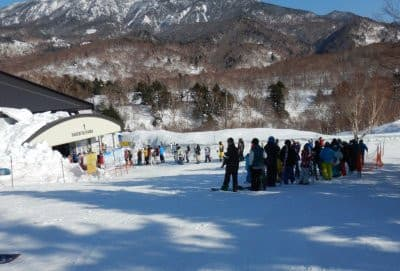
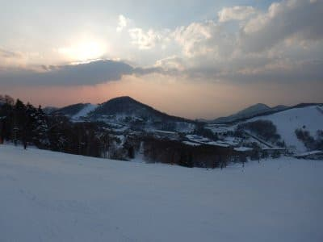

# 2021シーズンはどんなシーズンだったかな？…20000mの方々の破壊力ある迷言は無かったなぁ…

📅 投稿日時: 2021-08-02 02:51:50

🏷️ カテゴリ: [日記](cc4b5682fb7b8b144980957a978653fb0.md)

ということで．

今年もこないだ正月が明けたばかりの

気がするのですが．

一体どのような時空のゆがみがあったのか，

私は今，8月の世界にいるようですね…

知らぬ間に数か月タイムスリップして

しまったのかな？

そして．

Tokyo2020という表記をいたるところで

目にするので．

「今年，まだ2020年だよね…」

と誤解する今日この頃．

皆様いかがお過ごしでしょうか（時候の挨拶）

で．

この夏はダイビング遠征の予定がない

ため，ずっと冬モードが続いているこの

Blog．

でも，ラスト月山で私のスキーシーズンが

終わってから，早くも1か月半が経つので．

今シーズンがどんなシーズンだったか，

ちょっと振り返ってみましょうか…

今シーズンは…

というか，今シーズンも．

昨シーズンに続き，

コロナにやられたシーズン

でしたね…(激涙）

1月，2月のトップシーズンに滑れない

という，精神衛生上，大変よろしくない

シーズンを過ごしてしまい．

…さらに，3月に入っての

緊急事態宣言解除後は，

ゴンドラ乗車定員制限のため．

我が住み家の第1ゴンドラが激混み←だからゴンドラには住んでないでしょ？？

となり．

週末は朝9時には10分待ち以上，

最大30分待ちを超えて．

さすがの1ゴンラブ♡の私も，

「ごめん…1ゴン…君のことが嫌いなわけじゃないんだよ…」

と言い訳をしつつ，奥志賀や寺子屋に

浮気をし続けた今シーズン．

1，2月は緊急事態宣言でほとんど

滑らず．

3月は激混み，

そして人が減る4月は1ゴン営業せず…

(春営業は2ゴンのみ)

ということで．

おそらく，焼額に通うようになってから，

最も1ゴンに乗った回数が少ないシーズン

だったんじゃなかろうか？？？

例年なら，1シーズンで500～600回は乗る

焼額第1ゴンドラ．

多い日には，1日30本以上乗ることも

あるというのに…

今シーズンは100本ちょい位しか

乗ってないんじゃないかな？

こんなことじゃ，

焼額1ゴンが住み家

という称号は返上しないと！←だから住んでないでしょ？？（そもそも称号じゃないし）

そして．

今シーズンは

狙ったように週末に雨が降る

呪われたシーズンでした…

いや．

12月は良かったんですよ．

そして…

私が行っていない，1月2月は

週末ずっと雪だったようですが．

なぜか私が復活した3月からの週末を見ると．

3月6，7日…6日朝から雨

3月13，14日…13日どしゃ降り＆ゴンドラ運休

3月20，21日…21日強風で1，2ゴン＆奥志賀運休，昼前から本格雨

3月27，28日…28日強風で1，2ゴン＆奥志賀運休，昼から雨

4月3，4日…4日昼から雨

4月10，11日…6週間ぶりに雨が降らなかった週末

4月17，18日…17日強風で焼額・奥志賀ゴンドラ運休，朝からどしゃ降り

という感じで．

この7回の週末で雨が降らなかったのは

4月10，11日の1回のみ！

私がゲレンデに復活してから

7週間で6回雨って…

それも，雨だけならまだしも．

うち4回はゴンドラやリフトも運休…

呪われているとしか思えないシーズン

でした（涙）

これだけぶっ続けで週末に雨が

降ったのも，我が人生で最悪の

記録ですね…

そのおかげで．

焼額朝礼メンバーに，謎の「カッパーズ」

と自称する，雨の中でも，合羽（というか，

レインウェア）を着て滑る，

諦めの悪い人たち

が自然発生しましたが．

ここまでくると，なんというか．

スキー○カとしか言いようがないですね…←あなたもそのバ○の一人でしょ

でも，あれですね．

今年はコロナ禍もあり．

ゴンドラ乗車定員での混雑やら，

一の瀬ファミリー第3クワッドの運休が

あったりで．

20000mの方々も，1本でも多く滑ろう

という執念が薄れたのか．

今シーズンは，

「リフトが動いているから帰れない」

「スキーブーツはギプスです」

といったクラスの，破壊力がある迷言が

生まれなかった年でしたね…

今年はコンディションが悪かったのもあり，

20000mチャレンジした人も少なく．

おそらく，今年新たな20000m達成者は

1-2人くらいしかいないんじゃないかな？？

…とはいえ．

ニューブーツのおかげで滑りはよくなったし．

20000mな方々＆焼額朝礼メンバーは

いつも通り面白かったし．

今シーズンも数多くの出会いがあって，

仲間は増えていったし．

残念だったところもあったけど．

振り返ってみると．

今シーズンも楽しいシーズンだったと

思えた，Skier_Sだったのでした…

　

　

　

## 💬 コメント一覧

### 💬 コメント by (ゴン太＠SALLOT CLUB)
**タイトル**: 雨の慕情
**投稿日**: 2021-08-02 19:11:30

確か3月の21日か28日、一の瀬界隈が激込みの際に某レジェンドから

「もっと雨強くならないかな。空くのに。」

というお言葉を拝聴しました。

### 💬 コメント by (Skier_S)
**タイトル**: ＞ゴン太さま
**投稿日**: 2021-08-03 02:17:11

…その言葉は，十分迷言候補ですね…

さすが某レジェンド…

何かを突き抜けてますね（笑）

### 💬 コメント by (ikkun)
**タイトル**: Unknown
**投稿日**: 2021-08-04 17:16:07

誕生日米ありがとうございましたm(__)m    確かに年を重ねると(笑)……では奥様が居たりお子様が居たりしたら……あるかもですね？ １月2月は地元団体さんが、動いて頂けたから……しかし３月は悲惨でした  自由に滑走出来るから…moneyにならないわけで(笑)笑えません   あやつ退散m(__)m

### 💬 コメント by (Skier_S)
**タイトル**: ＞ikkunさま
**投稿日**: 2021-08-05 00:47:21

moneyにならないのは厳しいですね…

早く収まることを願うばかり．

