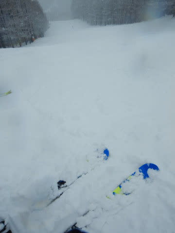

# 2020/12/30の志賀高原スキー場は…朝は湿雪，午後は冷え冷え雪が吹き付ける厳しめの一日

📅 投稿日時: 2020-12-30 21:48:34

ってなことで．

なか一日のK奈川県滞在で，また志賀高原に舞い戻った

わけですが．

本日はなかなか微妙な一日でした…

まず．

朝，志賀高原へ向かうわけですが…

長野県に入ったあたりから雨になり．

中野市を過ぎて，上林のチェーンチェックを

過ぎても雨なんですが…（涙）

ただ，登り坂の途中から，何とか雪になり．

スキー場が見えてくるころには，路面も完全

積雪路になってきました…！

ゲレンデで雨に降られるという最悪の事態は

避けられたようだな…

とりあえず，

　朝は6時ごろから標高が低いところは雨，

　標高が高いところは重い雪が降りはじめ

という予想は，きわめて正確に当てたようです！←自画自賛

…ただ．

　朝はちょっと風が強く，ゴンドラは減速運転．

というところは．

風がそんなに強くなく，ゴンドラは普通に営業したので．

ちょっと外したか…（涙）

でも，いい方に外れたから良しとしよう！←いつもその手でごまかしてないか？

ということで．

朝8:30の通常営業前に，いつも通りの焼額第1ゴンドラ

前に並びますが．

うむ？年末休に入ったわりには，それほど列が

長くないですね…

そして，別料金のファーストトラックが昨日から

開催されていて．

有料の朝いちバーンを滑っているお金持ちの方々を

指をくわえて眺めつつ，下々の民は営業開始を待ちます．

そして，8:30の通常営業開始と同時に山頂へ！

山頂の気温は…‐3℃ですか．

この時期としては，ちょい高めの気温…

で．

湿ったボタ雪が降り積もってます…

だもんで．

あさイチのゲレンデは，圧雪の上に5cmほどの

重めの雪がうっすら積もった状態でスタートです．

上に乗っている雪は重めの雪ながらも，

それ程新雪は深くなく．

下地はしっかり締まったいい感じなので，

意外と滑りいいバーン！

激軽ふわふわ新雪ではなかったけど，うっすら新雪を

切り裂きながら滑っていくのはいい感じ…！

うっすら新雪を楽しめたけど．

ウェアに着くとびしょ濡れになるような湿雪が降り続け，

ゴーグルに水滴がついて前も見にくいし．

ちょいと快適なコンディションではなかったのが

ちと残念…

そして，昨日から焼額第1ゴンドラには，

空席待ちの相乗りレーンができていて．

混雑してくると，乗車制限の4人まで

なるべく相乗りするようになっていて．

さらに，大雪のニュースで出かける人が

少なかったからか，ゴンドラの待ち時間は

年末休としては短く，朝9時半までは

ゲートの外に出るかどうか．

午前10時過ぎに，一瞬10分待ちくらいまで列が

伸びたらしいけど．

午前11時過ぎの昼時にはほぼ飛び乗りの

タイミングもあり．

午後は最長でもこのくらいまでしか待たず．

リフトは飛び乗りだったので，

26日の土曜に1ゴンが30分待ちになったとき，

「年末年始はすごい並ぶかも…」

と覚悟していたのは，今日は肩透かしの感じで，

リフトやゴンドラを，快適にグルグルできました！

とはいえ．

午前10時過ぎにいったん湿雪が止み，

視界はクリアになったものの…

昼を過ぎると，

　そこから気温が昼間に向かって下がっていき，

　昼から雪が本格的に降り始める．

という予想通り…

雪が激しい勢いで降り始めて来ました！

それも，朝の湿雪と違い，ウエアについても

パラパラと落ちる，冷えたいい雪です！

この雪が，視界が悪くなるほどの勢いで

降ったので…

ゲレンデは，またもやうっすらと新雪が！

…それも，今度はかなり軽い，滑った後ろに

パウダーが舞い上がるような気持ちのいい雪！

ただ．

視界も悪く，下地もわずかに凸凹していて．

その上に風まで出てきたので…

本日も，

根性の無いスキーヤーふるい落とし機能

が稼働し．

午後2時過ぎには，次々ゲレンデから人が消えて，

コース上はガラガラに…

この，根性の無いスキーヤーふるい落とし機能

に生き残った，選ばれし民は．

寒さと風に凍えながらも．

冷え冷え雪が積もりゆくガラガラのゲレンデを．

サラサラの雪を蹴散らしながら，

16時のリフトストップまで好き放題

飛ばすことができたのでした…

…で．

いい雪が積もったので．

これはナイターに行かずばなるまい！！！！

と．

ナイターに行く気満々でいたのですが．

ものすごい雪のため，一の瀬はナイター中止に（涙）

そして，焼額も，営業開始直前に

「悪天候で危険なため中止」

という案内が…（激涙）

まぁ，ある程度予想していたことではありますが．

ナイターに行けず，悶々と夜を過ごしました…

で．

今もすさまじい勢いで雪が降っています…

明日の朝には降りは弱まるものの，31日も

凍死レベルの寒さで雪が降り続けるため．

明日の朝イチは非圧雪コースは膝パフ，

圧雪コースは圧雪の上に5~10㎝の積雪，

終日コース上に雪が降り積もる日になりそう

です…！

根性がない人は避けた方がいいかもしれないけど．

根性がある人は，パウダーが楽しめそうです！

## 💬 コメント一覧

### 💬 コメント by (Goku)
**タイトル**: ふるい落とされる以前・・・
**投稿日**: 2020-12-30 21:59:07

根性のない『極楽派スキーヤー』の私は、ふるい落とされる以前に行くことすら諦めました(笑)

明日も人間をダメにする『コタツ』ってやつから抜け出せそうにありません。

### 💬 コメント by (今回はホームアサマ2000特派員m&t)
**タイトル**: Unknown
**投稿日**: 2020-12-30 22:10:48

Sさん、今日は投稿が早すぎでは・・・。明日は天気が荒れそうな予感がします。

本日のアサマも志賀高原同様、３センチ程の新雪がのったゲレンデで、雪が着くとウェアがびしょ濡れになり、ゴーグルに水滴がついて前か見にくい上にコースが凸凹。根性のないスキーヤー振り落とし機能に引っかかり、10時に早退しました。

新年は、１日か２日どちらか、天気をみて志賀高原に出没予定です。

### 💬 コメント by (かず)
**タイトル**: Unknown
**投稿日**: 2020-12-30 22:16:49

朝起きてあの雨…すぐ諦めました 今日は中止にした人が多かったと思います  良さそうに見えますがおそらく Sクラスでないと厳しいそう…時差ボケになる位寝たので体力復活！明日新板その2楽しみです

### 💬 コメント by (Northfox)
**タイトル**: 生き残りました
**投稿日**: 2020-12-30 23:15:22

今日の最後はかなり厳しい状況になりましたね。。。どこ滑っているのか分からないほど。宿に戻るために一の瀬ファミリーを上がるのですが、正面上部を滑る気になれずペアAにしてしまいました。ナイター営業中止のアナウンスには安堵しました。（ナイターに行くべきか悩んでいたので）

それでもタンネの森でリフト最終乗車を果たし（係員さんからは ”お疲れさまでした～” のお言葉が）何とかふるい落とされずに滑り切りました！！

### 💬 コメント by (ikkun)
**タイトル**: Unknown
**投稿日**: 2020-12-31 00:10:18

ワオ お疲れ様でした 新潟も朝は結構な雨～の講習辺りから細かい雨と……霧😱💦 昼休み辺りから45度の激しい雪になりました❗車運転もちいと怖い位でした霧の中の先輩のご教授「(  -_・)?理解不足だなぁ」の先輩の声にやはり萎えた私しでした  沢山積もりません様にって無理??(・・;)

### 💬 コメント by (西舘)
**タイトル**: 本日の天気予報は大正解でしたね！
**投稿日**: 2020-12-31 03:03:02

午後２時過ぎから、西舘は激混みでした。

皆さん、即撤退ではなく、3時半頃まで西舘で耐えていたようです。

西舘ワールドカップコースもOPENしたので、宿からの脱出が楽になりました。

本日、午後からの参加だったし、我が家はレインボーさんジャッジでも合格をいただけるのではと思うほど、『エス化』完了しているので、寒さでふるい落とされることは無さそうですが、私のゴーグルが午後3時半頃から凍結し、視界ほぼゼロの

ダイビングだったら死亡フラグ立ってる状態に。午後4時頃に危険走行と判断して退場しました。

皆さん、どうしていらっしゃるのでしょうか。

取り敢えず西舘Jr.が歯磨き粉で磨いてくれたので、様子見します。

特急『しなの』もがら空きでした。空いている時期、時間帯には6両編成で走らせているのですが、1ヶ月前には指定席を売り出しているため急に車両数を減らすこともできないので、当初予定のまま、8両編成で走らせた結果でしょう。この穴埋めが料金に跳ね返る。

お宿はキャンセル料金など取っていないでしょうし、ＪＲみたく今後の料金に上乗せすることもできないから、本当に行く末が心配ですよね。

・・・今回の緊急中止で旅行社だけ懐が潤ったような気がして闇を感じる・・・。

### 💬 コメント by (そとく)
**タイトル**: Unknown
**投稿日**: 2020-12-31 06:25:43

3時半に1ゴンに降りてしまい。営業終了とともに根性の無い私と私の子どもたちは、撤退しました。

やっぱり、会えませんでしたね。naoちゃんねるさんにはあえて、娘が感激してました。

午前中は、なかなかすべり安かったです。２時過ぎからは、滑るのもきつかったです。ゴーグルが凍りだすとだめですねー。雪の凹凸見えず恥ずかしいコケ方をしてました。

今日は、サンバレー順に中央エリアをぐるぐるする予定です。

一回もジャイアントのオープン日に来たことがないので、今年は滑れるかな？

### 💬 コメント by (Northfox)
**タイトル**: Unknown
**投稿日**: 2020-12-31 08:32:38

ゴーグルの曇り対策ですが…

注）新品のゴーグルにはお勧めしません

レンズの内側に食器洗い用洗剤を少し塗ると曇り防止の効果が有ると思います。

バイクのヘルメットのシールドの曇り止めとして昔し紹介されていた手法です。

### 💬 コメント by (レインボー73)
**タイトル**: Unknown
**投稿日**: 2020-12-31 09:18:15

皆様、激務お疲れ様です。私は29日に帰宅して、家庭でしっかり株をあげていますが、心はスキー。不幸せです。

曇りどめですが、私はアマゾンで購入した『パールくもり止めＣ 60ml』を毎日裏表に塗って問題なしです。もっとも私は、そんな激務の日には極様同様コタツ派ですから。

ちなみに２年前は881円でした。送料の関係で４本まとめ買いしました。

また、ワックスですが、毎朝『スーパーレインエックス』（車のガラスにシュッの液体。黄色の容器）を塗るだけの日が多いです。安い、簡単、庶民に最適。ママレモンもスタートワックスにいいと、以前レーサーに聞いたことがあります。

気に入らなければ車に使えばいいので、無駄な投資にはならないはずです。

### 💬 コメント by (アリス)
**タイトル**: Sさん、一般ピーポーではありませんよ
**投稿日**: 2020-12-31 16:31:46

Skier_S様

お世話になっております。

77,000円のシーズン券をお持ちの方こそ、富裕層スキーヤーですよ♪

さらにナイター券も別途購入ですから♪

FT券の料金が、朝一の3本のために割に合うかどうかスキーヤー次第ですよね。

どんなコンデイションでも営業時間最終まで滑るSさんは凄いです。

尊敬しちゃいます。

### 💬 コメント by (Skier_S)
**タイトル**: 今年もお世話になりました
**投稿日**: 2020-12-31 23:01:54

＞Gokuさま

コタツ，人間をダメにしますね…

スキーはもっと人間をダメにしますが（笑）

また年明けにお会いしましょう！

＞m&tさま

意外と今日は落ち着いた天気でした…

全く予想を外しました（涙）

年明け，また志賀高原でお待ちしています～！

＞かずさま

今日の雪は重かったですね…

明日の朝は軽い新雪が積もっていればいいんですが．

ニューイヤーファーストトラックがなくなったので，8:30からで

新雪が楽しめますよ！

＞ Northfox さま

昨日はラストまでお疲れさまでした．

昨日ラストはひどい天気でしたが，意外と今日は落ち着いた天気でしたね．

朝までに雪が積もって，昼間は穏やかな天気という理想的な一日でした…

明日もそうだといいですね！

＞ikkunさま

志賀高原は雨にならず，本日大晦日の朝まで結構積もりましたよ！

今日，新潟は結構降ったようですが，志賀高原は一日穏やかな日も射す

一日でした．

＞西舘さま

昨日の天気予想は当てましたが，今日の予想は外しました…

ゴーグルですが，私もフェイスマスクをするようになってから

曇りがひどくなってきました（涙）

曇ったまま凍り付くとどうしようもないですよね…

曇らないように，滑っていない時はなるべくゴーグルを

外すようにしています…

＞Northfoxさま

食器洗い用洗剤とか，シャンプーとか，洗剤系は確かにシールド曇り止めに使えますよね．

ゴーグル用曇り止めの薬剤もいっぱいありますが，

曇り防止加工ゴーグルの場合は

効かないものが多いですよね（涙）

＞レインボー73さま

ママレモンがスタートワックス！！！

初めて聞きました…

コースが洗剤できれいになりそうですね（笑）．

＞アリスさま

まぁ，毎週スキー場に通っているだけで一般ピーポーではない気はしているのですが．

ナイターの2時間には2000円払えても，FTに1500円はちょっと…

というあたりが，私の金銭感覚の限界です．

ひたすら休まず最後まで滑ってしまうのも，交通費とリフト券代を払っているんだからと，

1本あたりのコストを極限まで下げようとする私の貧乏性だったりします…

ついつい「もったいない！」と最後まで滑ってしまうのです（笑）

### 💬 コメント by (西舘)
**タイトル**: Northfoxさま、レインボーさま、Sさま、ありがとうございます。
**投稿日**: 2021-01-01 03:00:30

そうなんです、曇るだけなら滑ってしまうのですが、曇ったまま凍り付いて、視界ゼロになってしまいました。

気温が上がってくれば大丈夫な筈なので、2月になれば解消するかなぁと思ったりして。

『パールくもり止めＣ 60ml』早速購入しようと思ったら、在庫切れだった！残念！！追納を待とうとお思います。

### 💬 コメント by (レインボー73)
**タイトル**: Unknown
**投稿日**: 2021-01-01 20:20:06

お借りします。西館様、曇りどめは買いすぎたので、いつでも差し上げますよ。エス様にでも渡しておきましょうか。

私が志賀を留守にした僅かな期間に、最高の雪が降ったとか？　これも私の人徳のなさからと諦めることにします。私はもう欲しいものは何も無いんですが、エス化教の教祖様の洗脳のおかげで、何か買うものはないかと、いつも物色しています。困った教祖様です。

### 💬 コメント by (Skier_S)
**タイトル**: 元日から最高でした
**投稿日**: 2021-01-01 22:49:07

＞西館さま，レインボー73さま

西館さん，もし曇り止め必要なら，レインボーさんから預かっておいて，後日お渡ししますよ！

…そして．今日の雪は最高でした…レインボーさん，すみません（笑）

