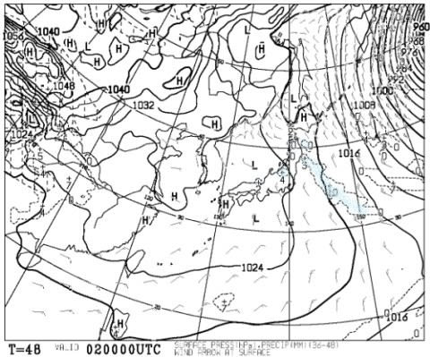

# この週末も志賀高原スキー場滑ってます～！土曜は新雪ブーツ～脛パフ，終日雪！日曜はトップシーズン冷え冷え雪の圧雪＆晴れそう！

📅 投稿日時: 2020-01-31 23:39:20

🏷️ カテゴリ: [日記](cc4b5682fb7b8b144980957a978653fb0.md)

えー．

あの，[プロジェクトX2の日々](ecdca7ac058e50b9e3a2a3ae04e18b623.md)からもうすぐ1年半になる，

わがVMGレヴォーグ君．

先日，走行距離44444kmを突破しました…

…購入から1年半で，早くも4万4千km．

順調に過走行の道まっしぐらですが．

今のところ，極めて快調に

走ってくれてます．

…ってなことで．

明日から，待ちに待った週末！

今日は，朝は予想通り10cmの積雪が

あったようで．

そして，

　この日は終日気温は-10℃クラスで，

　一日雪が降り続ける，真冬の一日．

　昼間もゲレンデにモサモサ雪が

　積もり続け，終日柔らか雪を

　滑り続けられそう…

という予想通り．

終日ほぼ-10℃近くをキープし．

夕方までに，トップシーズンの冷え冷え

雪が，15cmほど積もったようです…！！

（[焼額山Facebook](https://www.facebook.com/yakebitaiyama/?hc_ref=ARSf5VjkENoXVBnzL8SFBAcw61N4m3Gquxxzx2Mlqpg4meG-0w-rof7wajc0PvPHenc&fref=nf&__xts__[0]=68.ARDzVSdDhnXFr3psDDZkqyJN2WvPjYbmHkNQXAP8aBaJ0l6TshEwR5HP-2rZZCZ3akMiOzpnvF6SkMLI02_FIL5p7bOWu9CXLRLxNLvOX8vdKuSSWilHMGUto5ZF9HOftgokFCDpHijsJmfypczPuDIThw6wq3-_-YfSaFWoOrU9KbYfjXTFhEluvjeA6rpVZ1_IzMNCbRjIW8IoX6ZVtm07Dp_dKqCvscdgj8XhLYh83HqS-pbC2V_dT1dLSHSMURy1qb8WtgGzUk0TdKcwvNHAx-alCH7dBJ1POa9fUrXqv0GM2ca281VmBLQ1wtxMLGHhVTP8fHK3nyrqPmswg-kbPQ&__tn__=kC-R)より）

来ました…

ようやく，トップシーズンらしい雪が

来ましたよ～！！！

現在も，志賀は降り続けているようですし．

（[北信建設事務所道路気象状況ページ](http://hokushin.pref-nagano-roadcamera.jp/)より）

そして．

明日1日の朝9時の500hpa気温図を見ると．

そこそこ雪が降る目安の-30℃線．

こいつが本州に近づいてます…っ！

これなら，明日の朝も，冷え冷え新雪が10～20cm，

ブーツ～膝下パフくらい積もってくれそうです！！

明日，2月1日（土）の地上天気図は，

こんな感じで冬型なので．

ほぼ一日中雪が降り続けそうですね…

昼間の雪はそれほど強くは

降らなさそうですが．

昼間も-6～7℃程度までしか

上がらない，激冷え寒々の一日なので．

暖かい格好して言ってくださいね！

そして，土曜の朝の志賀高原への登り道．

かなり本格雪道と思うので．

雪道運転に慣れてない人は注意して

登ってください…

で．

日曜も，水色の-6℃線志賀にかかってるレベルだし．

朝は-9℃程度の冷えひえ！

冬型は弱まるので．

朝はちょっと雲が残ってる

かもしれないけど．

基本的に晴れそう！

やっぱりこの日は，冷え冷え雪が

見事に圧雪された，やわらかバーンを

滑れそう！！

ってなことなので．

2月1日（土）：朝は-10℃を下回る激冷え．

　朝イチはブーツパフ，雪が溜まるところは

　ひざ下パフまで行くか？

　あさイチの志賀高原への登り道，

　本格雪道なので覚悟．

　この日は終日雪降り．昼間も気温が-6～7度までしか

　上がらず，寒いよ！真冬の一日．

　雪質は冷え冷え最高！

　昼間の雪はそれほど積もるほどではないけど，

　雪が柔らかいので午後のゲレンデは凸凹の

　全面コブ斜面になっていく．

　急斜面は，コブ溝に硬い下地が

　出てくるかも…

2月2日（日）：朝は冷え冷えピカピカ柔らかシマシマ圧雪！

　おそらく今シーズンの週末では初と言っていい，

　トップシーズンらしい柔らかいシマシマ圧雪！

　久しぶりの柔らかいシマシマ！

　朝は雲が多いかもしれないけど，じきに

　晴れて，日が射す．

　昼間も-5℃程度までしか上がらず，

　冷え冷えなのに太陽のもと柔らかい雪を

　滑れる，トップシーズンの最高のスキー日和の一日！！！

　この日も午後はコース全面凸凹になり，

　一部下地の硬いところが出てきそう…

　でも，絶好のスキー日和！

ってな感じでしょうか．

で．

私はいつも通り，また週末焼額をグルグル

滑ってます～！！

…あと3時間後に出発です．

また睡眠時間3時間を切るのか…（涙）

## 💬 コメント一覧

### 💬 コメント by (なるなる)
**タイトル**: Unknown
**投稿日**: 2020-02-01 02:32:27

S様にはおよびませんが、私のVMGレヴォーグ君、1年で軽く20,000Km超えました…

志賀高原に行くのがダメなんでしょう。

プロジェクトX2終了後、このブログに影響されたのか、別件でディーラに行ったついでにバカみたいな

金額を提示して冷やかして遊んでいると、その金額になってしまい…

今週も志賀高原に行くので、また距離伸びちゃいます。

さすがに、S様に影響されても、平日仕事して睡眠時間3時間は無理な凡人なので、日曜から1泊で。

月曜の天気予想も簡単に教えていただければ幸いです。

### 💬 コメント by (真美子)
**タイトル**: Unknown
**投稿日**: 2020-02-01 15:53:37

15時51分です。最後の１本です。

ゴンドラ１には今日はもう乗れません。

会えなかった😢⤵⤵

### 💬 コメント by (Skier_S)
**タイトル**: 今日は最高でした！！
**投稿日**: 2020-02-01 23:53:26

＞なるなるさま

1年2万kmなら，かなり走ってる方ですね(笑)．

日曜から一泊ですか．

日曜は最高だと思いますよ！

月曜は，曇り空ですかね…日曜よりは気温が上がりますが，

終日マイナス気温なので雪質の心配はないですよ～！

＞真美子さま

午後3時ごろからは，15分に1本ペースで1ゴン回していたのですが…

残念ながら，サイクルが合いませんでしたか（涙）

明日もイチゴン滑ってます～！

（時々第2高速に浮気するかも）

### 💬 コメント by (ノムノム)
**タイトル**: 私も行ってました。
**投稿日**: 2020-02-02 19:01:58

Sさんご無沙汰しております。

この土日で当方も焼額楽しんできました！

特に今日は朝イチから1ゴンを回していたのですが、Sさんらしきお人は見かけられず…。

残念でした～！今年はお会いしたかった！！

レヴォーグ君も大活躍の様ですね。実は当方も冷やかしでディーラーに行って試乗、見積なんてやっているうちに買い替えちゃいました。しかも今と同じS4…。(笑)(A型GT-S→E型STI Sports)

雪道デビューは来シーズンの予定ですが、こちらも過走行になりそうな予感…。

### 💬 コメント by (Skier_S)
**タイトル**: ＞ノムノムさま
**投稿日**: 2020-02-03 01:40:01

あれ？？

土日いらしてたんですか？？

それもイチゴン回しなのに，全然お会いしませんでしたね…

来週以降は志賀高原の予定は無いのでしょうか？

しかし，同じ型のWRXを買い替えるとは…

さらにSTIに行くとは，かなりの散財ですね(笑)

納車はスキーシーズン後ですか．

待ち遠しいですね…

### 💬 コメント by (ノムノム)
**タイトル**: 今年は、、、
**投稿日**: 2020-02-03 22:59:51

志賀高原は今回が最後でした～。残念です。

来週からはホームゲレンデの野麦峠に行こうかと…。

今年は雪も少ないし、2月末が納車なので今年はそこで打ち切りな感じですね…。

Sさんの様に体力があれば日帰り志賀もチャレンジしたいですが、小生にはキツイので

止めておきます…（笑）

### 💬 コメント by (Skier_S)
**タイトル**: ＞ノムノムさま
**投稿日**: 2020-02-04 00:38:43

ええ！！

これで志賀高原ラストですか…

お会いできず残念です．

ぜひ，志賀高原に日帰りでお越しください！（悪魔の誘い）

