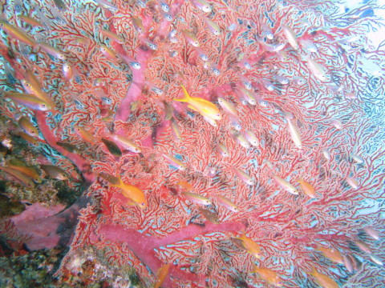

# 2017年8月，小学生の子連れで座間味でダイビングその9…ダイビング2日目の1本目は

📅 投稿日時: 2018-07-10 00:40:44

ってなわけで．

土曜はBRレガシィ君の長距離ラストランを

してきたわけですが．

日曜日も，意外と天気が良かったので．

「お昼は，外に食べに行こうか…」

と，出かけることにして．

お昼を外で食べてきました～！

（我が家で「外で食べる」とは，外食ではなく

リアルに外でご飯を食べるという意味）

BRレガシィ君でのお出かけチャンスも

たぶんこれが最後．

最後にひと活躍してもらった感じですね…

で．

当然，屋外でBBQとなると．

我が家の定番は…

そうです．サンマです！←いや，だからそれはBBQとは言わないから

でも，ホントに．

炭火で焼いたサンマは，すごい美味いのだ！

ガスで焼いたサンマが二度と食べられなくなるくらい

美味しいのだ！

…ちなみに．

このサンマは3匹とも娘が食べました…

おまえ，どんだけサンマが好きやねん…

ってなわけで．

本題のダイビング日記へ，Go!

---

ということで．

バンドが切れてしまったダイコンをカメラの

ストロボアームに括りつけて．

いざ，本日の1本目へエントリー！

ここも，ところどころにこんな根がある

ポイントで…

真っ赤できれいなリュウキュウイソバナの

回りに…

のんびりと小魚が漂っているのも

眺められて．

流れも穏やかだし．

結構のんびり系のダイビング

ポイントですね…

同じような写真ばっかりになっちゃいますけど．

でも，海の中にこの赤色が映えるんだな…

回りの砂地にはヒメダテハゼちゃんもいますが．

やっぱり，イソバナの赤は

写真映えしますね…

うーん．でも，もう少し太陽光が入ってくれると

いい写真になるんだけどなぁ…

そして，岩の隙間には，キンメモドキが群れてたり…

スカシテンジクダイがその上に群れていたり…

さらには，小さめサイズのクマノミさんが

居たりしますが．

このクマノミさん，ちょっとシャイですね（笑）

ってな感じで．

そろそろダイビングも終了タイム．

ボートに向かって戻ります…

ボート下に戻って，安全停止をしたら…

エグジット！

比較的ゆったりしたポイントだったので．

今日の1本目も，ダイブタイム60分の

ロングダイブでした～！

## 💬 コメント一覧

### 💬 コメント by (yumi)
**タイトル**: 久々の大爆笑🎉🎉🎉
**投稿日**: 2018-07-10 20:05:30

Ｓさぁ～ん🎆🎆🎆

お久しぶりでぇ～す🏝️🏝️🏝️

｢お昼は、外に食べに行こうか･･･｣

･････

･･･

お昼を外で食べて来ました🎵

ん❗️

･････

･･･

写真を見て･････

大爆笑🎊🎊🎊

久々に笑わせて頂きました🎵

しかし･･･

さんま、３匹とは驚き😮ました。

### 💬 コメント by (しんちゃん)
**タイトル**: 炭焼きサンマ
**投稿日**: 2018-07-10 22:20:44

これが噂の炭焼きサンマ。

私も以前炭焼きサンマを食べたことがありますが、マジ旨ですよね。

娘さんがサンマ３匹とすると、Ｓ様は隣で焼いてるトウモロコシとエリンギだけ？だったりして(笑)

### 💬 コメント by (Skier_S)
**タイトル**: やっぱりサンマでしょ
**投稿日**: 2018-07-11 01:24:03

＞yumiさま

いやーーー．

アウトドアな我が家．

「外でご飯」というと．

ホントに太陽のもとでの食事を指します…（笑）．

食材を買いに行くときから，娘は

「サンマ！私3匹食べるから！」と

自分の分を3匹買って．

しっかり3匹食べました…

＞しんちゃんさま

これが噂のサンマです（笑）．

もう，炭で焼くだけで最高のご馳走です．

サンマは，娘が3匹食べると宣言していたので，

私が1匹の，合わせて4匹買ってました…

でも，足りなかった感じ．

二人で5匹は行けますね～．

ホントにおいしいですから！

