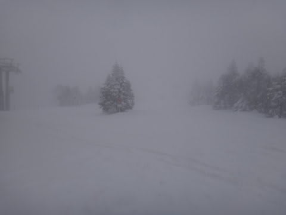

# 2月24日の志賀高原は…激寒なれど，終日パフパフ！

📅 投稿日時: 2013-02-25 00:51:09

むふふふふ．

日曜は．

またまた来ましたっ！

終日パウダーデーですっ！

ぱふぱふですっ！

天気予想通りっ！！！

…死ぬほど寒かったけど(ぶるぶる）．

朝は．昨晩から一晩だけの積雪で，車が埋もれちゃうくらい…

掘り出すのが大変だよ(涙)．

とりあえず，車を掘り出してヤケビへ移動し．

山頂に出ると…

気温はマイナス16度．寒いですね～．

んで，すげー降ってますよ～

埋もれてますよ～…

すごいですよ～

圧雪コースはこんな感じだったけど…

こんな日は圧雪コースを滑っても仕方ないのだ．

当然，オリンピックコースへ行くのだ．

オリンピックコースは…

むはははははははっ！！！

膝上パフなのだっ！！！！

軽い底付き感があり，完全浮遊ではないけど…

パウダーなのだ．

パフパフなのだっ！

…ちょっと視界が悪いのがつらいけど．

モフモフなのだっ！！！

あー．

幸せ…

と，思っていたら．

本日．朝から強風で，奥志賀ゴンドラも第2ゴンドラも終日動かなかったので…

焼額第1ゴンドラに人が集中して，朝10時からは5分～10分待ちになっちゃったのだ(涙)．

第1ゴンドラ側に人が集まる，ということは．

第1ゴンドラ側の人口密度が高くなる，ということで．

…天気が悪いわりに，ちょいと混んでましたね…

でも．

11時半を過ぎると，予想通り…

ふははは．

がらがらになったのだ．

日曜は，みんな昼で切り上げて帰るので，昼からはがらがらなのだ．

ということで．

終日こーんな感じで降り続けたので．

(どーでもいいけど，ホントに午後は人がいなくなる…)

午後もパフパフのまま．

人も少ないゲレンデで，しっかりパフパフを楽しんだのでした…

ってことで．

むふふふ．

今日もパフパフを満喫して，満足なのだ．

では，帰りますか…

と，駐車場に行くと．

く，車が…また埋もれてるんですけど…(涙）．

朝に続いて，2度目の発掘作業を強いられたのでした…

## 💬 コメント一覧

### 💬 コメント by (いか)
**タイトル**: Unknown
**投稿日**: 2013-02-25 02:37:12

すっごーー、って感じの大雪ですね(^^ゞ

朝イチはめちゃくちゃ楽しそうです。

こんなコンディションでファットスキーとか履いてみたいです。

志賀に行きたーい、ってなってるんですが、バスツアーだと一ノ瀬エリアの宿が空いてなくて断念しました(泣)

兎平のコブに弾かれてきますｗ (水曜日が雨になりませんように…)

### 💬 コメント by (aqura)
**タイトル**: Unknown
**投稿日**: 2013-02-25 12:41:08

いやー、良く降りましたね～。私も第一ゴンドラ中心に滑っていました。多分同じ駐車場。車でのゲレンデ間移動、地吹雪が酷くて閉口しました。でも、良い雪でしたね😃

### 💬 コメント by (Skier_S)
**タイトル**: 降りましたよ～！
**投稿日**: 2013-02-26 02:22:47

＞いかさま

いやー．

志賀高原にしては，かなりの降りでしたよ…

朝イチは，もうパウダー好きにはたまらん状況です．

…でも，視界が悪かったです(涙)．

水曜の八方は…微妙ですね．

名木山とか，下のほうはちょっとやばいかもです．

＞aquraさま

あら．

第1ゴンドラ滑ってたら，おそらく私を見かけているかと…

しかし．あの日の地吹雪はすごかったですね～．

5m前の車を見失ってしまうほどでした．

でも，雪は良かったですね～．

私は寒さで鼻の頭が軽い凍傷になっちゃいましたけど(涙）．

