# 2020/3/21(土)の志賀高原スキー場は…終日晴天！気温が上がったけど，西斜面は終日結構いい雪質をキープ！でも，さすが3連休の中日は混んだよ…

📅 投稿日時: 2020-03-22 02:20:41

🏷️ カテゴリ: [2020スキー滑走日記](c282e9230de179e245c7334eabeb0a3b3.md)

ということで．

3連休中日の本日も，志賀高原で滑ってましたが．

…本日は晴天で，春スキーと考えると

かなりめぐまれたコンディションでしたよ～！！

ただ，やはりさすが3連休の中日．

かなり混みましたが…

ってなことで．

まず本日朝イチですが．

いきなり営業開始前から，

これだけの人が並んでました…

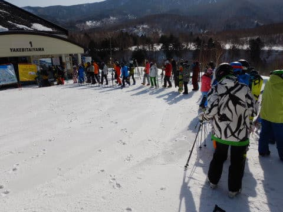

これって，正月より多いかも？？

…この時期に，これだけ人が集まるのね…

で．

あさイチゴンドラで山頂に到着すると…

山頂の気温は，-3℃と．

-2～3℃という予想ぴったりの気温！

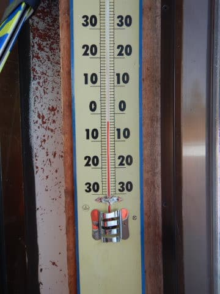

そして天気も…

予想通り，朝からぴかぴか晴天っ！！

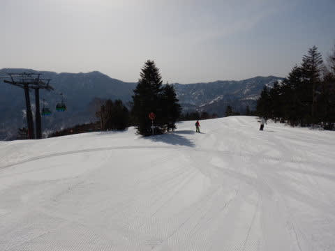

あさイチゲレンデは…

予想通り，かなり硬めのハイスピードシマシマっ！

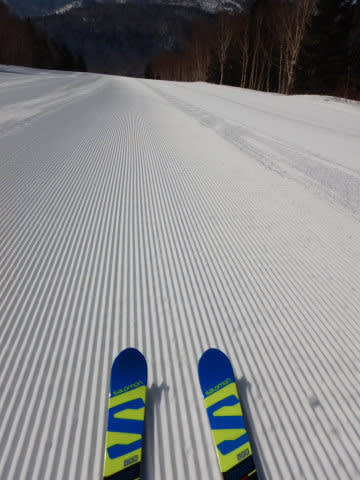

しっかり硬めで．ちょっと足元が崩れて

コロコロになっていくような感じでしたが…

でも．いい感じのシマシマっ！！

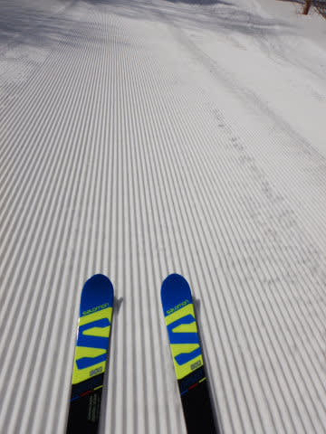

…ただ．

いつも通り，4人制限の焼額第1ゴンドラが

朝9時には早くも混みだしてきたので…

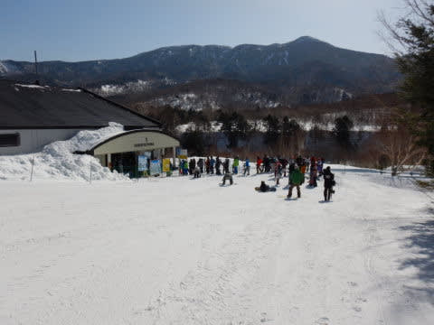

いつも通り，奥志賀へ移動してみるわけですが…

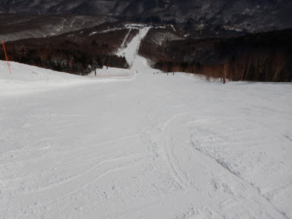

奥志賀エキスパートコースも，

いい感じで締まって，楽しめたものの…

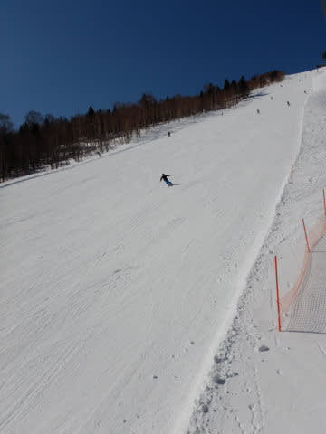

奥志賀のリフトも，10時過ぎには

すごい列に…（涙）

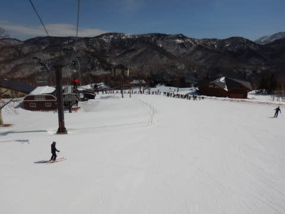

だもんで．

今度は一の瀬へ脱出！

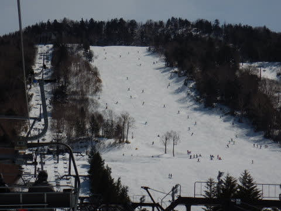

一の瀬はリフト待ちもなく．

結構いい感じ

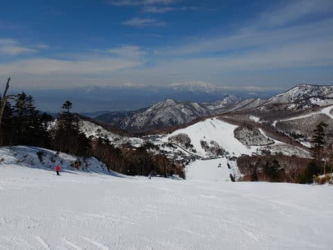

朝のうちは，ちょっとコロコロも

あったけど．

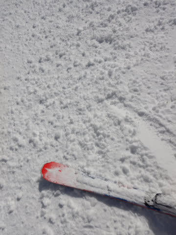

3月下旬の晴天で，

気温もプラスまで上がり，

暖かいほどだったのに．

午後3時頃まで，結構いい雪質を

キープしてくれました…！

そして，ラストは焼額へ戻ってきますが．

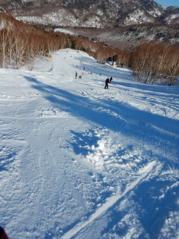

日当たりがいいの焼額．

気温が高かったこともあり，

雪はちょっとシットリした感じに

なってますね…

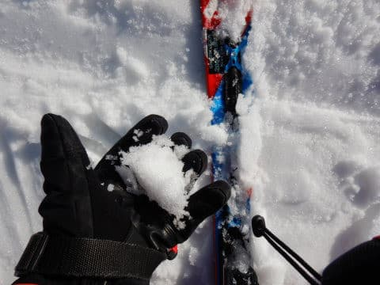

そして．

さすが3連休．

まさかの午後4時近くになっても，

ゴンドラ待ちが…！！

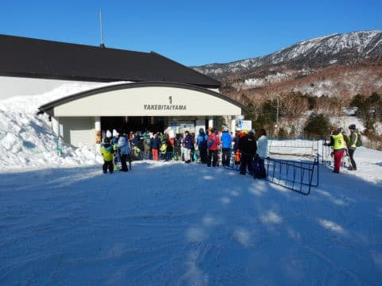

とはいえ．

ごんどらが4人乗りに制限されているので．

コース上の人口密度は，いつもより

少ない感じで．

営業ラストまで，いい感じで

大回りで楽しめました～！！

ってな感じで．

今日もラストまで滑り倒した

わけですが…

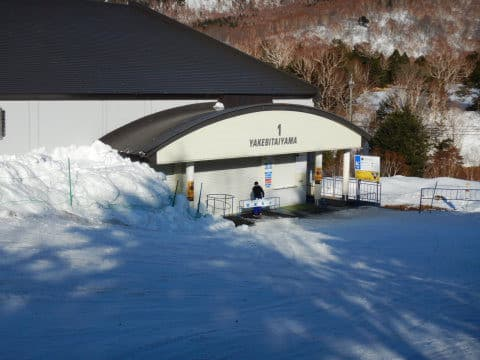

なんと．

今日は，一の瀬のナイター，今シーズンの

営業最終日じゃないですか！

…そして，3連休でダイヤモンドナイターが

滑れるとなれば…

これは行かずばなるまい！！

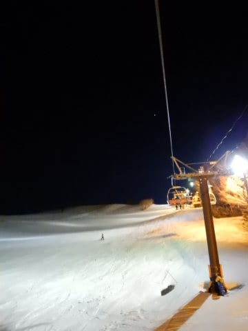

ということで，

ダイヤナイターにやってきましたが…

なんだか圧雪が荒くて，キャタピラ跡が

いっぱい残ってるのですが…？？？

そして，コース上は．

殺人コロコロが前面にばら撒かれているのですが？？？

ってな感じで．

コース上はガリガリで，

圧雪もかなり凸凹，

そして，殺人コロコロが全面を

覆うという，修行としか思えない

かなりてごわいバーンを，

「でも，これで今シーズンラストだから…」

と，泣きながら滑ったのでした…

で．

ナイターのあと，さらに飲み屋さんで

飲みまくって来たので．

ちょいと今，死にかけてます…

なんとか記事は更新しましたが．

コメント回答は，また明日！！

## 💬 コメント一覧

### 💬 コメント by (ほっぽ)
**タイトル**: 3/21　志賀高原
**投稿日**: 2020-03-22 06:03:14

Ｓさん

昨日は奥志賀や一の瀬ファミリーで滑る姿は見かけていましたが、

最後の最後でご挨拶できました。

私は今日も奥志賀スタートです。

お会いできたらご挨拶させて頂きます。

http://www2.tokai.or.jp/nana_hoppo/

### 💬 コメント by (ヒータロゥ)
**タイトル**: Unknown
**投稿日**: 2020-03-22 16:23:09

今日は、奥志賀の早朝から参戦しました。朝は晴れで、エキスパはエッジカミカミで、サイコーでした。その後、ヤケビへ移動し、gokurakuさんとお話しさせていただきました。ステッカーもいただきありがとうございました。

ヤケビは4時間券でしたが、終わるタイミングでちょうど雷でリフト、ゴンドラが全停止したので、ついてました。

来週は日曜日に子供ともども参戦予定です。

### 💬 コメント by (ゆーき)
**タイトル**: Unknown
**投稿日**: 2020-03-22 22:46:36

ほんの少しだけお会いできましたが、あのあと焼額山から、奥志賀へ、そしてまた焼額山にもどり、高天ヶ原のコブ練習、最後は一の瀬クワッド1649に乗って終了。3連休中日は、先週ほどではないですが、なかなか気持ちの良い日でしたね

### 💬 コメント by (Skier_S)
**タイトル**: 今日はアサマ2000
**投稿日**: 2020-03-23 00:49:51

＞ほっぽさま

すみません…今日はアサマ2000でした．

ほっぽさんは月曜まで志賀滞在ですか？？

＞ヒータロゥさま

奥志賀早朝って，6時半からでしたっけ？

昼は悲惨だったみたいですが，あさイチは良かったでしょうね…

そして，極ステも無事受け取られたのですね(笑)．

次の週末も焼額滑ってますので，またお会いしましょう～！

＞ゆーきさま

連休中日は，混雑したことを除けば，結構恵まれた

一日でしたね…

しかし，一の瀬ラストギリギリまで滑ってたのですね．

その時間になると，20000mゴールドの方々がいっぱい

一の瀬ファミリーで滑っていたと思いますが(笑)．

