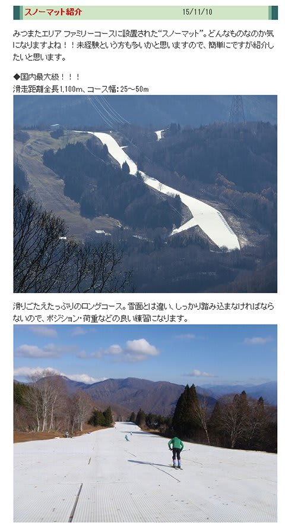
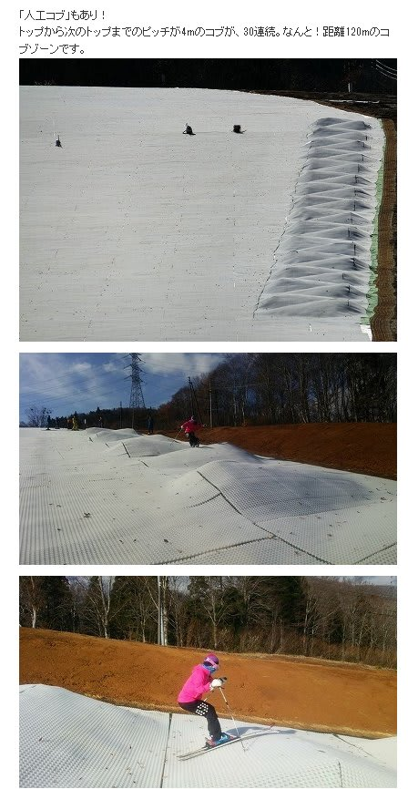
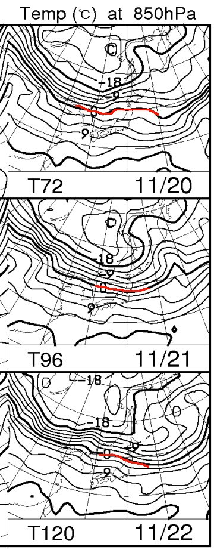
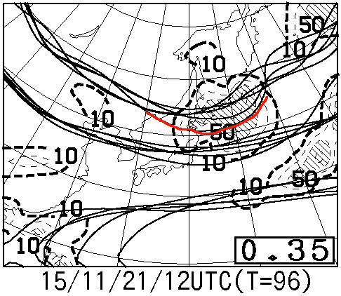
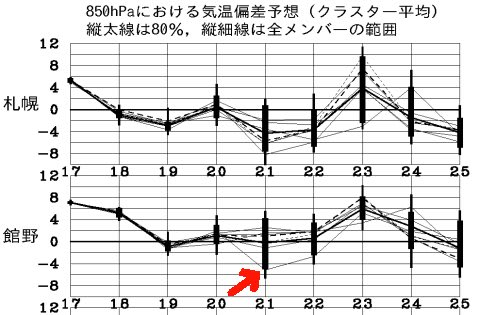
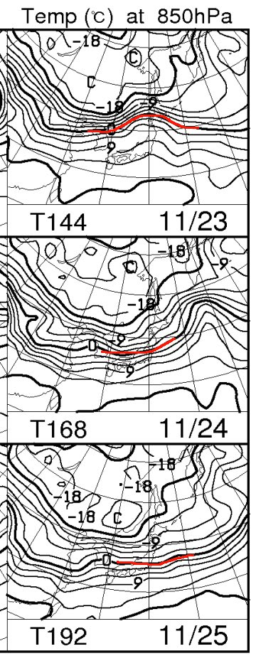
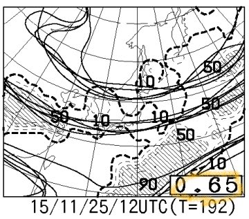
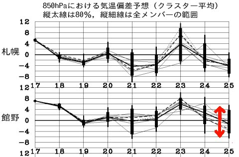

# これから一週間の天気は…雪が降る日はあるのかっ！？？？

📅 投稿日時: 2015-11-19 01:40:28

🏷️ カテゴリ: [スキー天気予想](c6554f5c3c106093b511a8daae23757e8.md)

今週末，3連休にオープン予定のスキー場の，

オープン延期ニュースが次々と飛び込んできて．

大変悲しい今日この頃，皆様いかがお過ごしでしょうか．

そんな中，かぐらスキー場は．

やっぱり，[先日の予想](e7e3c5c6295787387b9c3da09eabe62cf.md)通り．

[天然雪は0ですが，スノーマットゲレンデでオープンする](http://blog.princehotels.co.jp/ski/kagura/034098.php)ようで…

ふーむ．

長さ1100mと長いのはいいけど…

（以下，[かぐらのブログ](http://blog.princehotels.co.jp/ski/kagura/034099.php#__utma=1.236879500.1410187285.1447858929.1447861880.195&__utmb=1.8.8.1447862153776&__utmc=1&__utmx=-&__utmz=1.1447861880.195.193.utmcsr=ski.princehotels.co.jp|utmccn=%28referral%29|utmcmd=referral|utmcct=/shiga/&__utmv=-&__utmk=228279453)より）

コブもあるのはすごいけど…

雪がないのはいかんともしがたい（涙）．

…しかし．

これで，シーズン初めやGW以降，雪不足の時にゴンドラ乗り場まで

バス移動しなくても良くなったわけですが．

だけど…雪を滑る用の板で，プラマット滑るのか…

傷んでも大丈夫な板を持ってかないといけないのかな？

ってことで．

本題．

さて．

暖かい日々が続く今日この頃．

これから先，一体いつから冷えるのか？？

…というのが，気になって仕方がないわけですが．

いつも通り，専門天気図を見てみましょうか…

FXXN519の，850hpa気温予想ですが．

この，20日から22日の期間．

残念ながら，赤くマークした0℃線は

信州までは下がってきません…（涙）．

ということで．

22日までは，天然雪どころか，

人工降雪機を動かすのすら無理な感じ…（泣）．

ただ，かすかに期待できるのは21日．

こんな感じで，特定高度線のばらつきが大きく．

特に，赤く印したように，5340mの特定高度線が大きく

南にずれるような天気図になってくれれば…

…おそらく，この下の図の気温予想グラフの，一番下．

赤い矢印で示したように，平年比マイナス5度くらいまで

冷え込んでくれるかも…

…そうすれば，21日は，夜にかけて冷え込みます！

夜は，人工雪が打てるかも！！？

信州の標高が高いところや新潟の山沿いでは，

天然雪もうっすら積もってくれるかな…

で．

23日～25日の850hpa気温を見てみると．

ああ…23日は壊滅的ですね．

0℃線ははるか北…北海道付近．

それどころか，信州には+9℃線が（涙）．

これは，標高1500mでも+10℃クラスの気温，ってことで．

21日に人工雪が打てても，23日の高温の雨でほとんど

溶けちゃいますね（泣）．

…ただし．23日に，低気圧通過後．

前線が通過して冷えるようで．

赤く印した0℃線は，24，25日と

信州近辺まで下がってきてくれます！

24日は，標高が高めの山では，天然雪が降る可能性あり！

…これなら．

この状態なら，24，25日はガンガン人工雪が打てます！

昼間も人工降雪機動かせるレベル！

…と，喜ぶのもつかの間．

この，25日のFZCX50の500hpa特定高度線のスプレッドの値を見ると…

あうううーん．

0.65とかなり大きな値．

はっきり言って．

この値が0.5を超えてきたら，この日の数値予想図は

ほとんどあてにならないレベルです（涙）．

だもんで．

この日の気温予想も…

この赤矢印で示したように，結構気温予想の

ばらつきが大きく．

…ヘタすれば，平年より4度くらい高くなっちゃう

可能性も…（泣）．

ということで．

今のところ，24，25日の冷え込みに期待ですが．

…この日は，まだ「絶対冷え込む！間違いないっ！」

と言えるレベルではなく．

…運が良ければ冷えるだろう，というレベル．

あー．

そうそう．

この3連休のYetiの予想ですが（行きたくないけど，ここしかない…）

とりあえず，

1，2日目は晴れ．

3日目は雨．

気温は…

1日目は冷えるけど日差しがあるのでそれほど寒く感じず．

2，3日目は高めでしょう．

…でも，3日目は雨だから，肌寒く感じるかな？

…しかし．

これから先．まだ，確実な冷え込みが見えない…

一体，いつ雪が降るのか…

早く雪よ降れ～っ！！

## 💬 コメント一覧

### 💬 コメント by (まいる)
**タイトル**: Unknown
**投稿日**: 2015-11-19 07:15:54

雪情報ありがたいです。実は、今シーズン久々に技選に出ようと思っていたので、練習をしないと・・(--;)

ところで、私のアウトバック、エスティマからの乗り替えだったりします。

### 💬 コメント by (Skier_S)
**タイトル**: まいるさま
**投稿日**: 2015-11-19 23:51:33

をを！

技術選出場ですか！

…私も遠い過去，そんな名前の大会に

出たことがある気が…

がんばってください！

…しかし，エスティマからアウトバックって，

珍しい乗り換えですね．

ミニバンの広さに慣れちゃったら，

アウトバック狭く感じませんでしたか・

