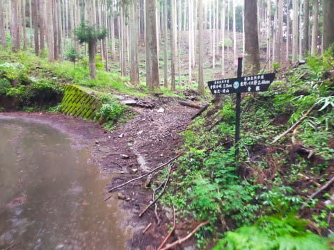

# また蛭ヶ岳を全力往復してきた…その2

📅 投稿日時: 2023-08-13 02:48:46

🏷️ カテゴリ: [登山・旅行](c1d637a11a25b457ac978d197adbdafc5.md)

ってなことで．

[前回](edcd7872bb4be069b509483276dd327d8.md)説明したように，

本来は南アルプスに行きたかったのに，

近場の蛭ヶ岳に再訪となってしまった

うえ，土砂降りの雨にモチベーションが

最低レベルに落ち込んでましたが…

車に乗ったまま登山口で30分ほど待つと，

ザーザーぶりの雨は，レインウェアを着なくても

大丈夫なレベルの小降りになってきました…

本来なら天気の悪い日は山を歩かないポリシーの

私ですが．

よく知ってて，今更ゆっくり景色を見ようと

思う山じゃないし．

今回を逃すと台風でしばらく山を歩けなさそうで．

先週は山に行かなかったため，Garminさんに

「そろそろトレーニングしろ」と，運動不足を

怒られているというのもあり…

あいつが出るかもしれない

という雨の丹沢山系の危険を冒し，

林道ゲートを超えて出発！

とりあえず．

今回は天気も悪く景色も楽しめないし．

運動不足解消という目的もあるので，

「[昨年の同じルートの蛭が岳全力疾走](ee8a23877f18d967910d1e4638efed067.md)のタイムを超える」

という不純な目的（？）で，全力疾走スタート！！

果たして，前回の蛭が岳往復の，

登り2時間48分，下り1時間44分の

記録を超えるのか？？

さっきまで土砂降りだったので，

びしょぬれの林道のアスファルト路面を

歩いていき…

しばらくすると．

きわめてわかりにくい，林道から

登山道への分岐があって．

この分岐を登山道側に行きますが…

土砂降りの後にしては，ひどいドロドロに

はなってないのが救いではあるものの，

やっぱり地面は濡れていて，あんまり

足場はよくない感じ（涙）

この足場が良くない中，距離2.5㎞ほどで

標高差740m登るという，「八丁坂」の急坂を

ハイスピードクライム！

さすがにこれだけの急斜面，走ると死ぬので

走りはしませんが…

ところどころ，雨の影響で濡れてて滑りやすい

ところもありながらも，何とかいいペースで

登り続け…

スタートから1時間27分で，

急坂が終わる八丁坂のてっぺん，

八丁坂分岐を通過！

ヤマレコの標準コースタイム3時間14分の

半分以下ですね…

…昨年のタイムからちょっとは詰めたかな？

と思ってたのに．

全く昨年のタイムと同じでしたね（涙）

まぁ，雨の影響で足場が悪い中頑張った…

と．

ここからは緩やかな登りになるので．

木道をダッシュ！

でも…

木道が濡れてて滑るので，ちと怖い…

フラットロードを飛ばして，八丁坂分岐から

15分ほどで姫次を通過すると…

その先は，比較的ペースが稼ぎやすい，

緩やかなアップダウンが続きます．

が…

このルートも，私が嫌いな階段が多い…

そして，蛭が岳ルート名物（？）

最後の階段での標高差300mアップを

乗り越えると…

山頂はもうすぐ！！

…だけど．

今日はやっぱり視界が悪い…

そして…

スタートから無休憩で，蛭が岳山頂到着！

果たして，タイムやいかに？？

昨年より短縮できたのか？？

と，見てみると．

到着タイムは…

スタートから2時間44分でした～！！！

昨年のタイムは2時間45分だったので…

1分縮めましたね．

ってか．

わずか1分か…（涙）

1分の誤差なら，完全同タイムといっていいくらい．

うむ．

2時間44分，無休憩で歩き（＆ところどころ走りで）

頑張ったのに…

全くタイムを縮められてないというのは．

やはり，前回もかなりの全力疾走（そこまで走ってないけど）

だったんだな…

そして．

今日は山頂は全く視界無し（涙）

さらに，天気が悪いってのもあるし，

朝9時前に蛭ヶ岳に到着するような

ペースが速い人はほとんどいないという

こともあり．

山頂は人が1-2人しかおらず，さみしい感じ…

ただ．

やっぱり，朝9時前に蛭ヶ岳山頂に立ってる

人ってのは，普通じゃなかったんですよね…

（[続く](e02c9c2551553fd5d53503c0c35107f93.md)）

## 💬 コメント一覧

### 💬 コメント by (スシネコ)
**タイトル**: Unknown
**投稿日**: 2023-08-13 10:18:33

この時期、雨の丹沢で出る「アイツ」といえば、ひょっとして・・・ｷﾞｬｱｧｧｧ━━(|||ﾟДﾟ)━━!!!!!

私は同じ日に筑波山のバリコースを３往復して累積標高差2000mほど歩いてきましたが、こちらは朝は曇りで昼から晴れでした。

それにしてもやっぱり速っ！

### 💬 コメント by (Skier_S)
**タイトル**: ＞スシネコさま
**投稿日**: 2023-08-14 20:41:17

その反応が出るということは，

たぶん予想が当たってます…

しかし，同じ山3往復ってすごい…私だったらすぐ飽きます（笑）

### 💬 コメント by (ねも)
**タイトル**: Unknown
**投稿日**: 2023-08-15 08:58:23

横から失礼します🙏

お二人とも凄すぎ(@_@)　体力にも驚嘆しますが、気力も半端じゃない👍

蛭ヶ岳に登るこのルートは、40年くらい前に一度だけ。

言っても詮ないことですが、毎日暑い💦　どうぞご自愛ください。

### 💬 コメント by (Skier_S)
**タイトル**: ＞ねもさま
**投稿日**: 2023-08-15 10:55:26

同じ山を3回という気力は，私も持ち合わせていません（笑）．

蛭ヶ岳のこのルート，以前登られたことがあるんですね…

今はよく整備された，すごい歩きやすいコースですが，以前もこんな感じだったのでしょうか．

しかし，暑いこの時期は2000m以下の低山を登るものじゃないですね…

