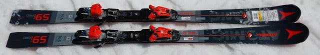
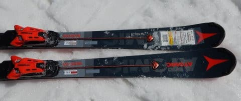
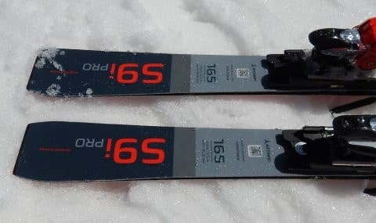
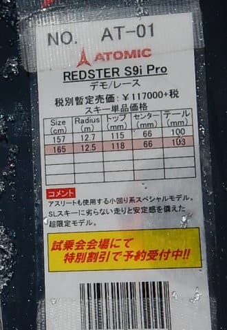
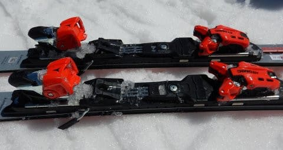

# 2020シーズンモデルのスキー板，試乗レポート…ATOMIC編その3

📅 投稿日時: 2019-06-18 00:05:42

ということで．

今回も試乗レポートですが．

今回で一通りのレポートが終了です…

ただ．

3月のアサマ2000で試乗したけど，

4月の志賀でもう一回乗った板が

4種類ほどあるので．

次回以降，一度レポートした板の，

2度目の試乗インプレッションが

もうちょっと続きます…

ってことで．今回はアトミックの板です．

では，どうぞ～！

○ATOMIC S9i PRO 165cm

基礎小回り．

3月のアサマ2000では，S9iとS9には乗れたけど．

このS9i proには乗っていなかったので．

今回，S9i proに乗ってみました…

この板は．

中身はほぼFISモデルのSL板だけど，

コアのみ軽量カルバコアに変更している…

というもので．

純粋に基礎スキー用に作られているS9iより，

強い板になります…

だもんで．

S9iがTLビンディングなのに対し．

S9i proは前後がバーで接続され，

板の張りが強くなるVARビンディングが

着いてます．

滑ってみたところ…

いや．かなりコア材が強いのか．

かなり硬く感じます．

でも．

意外なことにずらして滑った時の

コントロール性がすごい高いです．

ずらして行くと，トップ側がテールよりも

強めに抵抗を受ける感じで，

ずれていく中でもトップがグイグイ

内側に入っていくように旋回していきます．

スピードを出すとガッツリ食い込んで

カービングになっていきますが，

カービングではないズレで滑っている段階でも，

ぐんぐん旋回するように感じます．

かなり攻めたズラシができます．

スピードを出した中で板を動かしていき，

強い旋回力を出すことができるので．

ズレた中でも安定感は高く，きれいに

旋回していけて．

春雪の荒れた雪でも安心して

ずらしていけます．

硬い斜面でそこそこのスピードがあれば，

きれいに切っても行けるので．

切ってもずらしても，いい感じで旋回する，

コントロール性が高い板．

そこそこ重いにもかかわらず，

旋回性が高いので，重さを感じません．

板の強さがありますが，足場がしっかり作れる

硬い斜面でカービングに入れると，

思ったより小さい旋回半径で回ります．

仕上げでしっかりテール側を抑えて

いくと，圧が溜まって，

速く返りが戻ってくるので．

最後にすっと反対側に板が抜けていく

小回りができます．

山回りでは，結構テールを抑え気味に

行くのがいい感じ．

ただ，そこからフルオートで谷回りを

捉えていって，ギュインと小さく回るか…

というとちょっと違って．

谷回りはある程度自分で動かしていく感じ．

私が普段履いているSXほど，超オートマチックに

谷回りから小回りに入る感じは無いです．

だもんで，谷回りで板が回ってくるのを

信じて，軸を長く使って板を離していく…

というより．

谷回りで，積極的に外側に板を動かしていって

圧を受けてターン始動する…

という．

ある意味，ロッカースキー以前のオーソドックスな

操作性に戻った感じ．

ただ，板を自分で動かしていった時の

操作性，旋回性はかなりいいので．

カービング専用スペシャルではなく，

かなりハイスピード領域になっても，

カービングでもズラしでも，攻めた

滑りができる，いろんな小技が使える

リスクの少ない板だと思います．

でも，ちょっと重さを感じるし，

板自体のフレックスの強さがあるので．

コブで扱いやすいかどうかというと

ちょっと微妙…

コブは厳しいかもしれないけど．

整地でも，硬い雪でも，春の緩んだ雪でも．

そこそこの操作性で，高い安定感がある，

玄人好みの板かな～…
