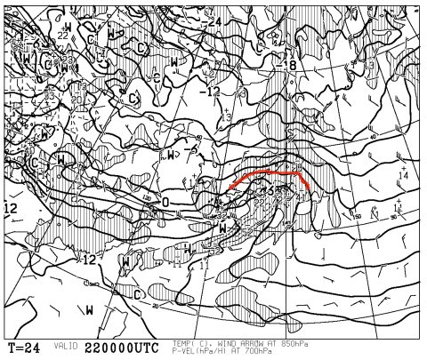
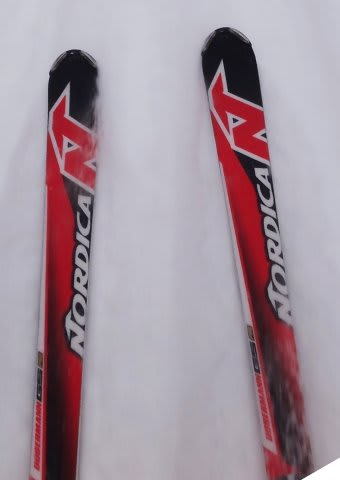
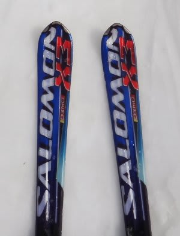
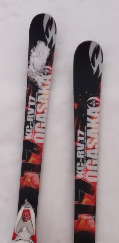
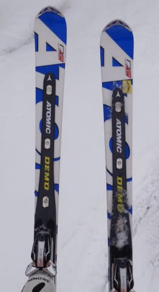
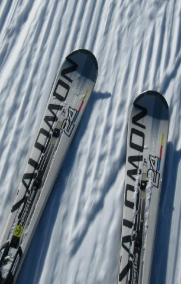
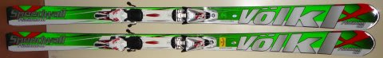

# 想定外に，Volkl Platinum CDを購入しちゃった…

📅 投稿日時: 2013-01-22 01:21:57

🏷️ カテゴリ: [スキー雑談](c1f9d2cb7478308da16419928ea3945e9.md)

…なんだか．22日の火曜日．

やばい感じです．

こんな感じで…

850hpaの0度線が，信州よりずっと北側まで上がっちゃってます(涙)

…志賀でも昼前に雨が降るかも…

降るとしても短時間だけで，すぐに冷えて雪になるかと思うんですが…

あー．

雨にならないことを祈りましょう．

また，アイスバーンになりませんように…(祈）．

で．

本題．

先週書いた，

[その1](e7fa96c3f88bd94ba6390c710d6538679.md)，[その2](e2417d511869d49d0e1e493c47fbd692c.md)

の続きになりますが…

とりあえず，前回からちょっと間が空いちゃったので．

これまでの経緯をまとめると．

今シーズンインの時点で．

'07 NORDICA DOBERMANN GS-pro

'09 SALOMON DEMO X3

'09 OGASAKA KC-RV 17

'10 ATOMIC D2 DEMO Type-A

'11 SALOMON 24hours LM

という，史上最強の5セット体制だったわけですが．

まず．'09 SALOMON DEMO X3と'09 OGASAKA KC-RVの2セットは．

シーズンイン時にヘタっているのが確認され，死亡宣告．

…ここまでは，想定の範囲内．

まだ3セット残るから，今シーズンは板を買わずに済むはずっ！

…と．思っていたところ．

想定外に，[小回り機のSALOMON 24hours LMが剥離](e6302c5755708c26ad01f9cd7b82c90ae.md)(涙)．

急遽，小回り機のATOMIC BLUESTER SXを購入したのが運の尽き…

新品板と比較すると．NORDICA Dobermann GSとATOMIC D2 Type-Aの2セットが，

かなりヘタっていたことに気づいてしまった！！これまた想定外っ！

ってことで．

…シーズンイン時の5セット，全滅じゃん(;o;)．

…まぁ，昨シーズンも板を買っておらず．

この私が，2シーズン，板を買わずに済む…

っていうことは．

かなーりありえないほどぜったいにあるわけがない，スーパー超甘すぎる見通しだったんだなぁ…

…と．つらつら考え事をしていて．

気づくと．

なぜだか．

神田のスキー街に立っている自分を発見したのでした．

とりあえず．

165cmの小回り板はあるから，大回り板を探さねば…

試乗で気に入った，VOLKLのPlatinum CDがあればいいんだけど．

通販でも売り切れのこの板．

まさか．

もう，残ってないよね…

ってことで．

いろいろ店を巡ってみたわけだけど．

石井スポーツ本店にもコンペ館にも．

フソウスポーツにもクルーにもアスペンにも．

アルペンにもヴィクトリアにも．

当然，どこにも無いわけで．

あー．

ロングの板，どうしようかなぁ…

SXが調子いいから，BLUESTER AXにでもしようかなぁ…

と．

最後に寄った，行きつけのお店．

…

…

まさか．

あるよ．

なぜか．

現品が．

唯一，この店にだけ…

私「すいません…こないだSX買ったのに，また購入です…」

ということで．

別に狙ったわけではないのに．

また，今度の板も．いつものお店のシールが貼ってある板になったのでした…

だけど．あれですね．

シーズン前まで．

少なくとも3セットはまだ元気だから，今シーズンも板を買わずにすむなぁ…

と思っていた状況から一転．

まさか，1シーズンで2セットも板を買う羽目になるとは…

…お財布に痛すぎる．

まさに想定外っ！

…って感じで．

なんだか，購入までで，ここまで長くなってしまった…

板のインプレッションは，次回に続く…(^^;

## 💬 コメント一覧

### 💬 コメント by (komu)
**タイトル**: Unknown
**投稿日**: 2013-01-22 07:36:06

komuデス

神田には魔物が住んでいて物欲大王の虜になってしまいます。そんな中で今季人気の両翼をゲットするとは…やはりSkier_Sさんにはスキーの神様の御加護がありますね

今日はあいにくの雨ですがゲレンデにはパフパフの雪がたくさん降りますように(-人-)

### 💬 コメント by (ひろりん)
**タイトル**: Unknown
**投稿日**: 2013-01-22 18:39:43

この板、不思議な乗り味だった記憶が・・・

しかし、Bluesterとコレとか、羨ましいです（TT)

AX欲しかったんですが高くてムリでした（＞＜）

というか持ってるKEO'S GP01がエッジ研いだせいで、大回り板になってしまって（汗）

GP01とAXだとかぶるんですよね・・・

### 💬 コメント by (Skier_S)
**タイトル**: komuさま
**投稿日**: 2013-01-23 00:29:18

いやー．

住んでますね．

神田には，魔物が…

早々に店頭から消え去った2機種，12月に入ってから

Getできるとは思いませんでした…．

けど，お財布に痛い(涙）．

…んで．

残念ながら，今朝は志賀高原も雨でした(泣）．

### 💬 コメント by (Skier_S)
**タイトル**: ひろりんさま
**投稿日**: 2013-01-23 00:31:25

そうなんです．

かなり不思議な乗り味です．

…私も，BLUESTER　AXも悪くないと思いましたが，

高すぎるのでVolkl狙いでした．

でも，Ogasakaの板もビンディング入れると

かなり高いですよね…(^^;

