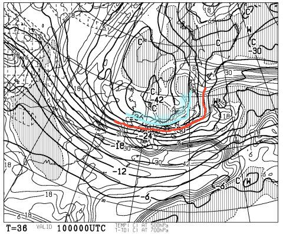
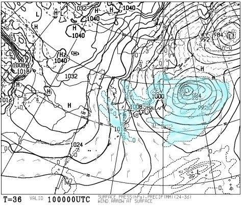
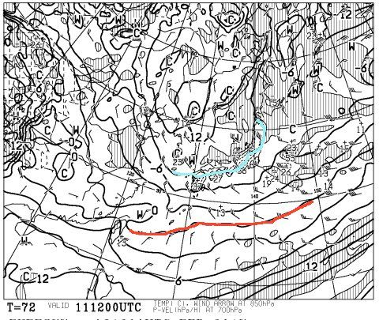
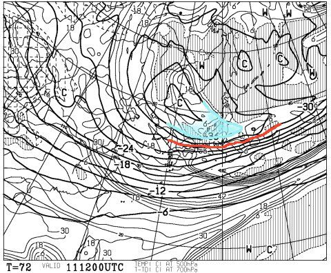
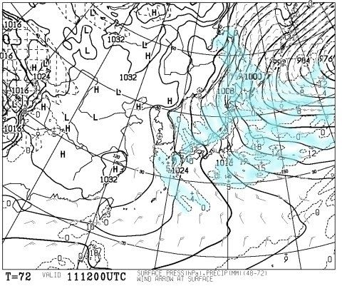
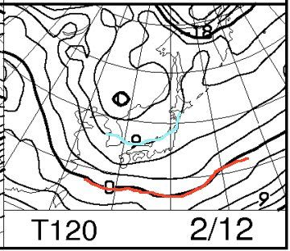
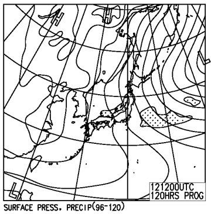
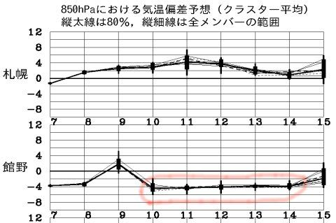

# 今週末，2月11，12日の志賀高原スキー場の天気は…土曜はすごいパフパフ積雪！日曜も雪降り．延々降り続ける2日間？？

📅 投稿日時: 2017-02-09 03:24:27

🏷️ カテゴリ: [スキー天気予想](c6554f5c3c106093b511a8daae23757e8.md)

ということで．

本日もご無体時間に帰宅していますが（涙）．

水曜夜恒例の，週末の志賀高原天気予想です～．

で．

昨日予告しましたけど．

…今週末．

降りそうですよ～っ！！！！

まず．

前日の10日，金曜日．

500hpa図を見てみると…

昨日時点での予想からほぼ変わらず．

そこそこの雪の目安，-30℃線は関東近くまで下がり．

志賀高原には大雪の目安，-36℃の歓喜寒気に

すっぽり覆われるという…

かなり気合が入った寒気様がいらっしゃるようです！！

そして，地上天気図は…

やっぱり，日本海側に寒気の吹き出しの雲が

かかっており．

…これは．

9日夜から10日にかけて．

かなり降りますよ～！

ちょっと重めの雪だろうけど．

10日はやっぱりエンドレスパウダーデーかなっ！！！

で．

肝心な週末，土曜日の850hpa図は…

ふむ．

志賀高原は，水色の-9℃線付近．

…激烈，ってほどではないですが．

そこそこの冷えですね…

でも．

500hpa図を見てみると．

相変わらず，赤線の-30℃線は関東近辺．

そして，志賀高原は引き続き，

水色で塗った-36℃線がかかっているので．

この日もエンドレスパウダーの一日に

なりそう…っ！！！

地上天気図を見てみると．

やっぱりこの日も強烈な冬型．

土曜も，降りそうですよ～！

＃ってか，鳥取，島根あたりはヤバそうな降りになりそう…

そして．

日曜ですが…

850hpa気温は，土曜とほぼ同等．

志賀高原は，大体-9℃線のあたり．

そして，地上天気図は…

この日も相変わらず冬型で．

そして，降水域を示す網掛けが，

日本海側に掛かっているので．

この日も，土曜ほどじゃないにしろ，雪が舞う

一日になりそう…

ってことなので．

まとめると．

11日（土）：前日から雪が降り続けるので…

　朝イチは非圧雪コースはひざ～太ももパフ

　ぐらいの新雪でスタート！

　圧雪コースも，圧雪の上に雪が積もった状態．

　新雪はちょっと重め．

　朝イチ気温は-12℃くらい．昼間も-10℃を超えないくらいの

　冷え冷え低温．

　終日ひたすら雪が降り続ける．時折強く降る．

　ゲレンデは終日モフモフかな．　

12日（日）：この日も雪が降り続けそう．

　朝イチは非圧雪コースはブーツ～スネパフくらいかな？

　朝イチはこの日も-12℃程度．

　昼間もわずかに-10℃超える程度の冷え冷え．

　この日は，タイミングによっては雪が止み，

　風向きによっては時折チラチラ日も射すかも？

　でも，基本的に終日雪が舞う．

　

…って感じかな～．

また，パフパフ週末ですよ～！！

そして，そのあとも…

うむ．

14日くらいまで，冷え冷え祭りPart2が

続きそうな感じ…

いや．

良く冷えた2月になりそう…

今シーズンは冷え冷え踊りを踊らなくていいので，

楽だな～！

## 💬 コメント一覧

### 💬 コメント by (れお)
**タイトル**: 土曜日出撃予定です!!
**投稿日**: 2017-02-09 11:05:04

降雪予想良い感じですね～!!

太板持ってきます(^_^)

でもこの感じだと、いつもより１時間以上は早く高速に乗るようにしないと、スタート間に合わないかもしれないですね。早起きしなきゃ～

### 💬 コメント by (Skier_S)
**タイトル**: れおさま
**投稿日**: 2017-02-10 01:40:53

を！

今週は久しぶりの志賀ですか…！

今週は太板の出番ですよ～

…って．

太板を持っている人がうらやましい…（涙）

