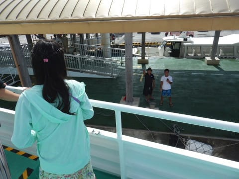

# 2018年8月，子連れ座間味で小5の娘とファンダイビング！ファイナル…最終日は帰るだけ

📅 投稿日時: 2019-10-01 02:07:07

🏷️ カテゴリ: [ダイビング日記](ce3a7a8d424d112fce83ee85c81a0e344.md)

やってきました．

10月です．

ついに10月ですっ！！

スキー場がオープンする10月が

やってきましたよ…！！

ということで．

そろそろスキーシーズンが近づいたので．

2回ほどスキーネタを挟みましたが．

本日は，座間味旅行記のラストスパート．

ようやく，2018年の座間味旅行記，最終回です！

--

ってなわけで．

ついに迎えた最終日…

この日は，朝の高速船で那覇に渡り，

そのまま帰りの飛行機に乗って

帰るだけ．

潜りに行かないので，

いつもよりのんびりした朝．

ダイビングに行く日は，朝ご飯を

7時にしてもらってましたが．

ダイビングに行かない今日は，

10時の高速船に間に合えばいいので，

朝ごはんは8時と遅めの時間．

…いつも通り，朝から

かなり分厚いトーストがついて，

お腹いっぱいになる朝食．

朝ご飯の後は…

昨日干した器材を回収，

パッキングしますが…

どうやら朝，雨が降ったようで．

イマイチ器材の乾きが悪いまま，

荷物をパッキング．

…ダイビング器材が3人分になると，

パッキングも大変で．

ダイビングバッグのギリギリの

スペースに無理やり突っ込んで

来ているので，

「行くときにどうやって詰めてきたんだっけ？」

というパズル作業になります…

そして，出航20分前．

お世話になった星砂さんを

後にします…

3泊，お世話になりました～！

港へ向かうと…

今日はお客さんがいないのか．

昨日までお世話になったティンガーラ号が，

今日は出航せずに港に

泊まってました…

娘「これから高速船に乗らないで，

　こっちに乗っていきたいなぁ…」

…娘よ．

私も同じ思いだよ…

ティンガーラ号を眺めていると，

那覇行の高速船がやってきました…

あぁ…

こっちじゃなく，またティンガーラ号に

乗って潜りに行きたいところ…

そして，予定時刻の10時に，

出航！

あぁ…

座間味島，今年もお世話になりました…

また来年戻ってきます～！

座間味を出た高速船は，

途中で阿嘉島に立ち寄り．

阿嘉島からの出航の時も，

別れのシーンが繰り返されます…

並走していくダイビングボートの

人たちが，いつまでも手を振って

くれていました…

あぁ…

いつまでも，このきれいな

座間味の海を眺めていたいものよ…

でも．

無情にも高速船は座間味を

離れていき…

ちょいと荒れ気味の海を，

那覇に向かって進んで行きます．

…行きの時はワクワクする

高速船ですが．

帰りの時は，気分が沈んで

いきますね…（涙）

ってなことで．

座間味を出てから1時間ちょいで，

那覇は泊港に到着です．

その後，空港へ移動し，

午後1時過ぎの羽田行きの

飛行機に乗り込みますが…

ありゃ？

去年の行きに乗った，StarWars

特別塗装機ですね…

機内も，SWスペシャルのヘッドカバー

が着いていたり．

なぜかギャレーには，

ヨーダの人形が…

機内の飲み物のコップも

スペシャルバージョン．

ということで．

SW特別塗装機に乗って．

那覇を離陸．

あぁ…

さよなら，沖縄．

短い5日間だった…

ということで．

約2時間半のフライトで，羽田へ戻り．

無事，帰宅したのでした…

ってな感じで．

いつもながらレポートは長かったですが．

行っている本人にとっては一瞬で

終わったように感じる沖縄旅行が，

おわったのでした…

（おしまい）
