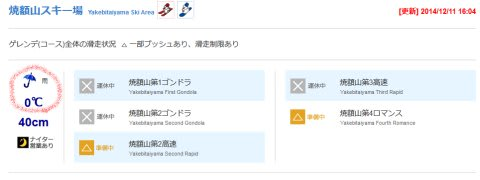
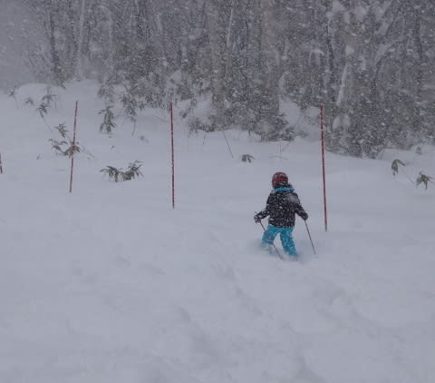
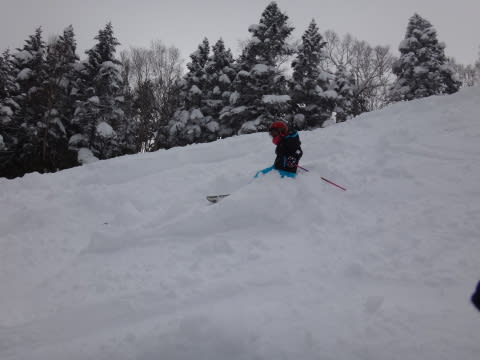
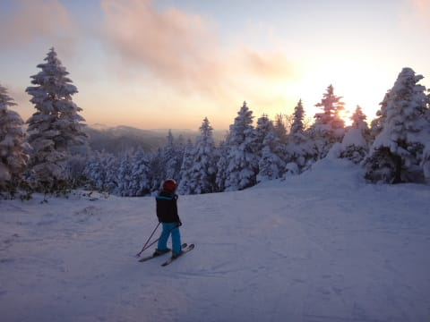
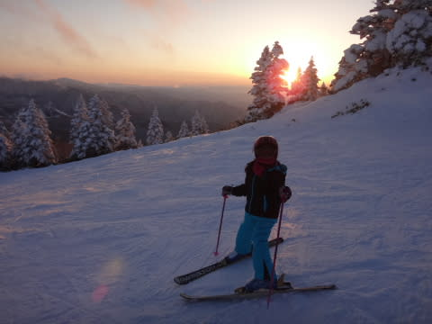

# わが娘．なんだか，完全にサルスキーヤー化しつつあるんだが…

📅 投稿日時: 2014-12-12 02:47:18

…やはり．

本日．

志賀高原も，雨だったみたいで…（涙）

志賀全山，昼頃まで雨だったようです…

それほどひどい雨じゃなかったのが救いですが．

まぁ，予想通り，昼過ぎからは雪になってくれたようで．

…とりあえず．

明日はぼちぼち降り積もり．

明日の夜から，すごい降りますよ～！！

土日はドサドサ降り続けの予感…！

これからの状況改善に，期待！

…ってことで．

本題へ．

えーとですね．

先週末．

今シーズンの初滑りを果たしたわが娘なんですが．

いやー．

小学生になり．

どうやら体力がすごい上がったみたいで．

日曜は，リフト営業開始から滑りはじめ…

（果敢に新雪を攻める娘）

そして，ゴンドラが動き始めると．

昼休み以外，午後はほぼ休みなくゴンドラを滑り続け…

夕日が沈む，営業終了タイムまで滑り続けたわけですが．

ゴンドラ乗り場に着いた直前に，「営業終わりです～」

と，ゲートを閉められてしまった娘．

娘「ええーーーーー！まだ滑るっ！滑りたいっ！！！！！

　すーーーべーーりーたーいーーーーー！！！（半泣き）」

…お前…

昼休み後，10本くらい連続でゴンドラ滑ったよな…

もういいだろ…

と，ツッコミを入れようと思ったところ．

半泣きの娘に同情してくれたらしい，索道係の方．

索道係「…いいですよ…どうぞ…」

えええ？

いいの？？

ゲートを開けてもらって，超大喜びで

ゴンドラに乗り込む娘．

そしてゴンドラに乗った後の，娘の一言．

娘「帰りたくないな～．明日も，明後日も．毎日スキーしたーーい！」

あー．娘よ．

…私もいつも，そう思ってるんだが．

…でも，お前．

それ，ある意味終わってる人間の発言だよ…

で．最後の1本を滑った後…

麓に到着して．

私「さあおしまい．スキー脱いで！」

娘「いやーーーー．まだ滑る～！」

と，歩いてゲレンデを再び登り出す，わが娘…

私（…終わってる．終わってるよ…）

そうやって．歩いて登って滑っている娘をしばらく眺めて．

…娘がスキー好きに育ってくれたのは，うれしいのだが．

なんだか，ある限度を超えてしまったかも…？

と，思わずにいられない，Skier_Sなのだった…

## 💬 コメント一覧

### 💬 コメント by (れお)
**タイトル**: 今週末もパフパフ
**投稿日**: 2014-12-12 09:03:34

娘さんとの会話が目に浮かびますね(^0^)

小学生になれば、上達のスピードはさらに上がりますから、次はもっと上手くなってるんだろうな～。期待してます!!

今週末も雪期待できますね♪

私も、全山オープン後、年内にはもう一度志賀に行きたいな～。

レポート楽しみにしてます～。

### 💬 コメント by (フナ)
**タイトル**: Unknown
**投稿日**: 2014-12-12 12:22:32

かわいい～～～(笑

スキーヤーの血が受け継がれてますね！！(笑

娘さんとまだまだスキー

楽しめそうでいいですね(^.^)！

### 💬 コメント by (miya)
**タイトル**: うらやましい！？
**投稿日**: 2014-12-12 21:54:39

かなり気合の入ったちびっこスキーヤーに

なりましたねー。

うちの娘（小4）も出だしは順調だったのですが、

最近はあまりスキーに行きたいと言いません（悲）

スキーに行っても、１/３は雪合戦です…。

少しはS家の御嬢さんを見習ってほしい！？

### 💬 コメント by (Skier_S)
**タイトル**: ここまでサルスキーヤーになるとは…
**投稿日**: 2014-12-12 23:00:12

>れおさま

いや～．

最後のゴンドラまでご一緒していただき，

うちの娘のサル具合，十分堪能いただいたかと（笑）．

今シーズンは，たぶんかなりうまくなるんじゃないかな～．

また，志賀高原でお会いしましょう！

>フナさま

完全に間違いなく，私の血が半分入ってるかと（笑）．

今シーズンは，娘と滑っても，それほど待たなくても

良くなってきたので，がんがん滑れそうです！

今週は一人ですが，来週と正月はまた娘と志賀高原

滑ってます～

>miyaさま

地元のジュニアレーサーとかにはかないませんが…

結構気合いが入った娘に育ってしまいました（笑）．

今シーズン，10月下旬からYetiに行ってる私を見て，

「自分も早く滑りたい～」とずっと言っていたので，

ようやく滑れたのが，すごいうれしかったようで．

もう，日曜の夜も帰りたがらず…

うちの娘を見習って，リフトが終わってもハイクアップ

して滑るような子供になったら…

ちょっといろんな意味でやばいかも（笑）

### 💬 コメント by (Sora)
**タイトル**: いやーやばくないですよ
**投稿日**: 2014-12-12 23:35:59

おとうさまは、もう終わっている・・かも、しれませんが、

娘さんはこれからこれから。

超一流になったプロは、子供のころからそのスポーツ

が好きで好きでたまらなかった子だったと、おしなべて

聞くじゃないですか。

娘さんも、おとうさまの将来を見据えた導きがあれば、

サッポロオリンピックで日の丸を上げる選手に（ちょっと

早いか）なるかもしれませんよ。

サルになるか一流のヒトになるか、進化の分岐点。お

とうさまの責任は、ある意味重大です。

### 💬 コメント by (KENKEN)
**タイトル**: 週末シーズンイン予定です。
**投稿日**: 2014-12-13 00:23:47

西日本も先週の寒波で結構雪が積もり日曜にシーズンイン予定です。

これまで娘のスキー道具は友人から貰ったお下がりでしたが、小さくなったのでちょっと早い(高い?)クリスマスプレゼントで板とブーツを買いました。

部屋の中で履いたりかなりお気に入りで楽しみにしているようです。

Sさんの娘さんには程遠いですが、今年は娘とたくさん滑ろうかと企んでます。

### 💬 コメント by (Skier_S)
**タイトル**: サルなむすめですから
**投稿日**: 2014-12-13 19:14:28

＞Soraさま

いやー．

スキーはレジャー程度に楽しむのが一番．

娘がスキー競技始めちゃったら，遠征費用やら

道具代やら，レジャースキーの比にならないくらい

お金が出て行っちゃうんで…（涙）

普通のヒトがいいかな～，と思っている父親なのでした（＾＾

＞KENKENさま

をを！

娘さんに新品アイテム揃えましたか！

我が家も，娘の板やブーツはお下がりです…

（父親は新品なのに（＾＾；））

でも，今シーズン，ウェアだけは新品を買ってあげました．

すごい喜んでました…

でも，家の中で板をはいているんですか（笑）．

うちの娘も家でブーツと板をはいてます…

ぜひ，今シーズンはいっぱい滑ってくださいね～

