# 1月28，29日の週末の志賀高原スキー場の天気は…土曜は終日雪降り，冷え冷えパウダーデー！日曜は朝は雪がぱらつくかもしれないけど曇り～晴れ

📅 投稿日時: 2023-01-26 01:41:50

🏷️ カテゴリ: [スキー天気予想](c6554f5c3c106093b511a8daae23757e8.md)

えー．

本日はやはり予想通りすごい雪に

なったみたいですね…

焼額では，25日の朝までに

60cm積もったようです！！

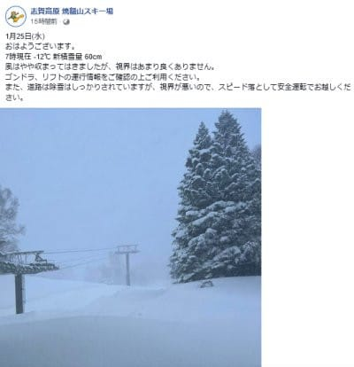

…ただ．

25日は雪が降っただけじゃなく，

風も強く，猛吹雪だったおかげで…

北風に弱い奥志賀は，朝は第1ペア

だけなんとか動かしていたようですが，

午後は全面運休．

焼額は第2ゴンドラが強風で運休，

第1ゴンドラは故障で運休という

状態(涙)

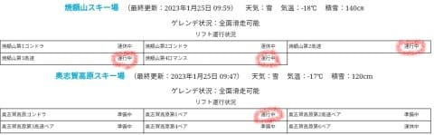

さらに一の瀬・高天ヶ原方面を見ると…

動いていたのは，西舘の下のクワッド，

高天ヶ原トリプル，

タンネの森，

ファミリーのペアくらいで．

西舘上部，高天クワッド，

一の瀬クワッド，山の神＆ダイヤは

運休だったようですね…

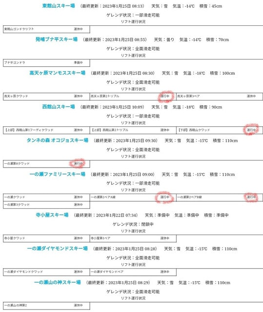

とりあえず．

かなりの強烈吹雪だったみたい

ですが…

雪は積もったみたいですね．

…ただ．

気温も-20度近くまで下がった，冷えた

さらさら雪だったので．

風で飛ばされるし，圧雪したら

ぺちゃんこになっちゃう雪なので…

積雪量の数字ほど積もった感じは

ないかも…

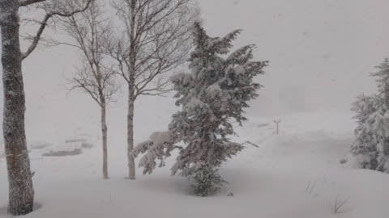

ってなことで．

今日は雪が積もった志賀高原でしたが．

これから週末にかけての志賀高原の

天気がどうなるか．

水曜深夜恒例の天気予想です！

えー．まず．

明日木曜26日の850hpa図ですが…

水色の-9℃線が志賀より南にある

レベルなので．

明日も冷えますね～！！

あさイチは-15℃近くまで冷えるかも？？

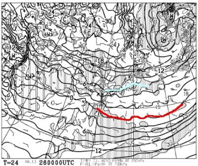

そして，地上天気図を見ると．

うーん．

日本海側に，水色に塗った雪雲エリアが

かかってますが．

西風なので，志賀は朝のうちちょっと雪が

残るかもしれないけど，曇り．

意外と昼間は晴れるかも？？

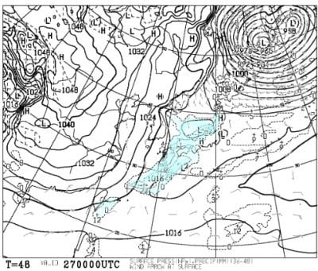

で．

翌27日の金曜は…

志賀にかかっているのは水色の-6℃線なので．

木曜よりは気温が上がりますね．

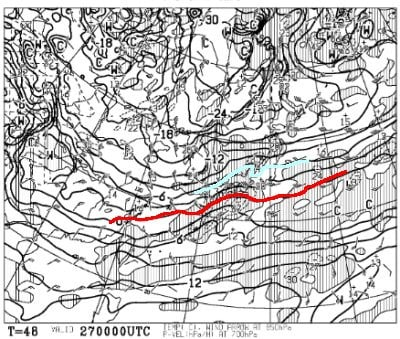

この日の地上天気図は…

うーん．

日本海側に低気圧があって，

水色の降水域が低気圧の周りに

広がってますが…

この低気圧の周りを拡大すると，

志賀高原のある内陸までは，雪雲は

伸びてませんね…

金曜の朝は，新潟の海沿いは積もり

そうですが．

西風なので，志賀高原は積雪はなさそう…

午後に雪が降り始める感じかな？

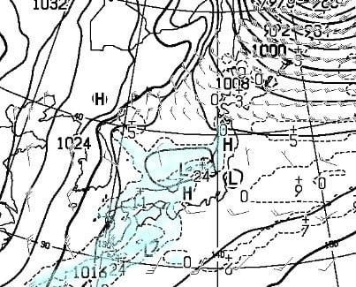

そして．

週末の28日，土曜の850hpa気温を見ると…

うはー！！

志賀高原には水色の-12℃線がかかってます！！

これは…

あさイチは-15℃を下回る，

激冷えの一日になりそう！！

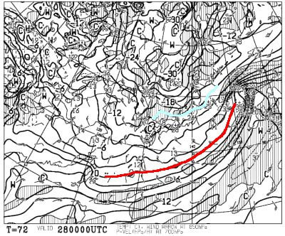

…そして，地上天気図はかなり本格的な

冬型で．

内陸深くまで雪雲が達してるので…

これは，金曜夕方から土曜朝にかけて．

かなり積もりそうですね…

30cm～50cmは行くかも？？

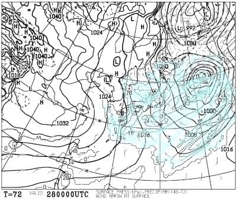

続いて，29日の日曜の850hpa気温を見ると．

この日も水色の-9℃線が志賀にかかってて，

そこそこの冷え込みですね…

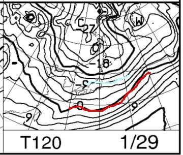

地上天気図は，冬型が弱まっているけど，

日本海側にちょっと降水域が残って

いるので．

うーん．朝は雪が降ってるかも

しれないけど，午後は西風で晴れてきそう…

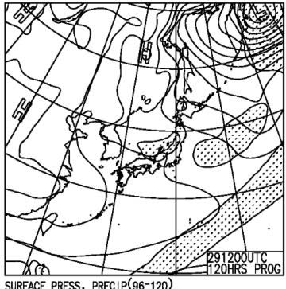

ってなことで．

まとめると．

26日(木)：昨晩からの積雪は10cm

　程度か…

　あさイチの気温は-13℃程度．

　25日の豪雪は弱まりそれほど

　積もってない．

　朝は曇り．昼に向かって晴れて

　いくかも？？

　晴れたら，昨日のパウダーが

　いたるところに残る，晴れのパウダー

　というGoodコンディション！

　ただ，夕方あたりに天気が崩れ，

　また雪がぱらつき始める．

27日(金)：朝は曇り．もしかしたら　

　朝のうち一瞬晴れてるかも？？

　あさイチは-10℃程度．

　天気はだんだん崩れていき，

　午後のどこかのタイミングで雪が

　降り始め，夜に向かって強く降る

28日(土)：雪降り．かなり積もる．

　高速道路もいたるところ積雪

　チェーン規制が入ると思うので，

　土曜朝に移動する人は注意．

　気温は-15℃以下と激冷え．

　朝イチは非圧雪バーンは30～50cm，

　膝下から太ももパフ．

　圧雪バーンも圧雪の上に10cm

　ほどの軽い雪．

　終日雪が降り，視界は悪そう．

　エンドレスパウダーデーだけど，

　終日ゲレンデは新雪でモサモサかな…

　寒いよ！！

　根性の無いスキーヤーふるい落としデー

29日(日)：朝までの積雪は10cmほどかな？

　朝はちょっと雪がぱらついて

　いるかもしれないけど…

　あさイチの気温は土曜より高め．

　天気はだんだん良くなり，午後は

　晴れていく可能性も．

　あさイチは柔らかめのシマシマ圧雪が

　楽しめるいいコンディション！！

　午後はバーンの一部が荒れるかも

　しれないけど，天気も晴れる可能性も

　あり，曇り～晴れの穏やかな天気．

　穏やかな天気で冷え冷えで雪も良く，

　コース脇は昨日のパウダーも残り，

　いい感じのスキー日和！

ってな感じでしょうか．

土曜に行く人は，太板を忘れずに！！

…そして，土曜朝に移動する人は，

高速道路のそこかしこでチェーン規制

やってると思うので(上信越は

横川あたりからチェーン規制かも…)

早めの移動をおススメします…．

とりあえず．

土曜は根性の無いスキーヤーには

辛いかもしれないけど，新雪が

楽しめそうだし．

日曜はコンディション良さそうだし．

今週末も楽しめそう…！！

## 💬 コメント一覧

### 💬 コメント by (レインボー75)
**タイトル**: Unknown
**投稿日**: 2023-01-26 16:03:50

木曜日の志賀高原情報

昨日の雪かきで古傷の膝を傷め、踏めない曲げれないの辛い一日となりました。さらにバッテリー(寒冷地仕様)で4万の出費。でも、毎日仕事漬けの人よりは幸せか！

嵐の昨日はゴンドラ運休で極寒強風。参戦した勇者によると、板が走らない雪で嫌になったとか。よかった、休場して。

今朝の蓮池は-11℃。オリンピックも綺麗に圧雪されており、太板の私は非圧雪を求めてさまよいました。

パノラマ唐松は快適だけど膝が！GSサイドも雪質が期待はずれ。ミドルも普通。夢見ていた感動がない。

さすればダイヤモンドです。非圧雪しか行かなかったけど、踏めない曲げれない私でもウハウハ10本。

早めの昼は二高の「獅子」。やや高めだけど信州割が効くし味は確か。

午後は私だけダイヤの大外回り。相変わらずのフカフカは感動なんだけど、そのあとが辛くてリタイア。

三高では膝が痛くて太板が邪魔。でもレインボーまでお勤めを果たしました。明日はGS板です。

### 💬 コメント by (Skier_S)
**タイトル**: ＞レインボー75さま
**投稿日**: 2023-01-27 03:55:06

あら…雪搔きで膝を痛めちゃいましたか！！お大事に…

それでも滑りに行くところがレインボーさんらしいですが…

オリンピックコースは新雪じゃなかったんですか！

ダイヤは良かったんですね．

金曜の朝は圧雪バーンはいい感じのシマシマバーンだと思いますよ！

