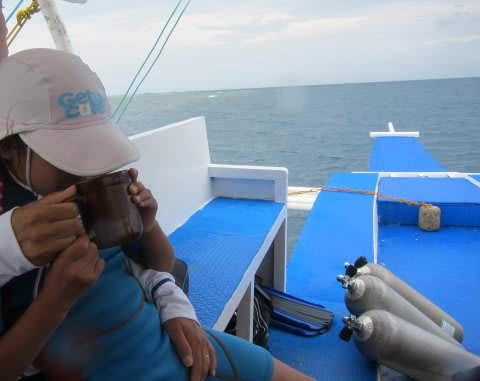
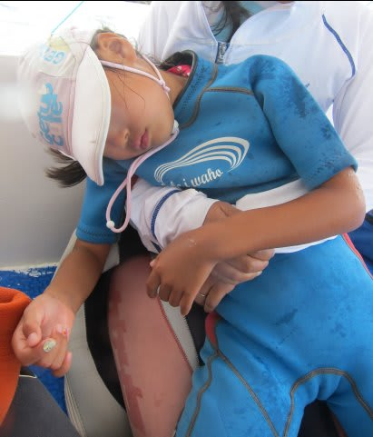
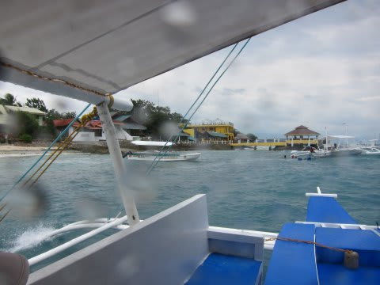
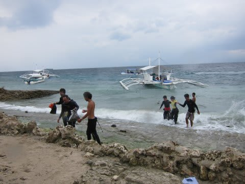
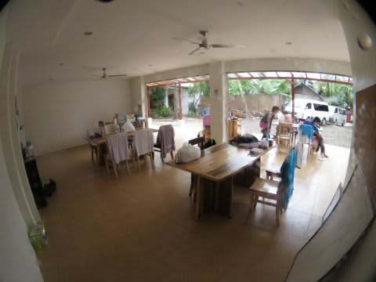
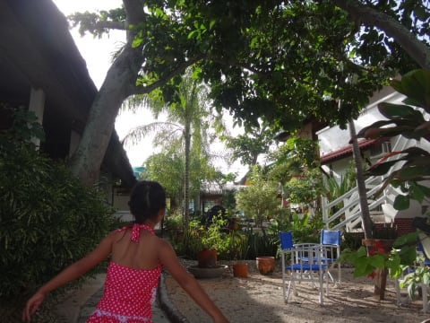
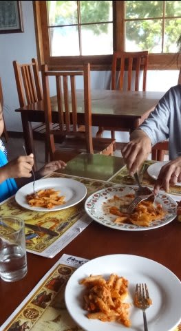
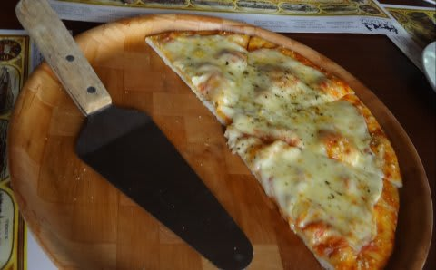
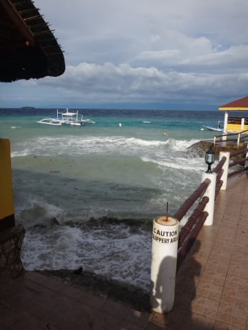

# 2015年8月　子連れでモアルボアルでダイビングその7…陸に戻ってお昼休み

📅 投稿日時: 2015-11-01 02:36:27

🏷️ カテゴリ: [ダイビング日記](ce3a7a8d424d112fce83ee85c81a0e344.md)

ってことで．

スキーに行っていない今日は．

このBlogで人気のないダイビング日記です…

はい．読者が少ないダイビング日記です←開き直り

ということで．

モアルボアル旅行記へ，Go！

----

というわけで．

久しぶりの海を堪能したというより．

カメラと格闘していた1本目を終えて．

ボートに戻ると…

あうーーん．

冷たい雨が降って，風も強くて…

ちょっと寒いよ（涙）．

娘も，あったかい飲み物をもらって

温まってます．

ってことで．

午前2本のダイビングを終わったボートはショップに戻りますが…

あら．

そのわずか10分間で，

娘は熟睡しちゃいました…

しかし．

時折激しい雨が叩きつけてきたりして．

…あんまりいい天気じゃないな（涙）．

そして，ショップの前に，船は戻ってきました…．

ショップは，自分たちが泊まっているホテルからは

近いので．

目の前に，ホテルから海に突き出している

テラスが見えます．

そして…

かなりの波が打ち付ける，

荒れた海を渡って，下船．

ショップまで戻ってきました…

基本的に，モアルボアルではボートで1時間かかるような

遠くへ遠征するポイントは無いので．

こんな感じで，午前2本潜ったあとは，

昼にショップに戻ってくるスタイルです．

ショップに申し込んでおけば，ショップでお弁当の

お昼ご飯を食べることもできるし，

ホテルに戻って，どこかに食べに行ってもOK．

我が家は一旦，ホテルに戻って．

シャワーを浴びたあと，

外に出ていくのもめんどくさいので．

朝食を食べた，ホテルの中のレストランでお昼ご飯．

…でも，

この，カバナ・ビーチリゾート内のイタリアンレストラン．

セブにいくつかの店を出している，割と有名なレストランらしく．

なんだか，予想以上にピザもパスタもおいしくて，

嬉しい誤算！

…そして，食後．

ホテルの海に突き出してるテラスの横を通っていくと…

…ちょっと日が射すタイミングがあるものの，

まだ，海が荒れてますな（涙）．

ってことなので．

どうせ泳げない娘を連れて行っても，退屈するだけだし．

妻は揺れる船に乗っていると，気分が悪くなりそう，ってことで．

午後は，娘と妻はホテルに残って，プールで遊ぶことに．

…すいません．

私一人で，潜りに行ってきます…
