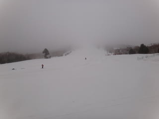
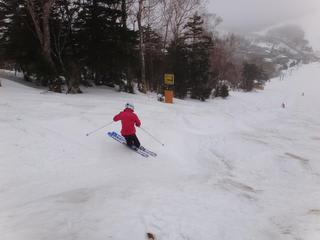
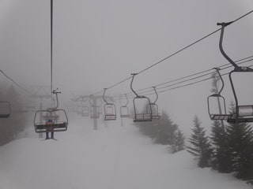
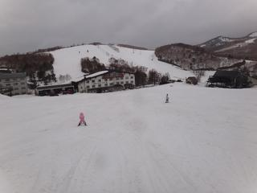

# 4月23日の志賀高原スキー場は…

📅 投稿日時: 2011-04-23 19:53:42

🏷️ カテゴリ: [2011スキー滑走日記](ca488c98cfb9169941c3e73770dcefb56.md)

雨，でしたね．

朝から夕方まで．

リフト営業時間中，ずっと小雨が降り続け，

止むことはなかったです…

しかし，ざーーーっという強い降りにもならなかったのが，

せめてもの救いですかね．

とりあえず，一日中雨の中滑ってました．

気温は比較的低めで，雪が壊滅的にどろどろに

なることはなかったですね…

雪の量は，この時期としてはありえないくらい多め，

まだ，土が出てくる気配すらありません．

GWも，雪だしすることなく，コース全幅滑れるのでは？？

あと．

なんにしろすいてます．

一の瀬ファミリーは，われわれ以外，後2－3組滑っている

程度でしょうか．

ホントに寂しい．

道路状況は完全ウェットで，道路に積雪はないですが，

まだ草津越えルートはクローズしているようですね．

信州中野から上がるしかありません．
