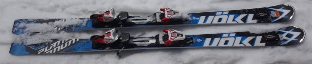
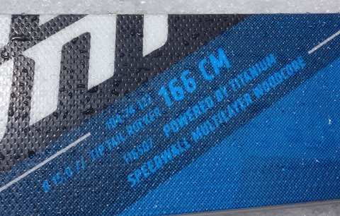
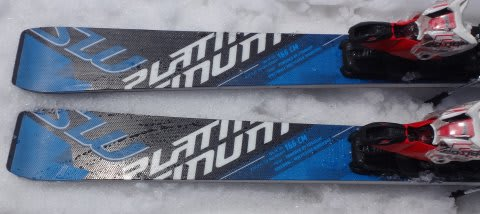

# 2017シーズンモデル，スキー試乗レポート第19回…VOLKL編その3

📅 投稿日時: 2016-06-18 02:44:38

🏷️ カテゴリ: [スキー板試乗](c0bd8048615710cee890e403a36cc9a2b.md)

はいはいはい．

まだ続く．

まだ続きます．

2017シーズンモデルのスキー板試乗レポート．

本日は，フォルクル編．

では，どうぞ～！

○VOLKL PLATINUM SW 166cm（2回目）

基礎オールラウンド

この板も，[前回の志賀高原](e66cfc2f781e8163bb427bbe1dfc8faae.md)に続く，2度目の試乗になります…

今回は，しっかり固い斜面でテストしたわけですが．

うーむ．やはり，グリップがかなり強い板に感じるなぁ…．

今シーズンモデルまでとちょっと違う感じ．

チューンナップの仕上げかなぁ…

もう少しビベルを落とし気味にすれば，動かしやすさが

増すかも？

とりあえず，今年までのSWに比べ，グリップ・張りが強いです．

グリップが強くなったからか…

板自体，固くなって芯があるように感じられ，

結構強いフレックスに感じます．

固く締まった熊の湯の斜面で，ガッツリグリップして

板のエッジなりに進んでいく，カービングマシン的

要素が強く感じられました．

結構固い斜面で，そこそこのスピードを出してもしっかり

エッジグリップして安定感があり，高速耐性も高そう．

荷重ポイントはテール．

くるぶし～かかと部分をメインに使っていく板です．

軽いのでどうでも動かせますが，

ちょっとエッジの引っかかり感があり，ずらしでの

コントロール性はあまり良くない感じ．

しっかりしたフレックス・グリップに乗って

エッジで切っていくのに適した板です．

とりあえず，固い斜面を高めのスピードで，

しっかりカービングで滑っていくのが気持ちいい

板でした．

うーん…チューンナップなのかなぁ…？？
