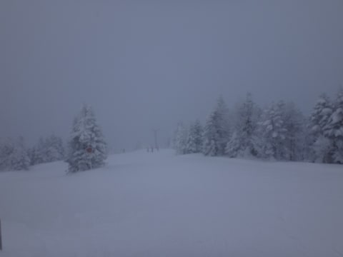
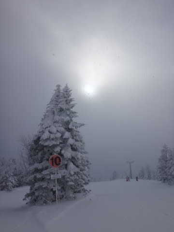

# 1月11日，3連休初日の志賀高原は…曇り時々晴れ

📅 投稿日時: 2014-01-11 22:18:18

🏷️ カテゴリ: [2014スキー滑走日記](c992167609b6415052179ee69ea1ea7d8.md)

えー．

ってなわけで．

本日から3連休で，志賀高原に来てるわけですが．

昨日の天気予想では．

朝早いうちは雪も残るが，一日晴れたり曇ったり．時折雪がさーっと

降るタイミングもあるかも…．

って感じでしたが．

実際にも，

曇り～雪，時折日が射す，って感じで．

まー，だいたい予想通りの天気でしたね～．

朝の気温はマイナス12度と，そこそこ冷え込んで．

朝の山頂は，雪．

で，朝の積雪は10cm弱と…

ふむ．

ここまでは，昨日の予想ぴったりですな．

圧雪バーンは，数cmのうっすら新雪がつもった柔らかバーン．

オリンピックコースはこんな感じで．

うーーむ．

残念ながら，新雪パウダーからは，ちと程遠いな(涙）

で．

日が射した時間は，わずかだったな～(泣）．

そして．さらに．

さすが3連休，ゲレンデの人が増えてきたなぁ…（涙)．

…と，思ったけど．

3連休と言うのに．

ピーク時でも，この程度しかゴンドラ待ちがないではないかっ！

明らかに，去年の3連休より人が少ない…

まー，リフト待ちする分には人が少ないのはいいんだけど…

3連休なのに，こんなに人が少なくて，

経営大丈夫かしらん？？

と言う感じで．

今日は基本的にこんな感じの曇り～雪の天気で．

時折日がさし．

やっぱり，夕方にはちょっと荒れてきたものの．

人が少なくて，正月休みほどはひどくならず．

すっきり晴れはしなかったものの．

3連休にして，これだけ空いてるゲレンデを滑れれば，上出来だなっ！！

＃経営が心配だけど…

PS.

ナイターも快適でしたが．

うーむ．

きれいな星空だったので，昨日の予想通り，

明日は新雪が積もらなさそうだな～(;_;)
