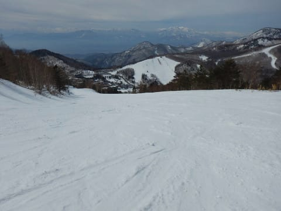

# 3月18日(日)の志賀高原速報モード…すっきり晴天，暖かな春スキーの一日

📅 投稿日時: 2018-03-19 03:02:15

ってなわけで．

今日も志賀高原でしっかりラストまで

滑った帰り道．

高速のパーキングエリアで2時間以上，

爆睡をかましてしまったSkier_Sです…

ってなわけで．

今日も時間が遅いので．

日曜定番，速報モードっ！！

えー．

まず．

今日の朝…

ん？

あれ？？

これは…焼額の早朝営業！？？

確か，昨日は朝4時前に家を出てきて．

ナイターまで行った上に，夜遅くまで

飲んでいたはずだけど…

なぜか．

気が付くと．

朝日が射しこむ早朝のゲレンデを

滑っている自分に気づいたのでした…

うーむ．

理性を失った人間の行動は恐ろしい…←なぜ他人事のように言っている？

でも．

この時期の早朝は雪もしっかり締まっているし．

ガチガチアイスバーンってわけでもなく，

適度にエッジが効く固めのシマシマで．

気持ちいいなぁ～！！！

しかし．

朝のうちは気持ちよかったけど．

朝からピカピカ晴天だった本日…

午前10時過ぎには，気温もプラスまで

上がってしまい．

焼額は全面，見事に春の雪に…（涙）

板に貼りつくほどのひどい雪ではなかったけど．

午前中は比較的数多くの人が滑っていたこともあり．

重い雪が蹴散らされて，昼ごろには荒れ荒れバーンに

なっていきます…（泣）．

だもんで．

午後はちょいと一の瀬ファミリーへ遠征！

晴天で雪が緩んだ日は，朝日があたらない

西斜面の一の瀬ファミリーの雪が緩みにくくて

いいのだ！

午後になった一の瀬ファミリーは人もそれほど多くなく．

午後1時ごろでも，雪はまだしっかり硬いまま！

そして，午後2時過ぎくらいまでは．

それほど荒れてない，締まった感じのいいバーンを

滑れましたね～．

ただ．

さすがに午後3時ごろにはちょいと

緩んで荒れてきましたが…（残念）

夕方に焼額に戻ると．

うはーーー！！

ドボドボになった雪が荒らされた，

全面荒れ荒れ凸凹バーン…（涙）．

こいつは，強烈に体力を消耗するバーンだよ…

ってな感じで．

早朝から滑り続けて，もう体力がつきかけている夕方に，

日が傾いて固まり始めたハードな凸凹斜面で

さらに体力を削り取られていくという，

なかなかハードなラスト数本を滑って…

今日も，営業終了まで滑り続けたのでした…

いや．

気温が高くて，雪が緩んじゃったのは惜しいけど．

天気も良くて．

早朝からラストまでたっぷり滑ったので．

満足な一日でした～！

また明日，詳細モードでレポートします～！

…明日の夜，常識的な時間に帰宅して，起きていられたらですが…

## 💬 コメント一覧

### 💬 コメント by (いさ)
**タイトル**: ようやく
**投稿日**: 2018-03-19 13:30:24

お疲れ様です。いつもゲレンデでお見かけしておりましたが、ようやくお話できました。土曜ナイター前にお声掛けさせてもらった夫婦です。ホテルでもすばやく走っておられましたね（笑）

しかしあれからナイター行って飲みに行って早朝から丸一日滑り倒すとは…さすがの鉄人ぶりに脱帽です。

またゲレンデで声掛けさせてもらいますのでご一緒させてください

### 💬 コメント by (サトシ父)
**タイトル**: 勇姿を発見！
**投稿日**: 2018-03-19 16:20:41

先週末はスキー学校のシニアレッスンに参加、ヤケビのオリンピックコースで一人颯爽と滑るSさんを発見、あっという間に視界からなくなりました。やはり20000m倶楽部の人は違うって実感しました。

帰りは久しぶりの関越道でしたが渋滞、中央道の渋滞よりストレスたまります。

### 💬 コメント by (なるなる)
**タイトル**: Unknown
**投稿日**: 2018-03-19 19:07:54

先週に続き禁断の平日スキーを楽しんでます。

滑ってる時は、天から落ちてくるものは、かろうじて個体で超楽しかったのですが、現在、液体が凄い勢いで降り注いでいます 涙

### 💬 コメント by (hiro)
**タイトル**: 早朝最高ですね
**投稿日**: 2018-03-19 19:56:08

日曜日の早朝では、ゴンドラでご一緒させていただきありがとうございました。いやー、朝早い時間の１ゴンは、スキーをこよなく愛している凄い方々に次々に出会えて楽しかったです。またご一緒させていただける時を家族で楽しみにしております！

### 💬 コメント by (ま)
**タイトル**: Unknown
**投稿日**: 2018-03-19 20:34:21

日中リフトストップまで滑り、ナイター終了後も、速攻でTEPAAに移動してきて２３時まで飲み、深夜までブログを書き、翌日自分が起きたときには、既に早朝スキーに出かけていた！！

スキーヤーの鑑というか、その情熱には頭が下がります。やはり、20000倶楽部会長として自明ですな。

### 💬 コメント by (michi)
**タイトル**: Unknown
**投稿日**: 2018-03-19 20:35:04

お疲れ様でした。

いやぁ、もう完全に春スキーの雪でしたが、天気最高で楽しめました。さすがにザクザク、凸凹だったので夕方はかなり疲れて少し早めにあがりました^^;

また来週も行く予定ですので宜しくお願いします。

### 💬 コメント by (さち)
**タイトル**: Unknown
**投稿日**: 2018-03-19 22:37:40

前回のはありがとうございました！

日曜日、ﾊﾟｰﾌｪｸﾀでお見かけしました！

これは幻か？と思いました(笑)

### 💬 コメント by (Skier_S)
**タイトル**: そして睡眠不足は続く
**投稿日**: 2018-03-20 04:26:00

＞いささま

あ！！

声をかけてくださったの，いささんだったんですね！！

もう，慌ててナイターに行く前だったので，

バタバタしててすみませんでした…

確かゴールド有資格者でしたよね？？

ステッカーはもう受け取ってらっしゃいますでしょうか…？

もし，まだだったらKonSukeさんにお願いして

お渡しできたのですが…

宿はいつもあそこですか？

私もかなりの頻度で泊まってますので，

またお会いした時声をかけてください！

＞サトシ父さま

…あ，今度はついに滑っているところを

目撃されたのですね…

もし，見かけたのが日曜でしたら．

前日夜遅くまで飲んだ後に，早朝から滑って

ヘロヘロになっていた頃かと…(笑)．

今回はスクールに入ってらしたのですね．

また今度，フリーで滑っているときに

見かけたら声をかけてください～！

＞なるなるさま

…平日スキー，うらやましいです…

液体になったのが夜になってからで良かったですね．

火曜もスキーですか？

火曜がどんなゲレンデ状況だったか，

またレポートお願いします…

＞hiroさま

日曜はお疲れ様でした～！

もう，焼額の朝礼はスキーを愛する人が

集まってますよ(笑)．

毎週末の朝イチはいつものメンバーが滑ってますので，

また遊びに来てください．

いつものメンバーがお待ちしています(笑)．

＞「ま」さま

朝起きた時，早朝に行こうかどうしようかすごい悩んだんですが…

やっぱり行ってしまいました．

早朝の魔力には勝てませんでした．

でも，日曜は午後はヘロヘロでした…

一の瀬であっという間に抜いて行かれたのを

追いかける気力もなかったです(笑)

＞michiさま

もう，日曜は完全に春でしたね…

午後は意外と一の瀬は良かったので，

ヤケビに夕方戻ってきたときは，

バーンがすごい荒れていてかなり

きつかったです…

また今週末お会いしましょう！

＞さちさま

そうなんです…

私にしては珍しく，焼額を脱出していたので．

幻ではなかったのかと…

でも…

パーフェクターで滑ってました？？？

全然気づきませんでした…

滑りに集中しすぎてたからかな…？？

しかし，前日の飲み→早朝という無謀なことを

してしまったので．

一の瀬で滑っていた午後には，かなりヘロヘロな滑りを

していたのがお分かりだったかと(笑)．

あの日はさすがに疲れました（^^:

