# 丹沢山系，塔の岳⇒丹沢山⇒蛭が岳を往復してみた　その1

📅 投稿日時: 2023-08-03 06:00:54

🏷️ カテゴリ: [登山・旅行](c1d637a11a25b457ac978d197adbdafc5.md)

こないだの週末も，4週連続で山に

行ってきたんですが…

やはり土日どちらかは仕事をしないと

いけなさそうな感じだったので．

翌日に疲れを残さない程度に，

午前中くらいで往復できる山に

行ってきたのですが…

さすがに3週連続で小仏⇔陣馬山を往復したので，

もう陣馬山は飽きた．

でも，車で1時間ちょいで行けて，

昼くらいには帰ってこれるところと

なると…

選択肢はそんなに多くなく．

…また，うちからそう遠くない丹沢山

方面に行きますか…

ってなことで．

丹沢山か蛭ヶ岳か，どっちかに行こうと

思ったんだけど．

どうせなら両方行けばいいんじゃね？

という安易な気持ちで，

戸沢スタート→塔の岳→丹沢山→蛭ヶ岳ピストン

という今から考えると無謀なプランを立てたわけで．

ヤマレコでプランを立てみたところ．

標準コースタイム，13時間38分ですか…

往復18㎞以上，標高差2000m近い，

かなりの本格ルートですね．

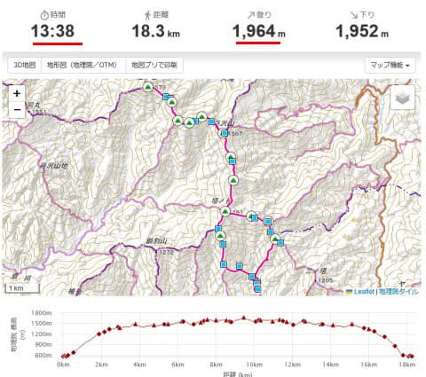

でも．

前に丹沢山に行った時は，朝5時スタートで

10時前には下山できたし．

丹沢⇔蛭ヶ岳は標高差もないから，

片道1時間，往復2時間で行って来れる

だろうし，12時前には下山できるかな…？

という甘い読みで，

今回も5時スタートで，丹沢～蛭ヶ岳へ

出発したのでした…

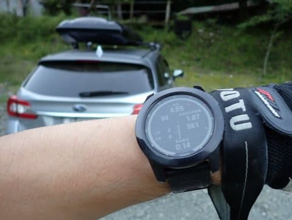

とりあえず，4週連続の山歩き．

最近のタイムが上がってきていることも

あり，行きはいいペースで登れて…

塔の岳到着はスタートから1時間40分後．

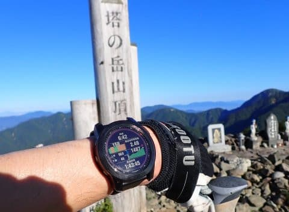

塔の岳で10分弱休憩して，

丹沢山はスタートから2時間27分で通過，

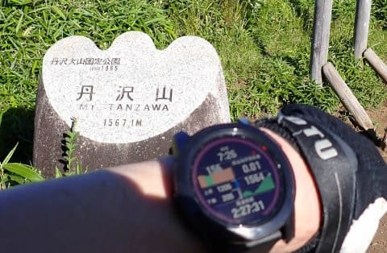

うーん．

ちょっと予想より遅いけど…

まぁ，スタートから3時間半の，

8時半には蛭ヶ岳に着けるよな…

と，楽しみにしていた丹沢山から

蛭ヶ岳までの景色がいいコースを

歩き始めたところ…

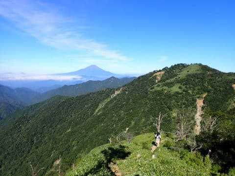

…え？？

丹沢山から蛭ヶ岳，標高差がそんなに

ないので，アップダウンもそこまでないと

思っていたけど…

すごい下って，あの向こうの尾根を登り返すの？？

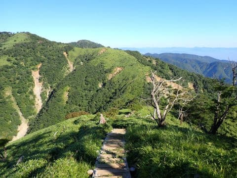

…そして．

下りは私の大嫌いな階段だらけ．

ひたすら階段が続くんですけど（涙）

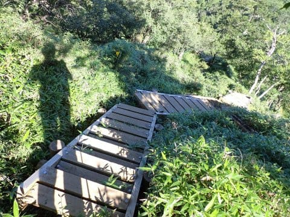

自分のペースや歩幅で走れなし，

トレッキングポールをうまく使えない

階段は，私にとっては鬼門なんですが…（涙）

そして．

下りだけじゃなく，登り返しでも私の嫌いな

階段が続き…

階段は，道を登るのと使う筋肉が違うから

筋肉疲労が速いんだけど（涙）

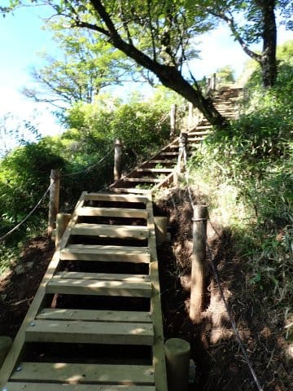

さらに階段を登り切ったら…

ええ？

まだ終わらないの？

またこれを下って登り返すの！？？

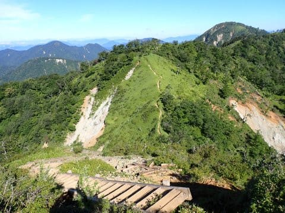

そして，下りは鎖が張ってある岩場も

あるし…

もう，想像以上のアップダウンと

ペースが上げられない階段や岩場の

コンボで，ペースが全然上がらず，

いつまでたっても蛭ヶ岳が近づかない…（涙）

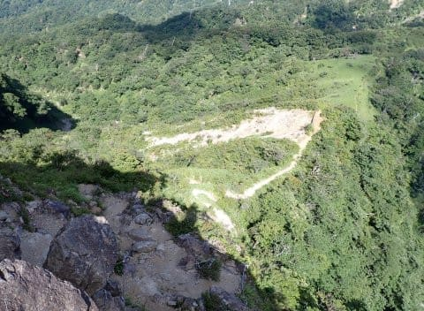

いや．

景色はいいのよ．

楽しみにしていただけあって，

丹沢山から蛭ヶ岳の間は，

丹沢山系の中では，すごく景色がいい

コースなんだけど…

予想以上のアップダウンで，

丹沢までの登りよりずっと体力が

削られていく感…（涙）

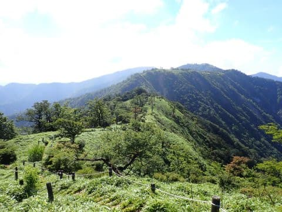

でも．

何とか頑張って．

待ちに待っていた，コース終了

表示が…

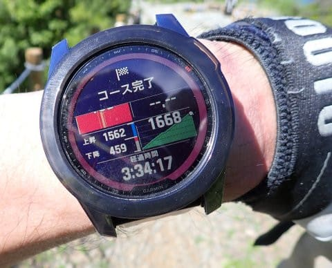

ってなことで，

スタートから3時間34分後，

丹沢山から1時間7分で蛭ヶ岳に

到着！！

いや…疲れた…

…最後，心拍数上げすぎた…

最後，トレイルランナーが後ろから

迫ってきてたので，ついついペースを

上げすぎて，

最後の15分間，平均心拍170オーバーで

攻めちゃった…

しかし．

丹沢～蛭ヶ岳．

舐めてた．

こんなにヘビーなコースだとは

思ってなかったよ…（涙）

（[続く](ecb4a5b801a79983a5ff16313e8ef1172.md)）
