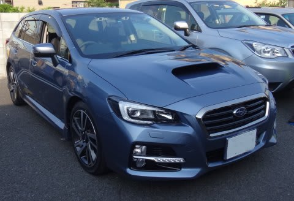

# LEVORGに試乗してみた…今度は2.0GT-Sの試乗レポート

📅 投稿日時: 2014-06-01 20:34:44

ってことで．

昨日は，1.6Lの試乗インプレッションでしたが．

本日は，レヴォーグの2リッターDIT版の

試乗インプレッションをば…

--

SUBARU LEVORG 2.0 GT-S

えー．

これは．

はっきり言うと．

1.6と全く別物の車ですね．

…これに乗ると，1.6には戻れません．

完成度が全然違います．

…いや，1.6も，いい車なんですが．

2.0は良すぎる…

ボディーの剛性感や，突き上げ・段差乗り越えの

際のサスの収まりかた，路面のざらつきの吸収具合．

ボディはしっかりと道路に追随しながらも，

角はきれいにおさえて伝えてくれるという．

これは…かなりの高級車っ！！

＃まぁ，350万円以上する車ってのもありますが．

車としての完成度．

これは，かなり高い．

ボディがすごいガッチリしている感じがあって，

右・左の繰り返しの切り返しでも，

ロールはしっかり抑えられて揺り戻しがなく．

横Gを高めて行った領域で，ステアリングを

切り足していっても，路面のうねりがあっても，

接地感はすごい高いっ！！

しっかりした足なのに，しなやかというか．

突き上げ感もなく，ばたつきもなく．

ものすごい気持ちいい足の動きで．

1.6だと，「ドシン，ドシン」といって，

ガタガタ飛ばされる感じの凸凹でも，

しっかり滑らかに乗り越えていきます！

コーナーで不安になる「グラっ」とした

感じは全く無縁．

かなり攻めても，きれいに狙った

クリップポイントに車を運んでいけそう…

そして．

そして．

このエンジン．

…悪逆だわ．

反則でしょ，というくらいのトルク感．

まず，街中でちょっと踏み込みすぎると．

あっという間に制限速度を大きく突破．

アクセルをちょっと踏み込んで，十分な

トルクが出るのに．

そこからさらにブーストが上がってくると，

「え？まだトルク出るの？」

って感じで，まだトルクの伸びしろがあるのに，

あっという間に100km超え…

SI-DriveのS#モードにすると，8速

ATモードになり．

この8速ATモードと，かなりの接地感の

足のおかげで．

コーナー攻めるの楽しそうなんですがっ！？

ただトルクがあって速いだけの，

直線番長ではないですよっ！

これは，楽しい．

優等生っぽい車が増えてきて．

ハンドルを握っても，ここまでわくわくさせる

車が少ない昨今．

これは，衝撃的な車でした．

…はっきり言って．

この車．

ほしい．

欲しいっ．

ほーしーいーっ！

…でも．

燃費は1.6より悪くて，ハイオクだし．

オプション・諸経費入れると400万近い…

うーーーーむ

我が家では，無理か…（涙）．
