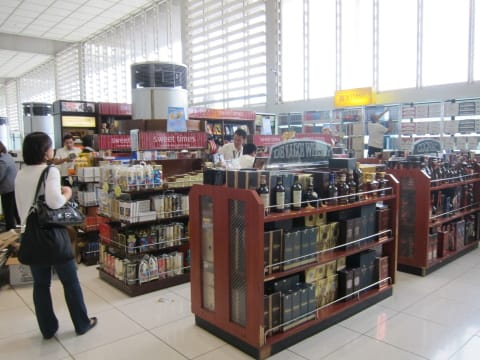
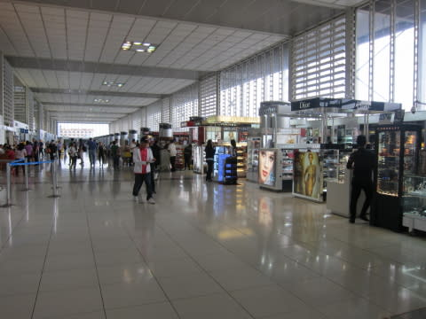

# 2013年11月　フィリピン・オスロブ　子連れでジンベエを見るぞっ！　その26

📅 投稿日時: 2014-08-11 02:30:43

えー．

この週末．

BRレガシィ君で1100kmほど走ってきましたが．

平均燃費，16km/L超えましたね…

ほとんど高速ばっかりだったってのもありますが．

ルーフボックスつけっぱなしの4WD車としては，

かなり燃費がよい車なんじゃなかろうか？？

ってことで．

今日もダイビング日記へ，Go!

---

という感じで．

7時間待ちを過ごさなくてはいけない

マニラ空港に到着したわけですが…

到着したのは国内線ターミナル．

成田行きに乗るために，国際線ターミナルへ

移動しなきゃならんわけですが．

この空港．

国際線ターミナルと国内線ターミナルの建物は

つながっているのに．

国内線到着ロビーから，一旦建物の外に出ないと

国際線ターミナルに行けないのね…

なんだか，分かりにくい乗り継ぎ…

建物自体はつながっているのに，なぜ？？

って感じで．

迷いながら，国内線ターミナルから

国際線ターミナルにやってくると…

ふむむ．

新しい空港ってことで，建物はきれいなんですけど…

…でも．

国際線ターミナルのチェックインカウンターのあるフロア，

お店がちっちゃな売店しかないのは，気のせい？

セブ空港の方がよっぽどにぎやかですけど？？

この空港で，7時間過ごすのか…？

…なんだか，いやな予感…

でも．まぁ，チェックインエリアを

過ぎて，搭乗待合エリアに行けば，

いくらなんでも免税店くらい

あるだろう…

と．

搭乗待合エリアに行きますが…

うむ．

ちょっと寂しい感じ…

店はあるにはありますが…

…ちょいと寂しいかも…

…ここで，これから残り6時間過ごすのか？？

まぁ，待合室自体は広いし．椅子も十分あるし．

何より救いだったのが，無料ネットやWifiがつなぎ放題の

インターネットスペースがあったところ．

自前PCでも，無料でネットつなぎ放題！

…これは助かった…

ってことで．

まずは売店で売っている麺を買い込んで…

ちょっと遅めの朝ごはん．

そしてお店を見て回ったり，何だりして，

なんとか，約2時間ほどつぶしましたが…

…まだ，あと4時間もあるのか…

ここで，必殺．

PCに入れておいた映画，登場！

娘の好きな映画を見せておけば．

2時間半は熱中するのだ！

ありがとう，ナウシカ様っ！

でも，熱中しすぎて…

お昼ご飯も，映画を見ながらってのはどうかと思うが…

しかし．

「ラン，ランララ…♪」と歌い続ける娘と一緒に，

私も必死に映画を見続けたのでした…

＃やっぱりナウシカは名作じゃのう…
