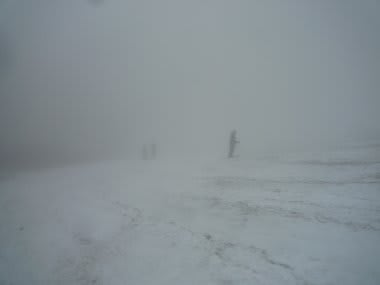
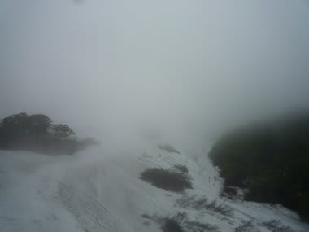
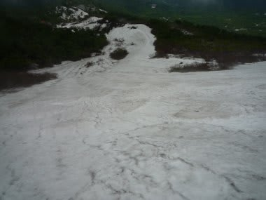

# 6月17日，日曜日の月山速報

📅 投稿日時: 2012-06-18 00:51:42

🏷️ カテゴリ: [2012スキー滑走日記](cca3a0e9524e0203150f790b1fc3c71ad.md)

あー．

夕方4時に山形を出て．

500km運転して夜遅く帰ってきたので．

今日は速報のみで…

まぁ．あれですね．

この2日間をまとめて言うと．

私の日ごろの行いが悪かった

という一言に尽きるのでしょうか．

日曜も．土曜と同じく，終日雨でした…．

朝8時，リフト営業開始の一瞬は止んでいたんですが．

その後．

すぐ小雨になり．

10時ごろからは，時々ざーーーーっと降ったりして．

さらに．山頂から，大斜面の上の方まではガスが…

せめてもの救いは．

ガスが降りても大斜面中間点くらいまでで．

下半分は視界がよかったことと．

あとは，リフトががらがらだったことと．

…このくらいですか．

で．

謎なのは．

月山を降りると雨が降っていた気配はなく．

山形市内は，日が差すこともあるくらいで．

終日雨が降らなかったとか…

月山付近だけ雨だったようです．

…日ごろの行いが，よっぽど悪かったようですね(涙)．

明日，詳細レポート書きますので．

しばしお待ちを．
