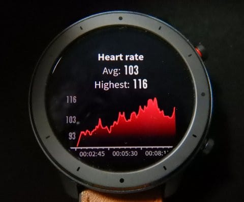

# Amazfit GTRスマートウォッチを買ってみた，その3…アクティビティーモードを使ってみた

📅 投稿日時: 2019-08-31 04:39:43

🏷️ カテゴリ: [PC,カメラ&小物](c0d8caed13e597efe97b661a8ae56bed0.md)

えー．

昨晩は．

Blogが更新されず．

「やっぱり，Skier_Sは死んだか…」

と思った方が多かったと思いますが．

…

…ええ．

そうです．

死んでました．

予告通り…

でも，ヤマ場は乗り越えたので．

今日はこれから，

死んだように眠ります！！

やっと夜普通に眠れる…←って，もう朝5時近いやないか～い！！

しかし．

この山場を乗り越えるために

犠牲になった他の仕事が多数…（涙）

そいつらをやっつけるために，

この土日はどこにも出かけられ

なさそうです（泣）

でも．

ここ4週間ほどで，

静岡，沖縄，関西某所，群馬，モアルボアル，長野

と遊びまくったので，

休み明けに仕事が溜まっていたのは，

自業自得なのかもしれない…

ということで．

本題へ．

えー．

スマートウォッチ，[Amazfit GTRを購入](e07b216ec3b426f7a5a1462a3b6fd1c02.md)して，

[試しに使ってみた感じ](edd1205f6bd9cd6dadb50e4fc6316b747.md)を報告しましたが．

…そろそろ，こいつを使い始めて3週間．

3週間使ってみた感じは…

・盤面の常時点灯ができない

・日本語が，漢字以外「？？？」表記になってしまう

という問題はありますが．

この2点以外，かなり満足してます…！

8月15日にファームアップデートがあったので，

「もしかしたら，日本語対応するか？？」

と期待したけど．

相変わらず「？？？」表記のままで

がっくり…（涙）

とはいえ．

購入後20日経った現在．

買ったときに充電したっきりというのに．

まだ電池が20%残ってます…！！

普通に使って電池もち24日というのは，

嘘じゃない感じです．

で．

[前回](edd1205f6bd9cd6dadb50e4fc6316b747.md)，

「アクティビティログを

一旦Onにすると，

停止させるまではスマホの通知を受け取ったり

できなくなるようです」

と書きましたが．

すみません，

これは間違いでした！

アクティビティログOn時でも，

スマホやLINEの着信などの

メッセージ通知は受け取れました！

スワイプしてメッセージ通知を消すまでは，

画面にはずっとメッセージ通知画面が

表示されます．

…ただ，アクティビティログOn時には，

画面に出ているメッセージ通知を

スワイプして一度消してしまうと，

二度とメッセージ着信があったかどうかを

確認する画面に戻れません…

ちなみに，着信通知のバイブレーションは

結構強くて，運動していてもちゃんと気づく

レベルです．

バイブレーションの強弱は調整できないけど，

リズムを編集できて，気づきにくい場合は

長く鳴らすとか，そういった調整は可能．

…ただ，アプリごとに鳴らしわけることは

できず，電話着信か，アプリ着信かの

2種類での鳴らし分けになります…

ってな感じで．

アクティビティーログOn時でも

メッセージ着信が確認できることが分かり．

私にとって重要な，スキーログと

メッセージ着信の両方が同時に使える

ことが明らかになり一安心．

…ってなわけで．

前回はレポートできなかった，

アクティビティーログについて

少し詳しく書いてみましょう…

このAmazfit GTRは，11種類の

アクティビティーモードを持っていますが，

そのうちの，Walkingモードを

試してみましょう…

前回レポートしたように，

アクティビティーログを

スタートさせると．

<

こんな感じで，アクティビティーモードに

切り替わり．

Walkingモードなら，こんな感じの

画面になり．

歩数，歩いた距離，現在の心拍数が

表示されて…

この画面を下にスワイプすると，

今の歩行速度，平均速度，消費カロリーが

表示されます．

そして，右にスワイプすると，

現在時刻が確認できます．

Walkingモードを一旦スタートさせると，

この3画面以外に切り替えられなくなります．

そして，歩行が終了して．

Walkingモードを終了させた後は．

今度は，Activitiesメニューを

開くと，過去のアクティビティーの

記録を見ることができます…

記録のリストが出るので，

見たいものを選ぶと…

（今回は購入してからまだ一回しかログ記録

　してないので，リストは一つだけしか

　表示されてませんが…）

　

Walkingモードの記録なら，

まずは移動経路が表示されて…

（地図が無いと，どこを歩いたか分からないけど(笑)）

ログの記録時間，

歩いた距離，

歩数と…

歩いた平均速度，

最大心拍数，

ケイデンス（1分当たり歩数）

ストライド（1歩当たりの距離）

消費カロリー

そして，どのくらいの時間，

心拍数がどのエリアに入っていたか

（上から，安静，軽い運動，ちょっと負荷のかかった運動，

　有酸素運動，無酸素運動，最大運動量）

心拍数の変化グラフが，

表示されます．

…うむ．

こんなにいろいろ見れるの，

面白い．

スキーだと，最大速度とか，

平均速度とか，傾斜とか距離とか

本数とか，上り下りの標高グラフ

なんかが見れるようです…！！

（まだ使ってないので分からない）

さらに，スマホにつなげば，

もう少し詳しい情報が確認できます．

いや，結構面白い！

…ってことで．

次回は，Amazfit用スマホアプリについて

説明します～！
